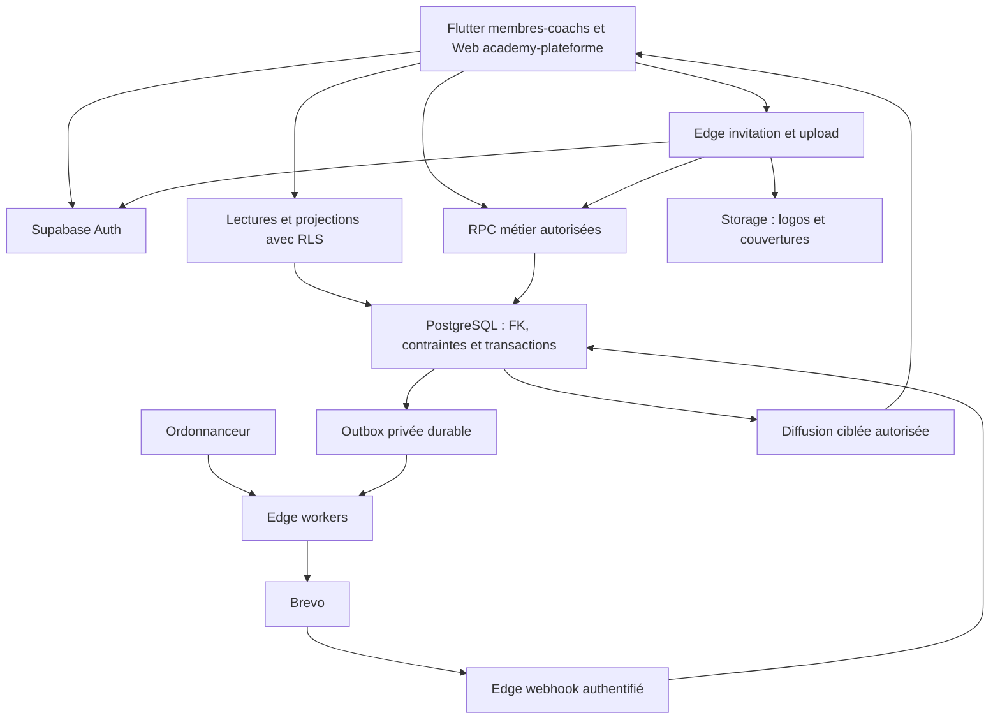
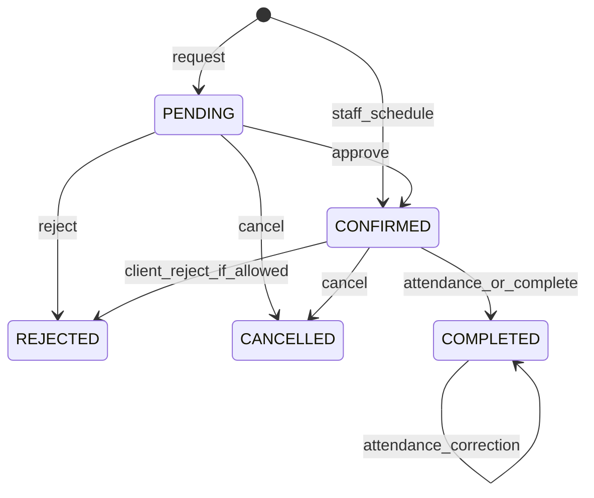
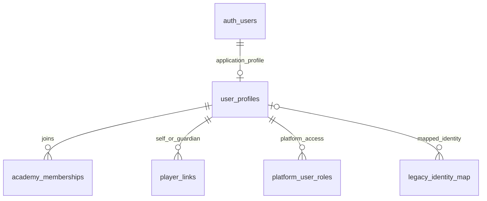
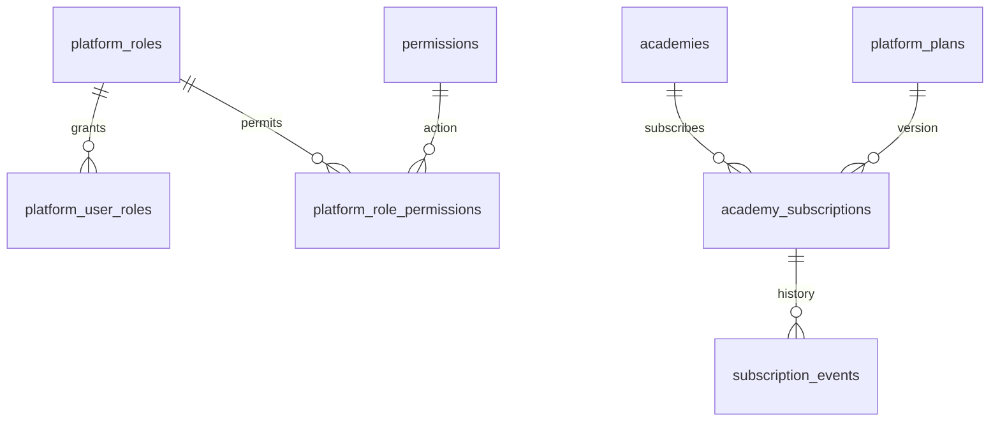
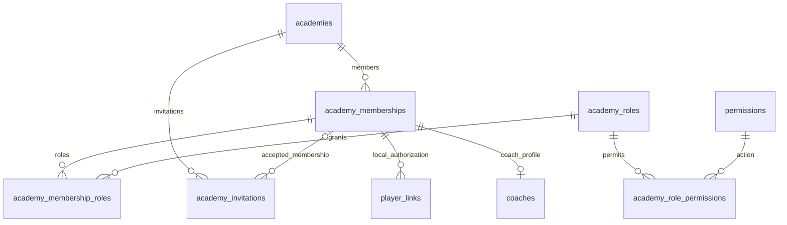
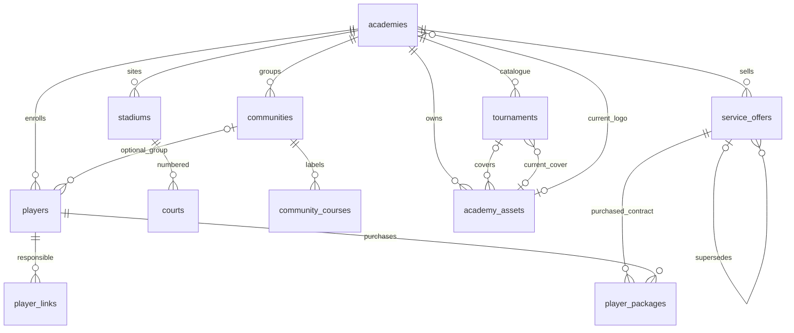
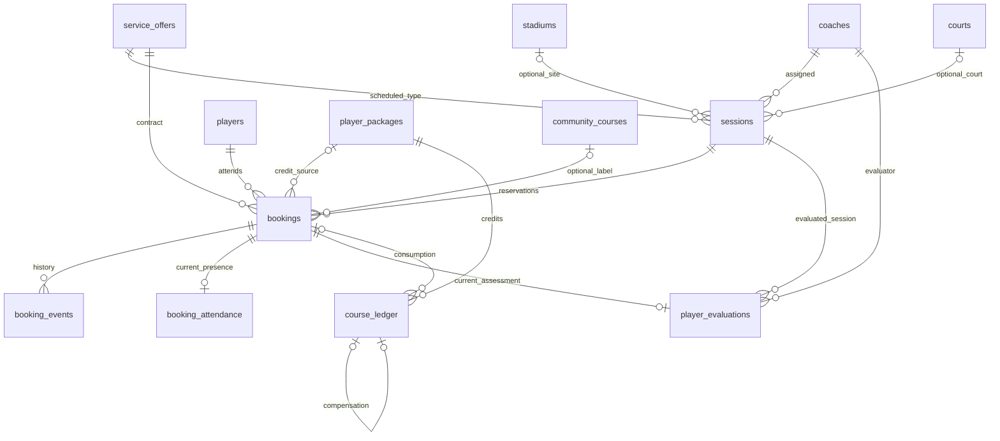
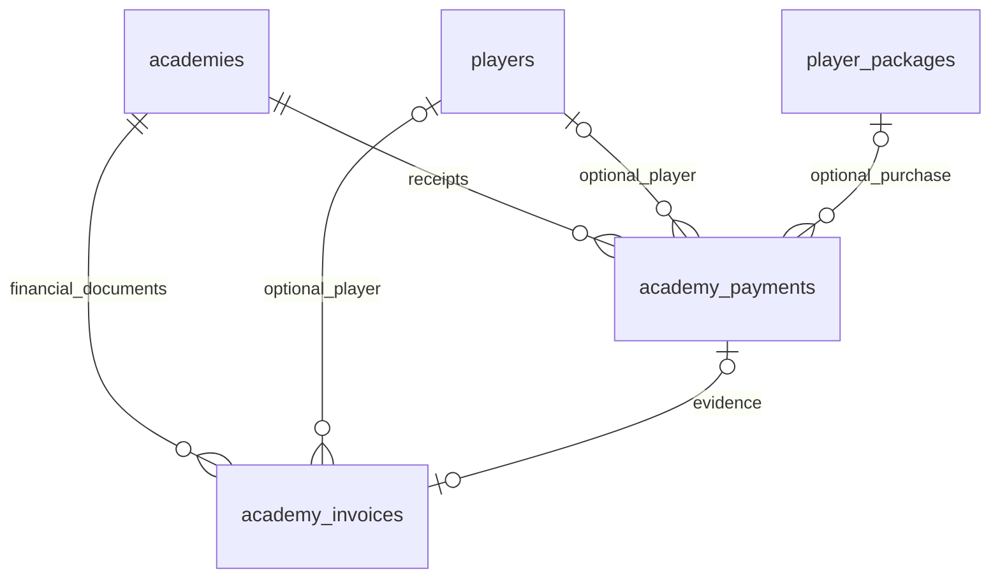
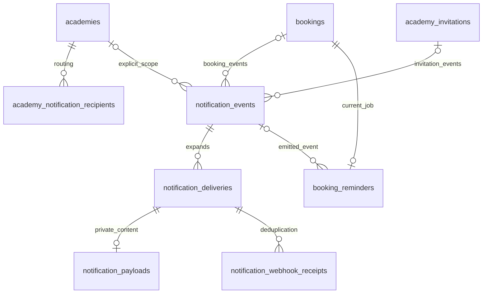
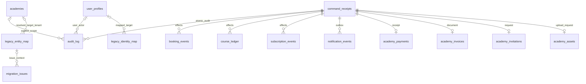

# 1. Executive Summary

**Sport Connect Academy — Database Design Specification V1, candidate de revue humaine, 24 septembre 2026.** Source de départ : [AUDIT.md](AUDIT.md), relu avec les preuves ciblées indiquées ci-dessous. Livrable exclusivement documentaire : aucune migration, table, policy, RPC, Edge Function, donnée ou application modifiée. Ce document n’autorise pas l’implémentation.

La cible distingue identité globale Supabase Auth, membership par académie et joueur métier local. Elle normalise les offres (`service_offers`), achats (`player_packages`), mouvements de crédits (`course_ledger`), séances et réservations. Toutes les transitions critiques ont un contrat transactionnel unique. Les communications externes passent par une outbox ; aucun HTTP fournisseur n’appartient à la transaction métier.

Le catalogue contient **44 tables applicatives candidates V1**, réparties entre métier nécessaire et soutien technique. `auth.users` et `storage.objects` sont des tables gérées par Supabase, pas des tables applicatives supplémentaires à créer. Les fonctions décrites sont des contrats, sans corps SQL. **33 décisions ouvertes sont enregistrées, dont 15 bloquent la première migration SQL du périmètre V1 complet**. Un choix recommandé n’est pas une validation métier ; les dépendances Dxx restent explicitement ouvertes.

## Statuts et justification

| Marqueur | Sens dans cette spécification |
|---|---|
| CONFIRMED | Fait du code local étayé par l’audit ; pas une observation de production |
| INFERRED | Conséquence ou interprétation raisonnable, non démontrée par un export/test |
| MISSING | **NOT FOUND IN REPOSITORY** ; information à recueillir |
| PROPOSED | Contrat cible soumis à revue ; ne décrit pas un système déjà créé |
| DECISION REQUIRED — Dxx | Arbitrage humain nécessaire ; aucune valeur implicite n’est retenue |
| A / B / C / D | Justification : A besoin existant confirmé ; B défaut confirmé dans l’audit ; C besoin nouveau explicite de la mission ; D intégrité/isolation nécessaire au SaaS |

**Tous les noms de tables, colonnes, contraintes, permissions et RPC cibles sont PROPOSED**, même si leur principe est imposé pour cette phase. Chaque fiche porte ses justifications A/B/C/D. Les statuts stockés proposés sont en MAJUSCULES ; objets SQL et permissions utilisent snake_case et `resource.action`.

Les références `Audit §n`, `Q01…Q23`, `I`, `M`, `D`, `A`, `NO/NQ/ND/NR/NW/NF` reprennent les sources et numéros de ligne définis dans AUDIT.md. Attention : la lettre de justification **D** signifie SaaS ; la référence source `domain.ts` est écrite en toutes lettres ici pour éviter l’ambiguïté.

## AUDIT CORRECTIONS / NEW EVIDENCE

La relecture ciblée d’authorization.ts et domain.ts ne contredit pas les faits CONFIRMED sur les rôles et les crédits. Les points suivants **complètent le modèle PROPOSED de l’audit** ; AUDIT.md reste inchangé.

| Audit statement | New evidence / précision | Files/lines | Impact | Recommended correction |
|---|---|---|---|---|
| §16 : FK booking→package par académie | Même tenant ne garantit pas que le forfait appartient au joueur réservé | [index.ts](../../classcard-functions/src/index.ts):245-279 ; audit §16 | Un joueur pourrait consommer le forfait d’un autre dans le même tenant | Ajouter FK `(academy_id,player_id,package_id)` et mêmes liens forts finance/ledger |
| §16 : player_links→profil | Le membership et le lien joueur sont deux autorisations distinctes ; une FK profil seule ne les raccorde pas | [authorization.ts](../../classcard-functions/src/authorization.ts):30-39 ; audit §18-19 | Lien survivant à suspension ou associé à un non-membre | FK `(academy_id,user_id)` vers membership ; statut membership vérifié à chaque lecture/RPC |
| §16 : archivage completed diminue occupation et peut restituer crédit | C’était un arbitrage proposé, alors que domain.ts distingue explicitement restitution et libération | [domain.ts](../../classcard-functions/src/domain.ts):106-139 ; I:344-377 | Ne pas transformer cette proposition en règle décidée | D31 bloque la sémantique définitive ; archive et correction financière sont séparées dans le contrat recommandé |
| §16 : created_at obligatoire avec ancien timestamp parfois absent | Date d’insertion cible et date historique sont différentes | M:1030-1040 écrit issuedAt mais pas createdAt ; audit §24 | Import impossible ou création d’une date historique fictive | created_at = insertion cible ; source timestamps nullable dans mapping, occurred_at historique inconnu explicitement indiqué |

# 2. Design Principles

| ID | Principe PROPOSED / direction imposée | Justification |
|---|---|---|
| P01 | `auth.users` autorité d’identité ; `user_profiles` profil minimal, sans email autoritaire bis | C/D ; audit §7 |
| P02 | Membership unique compte/académie, plusieurs rôles par membership ; joueur distinct du compte | A/C/D |
| P03 | academy_id obligatoire sur tout objet métier local ; aucune « académie inconnue » dans les tables opérationnelles | B/D ; joueurs null audit §8 |
| P04 | FK composites tenant et FK enrichies pour joueur/forfait, stade/terrain, booking/évaluation | B/D |
| P05 | Une machine d’état booking ; commandes idempotentes ; verrouillage cohérent ; effets dans une transaction | B ; audit §14 |
| P06 | Ledger append-only ; solde matérialisé exclusivement transactionnel et rapprochable | A/B/C |
| P07 | Offre, achat, facture, paiement et utilisation sont distincts | A/B/C |
| P08 | Historique métier conservé ; snapshots contractuels, pas copies de noms courants partout | A/B/C |
| P09 | Lectures RLS, écritures sensibles RPC ; Edge aux frontières externes | C/D |
| P10 | Outbox atomique, traitement asynchrone et résultat fournisseur incertain explicite | A/B |
| P11 | Aucun tarif, quota, trial, droit commercial ou délai d’annulation inventé | C |
| P12 | Données ambiguës en quarantaine ; mapping par projet/chemin/UID, jamais par nom seul | B/C |

# 3. Decisions Locked for V1

« Locked » signifie **direction explicitement retenue pour la conception par la mission**, pas approbation d’une migration ni de toutes les options du catalogue.

- Supabase Auth global ; pas de table applicative `users` concurrente ; email géré par Auth.
- Séparation utilisateur/membership/joueur ; joueurs locaux à une académie ; un joueur peut ne pas avoir de compte.
- Relations parent/self unifiées dans `player_links`, sans miroir Firebase.
- `academy_id NOT NULL` dans le métier tenant ; liens inter-tenants interdits ; terrains matérialisés.
- Nom **`service_offers` retenu** : l’entité vend nombre de séances, activité, type, âge, prix et durée éventuelle ; une séance réelle reste `sessions`.
- Plusieurs achats historiques par joueur ; ledger append-only ; pas d’UPDATE client des crédits.
- États booking PENDING, CONFIRMED, COMPLETED, CANCELLED, REJECTED ; point central de mutation et journal.
- Paiements/factures séparés ; pas d’intégration paiement en ligne/refund active V1 ; abonnement SaaS manuel distinct.
- Outbox durable, Brevo externe, deux seuls usages Storage prouvés (logo/couverture), Realtime sélectif.
- Livraison d’un document Markdown unique et arrêt avant implémentation.

**Choix techniques recommandés pour validation** : séparation présence courante/historique, ledger avec compensation référencée, `command_receipts` pour idempotence complète, `academy_assets` pour finalisation et nettoyage d’upload. Leur justification figure dans le catalogue ; ils ne sont pas des fonctionnalités existantes revendiquées.

# 4. Decisions Still Open

Le registre §39 est normatif : il distingue **blocage de la migration SQL complète** et **blocage d’un parcours avant activation/import**, même lorsque le schéma sait représenter plusieurs options. Aucun timeout ou absence de réponse ne vaut validation.

Blocages avant SQL : **D02, D03, D04, D06, D07, D08, D09, D12, D14, D19, D23, D24, D30, D31, D33**. Ils déterminent cardinalités, contraintes, visibilité ou invariants de consommation. Le catalogue présente une **candidate recommandée** et les variantes affectées ; une migration ne peut pas être produite mécaniquement avant ces décisions.

Les questions non bloquantes pour DDL restent ouvertes : annulation et délais, attribution des overrides, catalogue de plans, paramètres du pilote, migration Auth, correspondance production, rapprochement legacy, rétention et suspension commerciale. Leurs parcours dépendants ne doivent pas être activés par défaut.

# 5. Target Architecture



PROPOSED A/B/C/D. Les RPC sont l’autorité des mutations critiques. Le worker appelle des contrats privés bornés, pas des mises à jour arbitraires de toutes les tables. Realtime ne valide aucune réservation. Le back-office plateforme est un client avec permissions spécifiques, pas une distribution de clé service_role.

# 6. Authentication Model

PROPOSED C/D ; baseline CONFIRMED email/password (audit §7). `user_profiles.id` = UUID de `auth.users.id`. Profil : nom affiché, téléphone, langue et état global. Pas de rôles, academyIds, mot de passe ou hash dans le profil. Le login email vient de Supabase Auth ; les coordonnées figurant sur facture ou email sont des snapshots explicitement datés.

Provisioning : création Auth puis profil applicatif idempotent ; un compte sans profil ACTIVE n’obtient aucun droit métier. L’échec après création Auth est réconcilié par une tâche privilégiée, sans supprimer aveuglément un compte dont le commit applicatif est incertain. D20 détermine reset ou migration de mots de passe ; aucun cast de Firebase UID vers UUID.

L’acteur d’une RPC utilisateur provient exclusivement de `auth.uid()`. Les paramètres `target_user_id`, `player_id` désignent des cibles, jamais une identité d’acteur. Un acteur système est représenté explicitement par `actor_kind=SYSTEM` et un identifiant de job vérifié, pas par un faux utilisateur. Suspension globale bloque le profil et les lectures ; révocation Auth est une opération externe complémentaire.

# 7. Platform Administration Model

PROPOSED C/D. Rôles V1 proposés : SUPER_ADMIN et PLATFORM_ADMIN. SUPER_ADMIN gère les attributions plateforme et le bootstrap ; PLATFORM_ADMIN crée/suspend une academy, consulte ses métadonnées opérationnelles et administre manuellement plans/abonnements. Ces rôles ne donnent **pas de lecture automatique des joueurs, évaluations, familles ou encaissements**.

SUPPORT et BILLING_ADMIN : V1.1/V2+, aucun rôle actif, aucun grant implicite, aucune table de support access dans la migration V1 proposée. Une future délégation support sera temporaire, auditée et créée par RPC. Le root actuel a des droits globaux (CONFIRMED), mais son mapping est une décision D23 ; ne pas importer un droit de contournement universel.

Création academy : academy, owner membership, rôle ACADEMY_OWNER et audit dans une seule transaction lorsque le profil owner existe ; sinon invitation Auth d’abord, puis transaction de finalisation. Interdire de retirer le dernier owner actif et le dernier SUPER_ADMIN actif. Cette protection nécessite verrou sur academy ou catalogue plateforme, pas un simple comptage non verrouillé.

# 8. Academy Multi-Tenancy Model

PROPOSED C/D. Une base logique partagée, une academy par ressource locale. Chaque UUID métier reste globalement unique mais porte une paire unique `(academy_id,id)` pour les FK. Un changement academy_id d’une ressource existante est interdit ; un transfert métier futur crée un nouvel enregistrement local avec provenance, pas une réécriture de tenant.

Périmètres : `GLOBAL` identité/catalogues rôles ; `PLATFORM` administration SaaS ; `TENANT` données locales ; `SCOPED` journaux/jobs pouvant être TENANT ou PLATFORM avec CHECK explicite ; `PRIVATE_MIGRATION` sources potentiellement ambiguës. Dans SCOPED : `scope='TENANT' ⇔ academy_id IS NOT NULL`, `scope='PLATFORM' ⇔ academy_id IS NULL`. NULL ne veut jamais dire « toutes académies » ou « tenant inconnu ».

Même lorsqu’un utilisateur a accès à A et B, une réservation A→joueur B est interdite. La frontière porte sur les ressources, pas seulement sur les académies de l’acteur. Les états academy, membership et abonnement sont indépendants ; D32 décide des restrictions commerciales, sans rendre inutilisables les processus d’annulation et de réconciliation.

# 9. Roles and Permissions

## Comparaison exacte avec la source

CONFIRMED A : [authorization.ts](../../classcard-functions/src/authorization.ts):4-39 définit six permissions et l’union rôle+permissions stockées. Les chemins spécifiques booking possèdent aussi des règles par rôle (I:225-227).

| Source | Permissions/default et particularité confirmés | Mapping PROPOSED | Perte/gain à faire valider |
|---|---|---|---|
| root | Six permissions ; bypass academyIds ; bootstrap script | SUPER_ADMIN, memberships locaux seulement si nécessaires | Pas de bypass général des données sportives ; D23 |
| admin | Six permissions ; scope academy quand fourni ; administration « globale » dans certains chemins | ACADEMY_ADMIN par academy connue ; PLATFORM_ADMIN seulement sur attribution explicite | Aucun rôle plateforme automatique ; D23 |
| academy_manager | academies.manage, stadiums.manage, coaches.manage, sessions.manage ; override booking possible par rôle | MANAGER local | Suppression création academy globale ; décision sur override D09/D10 |
| booking_manager | bookings.approve ; createSession fallback ; cash et facture utilisent aussi cette permission | STAFF avec ensemble d’actions opérations proposé ci-dessous | Ne pas confondre approbation booking et droit finance ; D23 |
| coach | users.role coach actif ; affectation via UID ; présence et évaluation | COACH du membership, document coaches local | UID global distinct de coach UUID local |
| parent | aucun droit admin ; relation guardian | PARENT + player_links GUARDIAN | Accès aux seuls joueurs autorisés, D02/D03 |
| student | aucun droit admin ; relation self | STUDENT + player_links SELF | Un compte student n’est pas chaque joueur de l’académie |

Rôles tenant proposés : **ACADEMY_OWNER, ACADEMY_ADMIN, MANAGER, COACH, STAFF, STUDENT, PARENT**. Ils forment des ensembles de permissions atomiques, pas des niveaux numériques. Plusieurs rôles d’un membership s’additionnent ; aucun tableau de permissions sur le profil. Modèle V1 proposé sans deny individuel ni rôle custom tenant ; D23 doit valider l’abandon de l’union Firebase avec permissions libres.

## Catalogue d’actions proposé

| Domaine | Codes d’action distincts |
|---|---|
| Plateforme | platform_roles.read, platform_roles.assign, academies.create, academies.read_metadata, academies.set_status, plans.read, plans.write, subscriptions.read, subscriptions.transition, migration.review |
| Academy | academy.read, academy.update, academy.branding_upload, academy.notification_recipients_write, memberships.read, memberships.invite, memberships.set_roles, memberships.suspend, memberships.transfer_owner |
| Joueurs | players.read, players.create, players.update_identity, players.archive, player_links.read, player_links.assign, player_links.revoke, player_links.set_contacts |
| Sport | coaches.read/create/archive, stadiums.read/create/update/archive, courts.read/create/update/archive, communities.read/create/update/archive, community_courses.read/create/update/archive, service_offers.read/create/publish/retire |
| Planning | sessions.read, sessions.create, sessions.close, sessions.cancel ; replanification future hors V1 |
| Booking | bookings.read, bookings.request, bookings.schedule, bookings.approve, bookings.reject, bookings.cancel, bookings.complete, bookings.archive ; bookings.override.capacity/age/offer/quota/player_overlap/session_state |
| Pédagogie | attendance.read, attendance.record, attendance.correct, evaluations.read, evaluations.record, evaluations.correct |
| Droits/finance | packages.read, packages.purchase, packages.activate_credit, packages.archive, course_ledger.read, course_ledger.adjust, payments.read, payments.record, payments.confirm, invoices.read, invoices.issue |
| Tournois | tournaments.read, tournaments.create, tournaments.update, tournaments.archive, tournaments.cover_upload |
| Exploitation | notifications.read_metadata, notifications.retry, audit.read |

Notation `x.read/create` dans ce tableau désigne deux codes distincts `x.read` et `x.create`, jamais un code contenant `/`. Toutes les valeurs réellement utilisées sont des lignes du catalogue `permissions`. L’appartenance seule ne donne pas accès : les relations SELF/GUARDIAN et coach assigné restreignent en plus la permission. Les demandes self/guardian utilisent la même action bookings.request, avec contrôle de la cible.

# 10. User / Membership / Player Model

PROPOSED A/B/C/D. `user_profiles` 1:N `academy_memberships`; membership 1:N rôles ; academy 1:N players. `player_links(academy_id,player_id,user_id)` référence le joueur **et** le membership `(academy_id,user_id)`, puis le profil. Le lien peut être SELF ou GUARDIAN. Membership suspendu ou lien révoqué ne donne plus d’accès, même si le joueur existe toujours.

Pour D01, deux profils joueurs locaux pour une personne inscrite dans A et B sont possibles sans partager leurs données ; aucun dossier sportif global n’est créé. D02/D03 déterminent le nombre de liens actifs, l’unicité SELF et les contacts principal/financier. Le catalogue propose la capacité de plusieurs liens mais n’active pas ce comportement : l’unicité V1 du lien actif reste conditionnelle à D02.

Un utilisateur lié au joueur et un payeur de facture sont deux notions : la facture peut désigner un client externe, sans créer de compte Auth. Les contacts financiers des player_links ne remplacent pas les snapshots de facturation. Aucun rapprochement automatique de personnes par nom/email.

# 11. Sport Domain Model

PROPOSED A/D. Sports V1 confirmés : TENNIS et PADEL ; types PRIVATE, SEMI_PRIVATE, GROUP. Coaches, sites, courts, communautés et cours communautaires restent distincts. `community_courses` ne possède pas de dates/capacité planifiées car ces champs sont absents du modèle source ; D14 doit préciser si son libellé est une offre, un programme ou un lieu.

Players.community_id est optionnel ; bookings.community_course_id optionnel. Tous les liens conservent le tenant. Un coach est un profil de membership COACH local : désactiver ce rôle ne supprime pas les séances passées. Tournois V1 : catalogue, couverture, capacité et compteur source identifié comme legacy ; inscription/participation individuelle **MISSING — NOT FOUND IN REPOSITORY**, non créée dans le modèle V1.

# 12. Service Offers and Player Packages

PROPOSED A/B/C. Mapping retenu : `sessionConfigurations → service_offers`; `padelSlotTemplates → service_offers.duration_minutes` après résolution du miroir. Une offre publiée est une version de contrat : groupe `offer_key`, numéro `version`, nouvelle ligne lors changement de prix/quantité/âge/type. `supersedes_id` peut référencer la version précédente du même groupe et tenant. Nom/title descriptif n’est pas une clé métier.

Une offre porte activité, type, tranche d’âge inclusive, nombre de crédits, prix et devise, durée optionnelle, état DRAFT/PUBLISHED/RETIRED. min_age=max_age conserve l’âge exact Firebase ; aucune signification « illimité » inventée pour maximumAge null. D33 règle chevauchement des tranches et unicité des offres padel par durée.

Un package est **un achat ou un solde legacy**, avec joueur, version d’offre, quantité achetée, montant total contractuel, devise, état de paiement et terms_snapshot. Plusieurs packages peuvent coexister ; booking choisit explicitement package_id, aucun « forfait courant » sur players. Recommandation V1 : pas de date d’expiration ni transfert de crédit entre joueurs, faute de preuve. Ajouter un nouveau package pour renouvellement ; ajuster par mouvement tracé, jamais écraser les achats antérieurs.

`price_basis` PACKAGE/SESSION permet de qualifier le prix d’offre, mais **D12 bloque le choix produit et l’import**. `player_packages.total_price` est toujours le total de cet achat : si SESSION est validé, la multiplication par la quantité se produit une seule fois lors de l’achat. Le montant historique d’un booking reste snapshot de référence, pas un montant à encaisser.

# 13. Course Ledger

PROPOSED A/B/C. Le ledger est la source d’explication du solde. `remaining_sessions` est retenu comme **cache transactionnel** dans player_packages ; invariant : somme des delta du package = remaining_sessions. Solde initial zéro, puis mouvement d’ouverture/purchase ; ne pas cumuler un solde d’ouverture hors ledger et un ledger qui contient déjà l’ouverture.

| Raison proposée | Delta | Origine et règle |
|---|---|---|
| PACKAGE_PURCHASE | positif | crédit activé une fois après validation paiement ou octroi explicitement autorisé |
| LEGACY_OPENING | ≥0 | solde constaté importé, y compris zéro ; n’invente pas l’historique des consommations |
| SESSION_CONSUMED | -1 | booking/package concordants ; une consommation non compensée maximum par booking |
| BOOKING_CANCELLATION_CORRECTION | +1 | compensation d’un débit précis ; pas +1 parce que status devient CANCELLED |
| ATTENDANCE_CORRECTION | +1 ou -1 | correction versionnée ; re-présence peut créer un nouveau débit après compensation |
| MANUAL_ADJUSTMENT / ADMIN_CORRECTION | entier non nul | permission dédiée, raison, ne modifie pas purchased_sessions |

Chaque ligne est immuable et porte operation_id+effect_key unique, booking_id éventuel, `reverses_entry_id` éventuel. Une compensation référence le même tenant/package/booking et le delta opposé. Recommandation V1 : compensation intégrale d’un mouvement, jamais partielle ; UNIQUE(reverses_entry_id) non-null empêche double restitution. Un delta zéro n’est permis que pour LEGACY_OPENING.

Le paquet est verrouillé avant tout calcul ; lecture du ledger sous ce verrou, validation solde non négatif, insertion mouvement puis update cache atomiques. Deux opérations distinctes sur le même booking verrouillent également ce booking et vérifient le **net consommé**, pas seulement une clé de requête différente. D04 décide de l’absence ; D30 décide de réserver les crédits à l’avance. Candidate recommandée : aucune réservation de crédits pending/confirmed, comme le comportement actuel, mais activation après paiement tracé ; si D30 impose des holds, une table de réservations de crédits devra être ajoutée avant SQL.

Pour les données legacy, un crédit global d’ouverture ne prouve pas quelle réservation ancienne fut débitée. Une correction ciblée n’est automatique que si son débit et son éventuelle compensation sont prouvés ; sinon migration_issue + correction administrative motivée. Le code source ne permet pas de recréer une histoire comptable certaine.

# 14. Stadiums and Courts

PROPOSED A/B/C. `stadiums` est un site ; `courts` un terrain identifié par UUID, tenant, stade, numéro positif, label optionnel, active. UNIQUE(stadium_id,number) s’applique y compris aux terrains archivés pour éviter de réutiliser un numéro comme une nouvelle identité sans décision de remplacement.

Un ancien `stadiumId_court_3` est conservé seulement dans legacy_entity_map ; la cible référence un UUID. Le nombre de terrains courants est dérivé des lignes actives ; pas de courtCount concurrent. Session peut ne pas avoir de stade/terrain : cas confirmé « À définir ». Si court_id existe, stadium_id doit exister et correspondre au parent du terrain via une FK triple.

# 15. Sessions

PROPOSED A/B/C/D. Session = occurrence datée, liée à une version d’offre, un coach local, un stade/terrain optionnels. Starts/ends stockés en UTC timestamptz ; timezone de l’académie utilisée pour interpréter les saisies et afficher. `ends_at>starts_at`, durée≤8h et capacité1..100 héritent de M:891-904 ; private=1, semi_private2..4, group≥3 contrôlés dans create_session.

États candidats : OPEN (réservable), CLOSED (plus de nouvelles demandes), CANCELLED (séance abandonnée). CLOSED n’est pas COMPLETED : la fin temporelle est une date, la présence concerne le booking. Les dates, coach, court et offre deviennent non modifiables après le premier booking dans V1 ; replanification future requiert un contrat dédié de propagation, absent ici.

**Protection terrain** : exclusion GiST sur academy_id égal, court_id égal et intersection de `tstzrange(starts_at,ends_at,'[)')`, court_id non-null. Candidate recommandée : OPEN et CLOSED bloquent ; CANCELLED ne bloque pas. **DECISION REQUIRED D08** avant définition du prédicat. Aucun soft delete de séance en V1 : les séances passées restent dans l’historique ; seule une annulation explicite modifie l’état bloquant. GiST/btree_gist est une direction technique, pas du SQL livré.

**Coach** : D07 décide si une exclusion analogue s’applique, y compris entre académies pour un même compte coach ; un coach UUID local seul ne détecterait pas le chevauchement inter-académies. Candidate V1 : contrôle local seulement tant que le partage de disponibilité globale n’est pas autorisé. Aucun conflit coach n’est déclaré CONFIRMED dans l’existant.

Occupation recommandée : nombre de bookings CONFIRMED ou COMPLETED, y compris les COMPLETED archivés ; archivage visuel ne change pas l’occupation historique. Annuler/rejeter un confirmed libère une place ; completed reste consommateur d’une place de séance. Cette recommandation remplace la candidate de l’audit qui retirait les completed archivés et reste **D31**. Ne pas imposer occupied_places≤capacity si D09 autorise un dépassement explicite.

# 16. Bookings

PROPOSED A/B/C/D. Chaque booking a un UUID distinct. Relations obligatoires : académie, joueur, session, offre contractuelle choisie ; package_id nullable seulement pour une dérogation approuvée ou legacy à qualifier. Si non-null, il appartient **au même joueur** et au même tenant. L’offre d’un booking peut différer de celle de la séance uniquement avec override.offer validé ; c’est nécessaire pour conserver le cas admin démontré par les tests (I:245-279).

Pas de prix courant calculé depuis une offre mutable : terms_snapshot à la réservation (activité/type, conditions d’âge, libellés historiques nécessaires, offre/prix de référence). Les noms actuels sont lus par jointure. Les dates opérationnelles sont celles de sessions, pas une seconde source de planning dans bookings ; le snapshot conserve les dates au moment de la réservation si besoin historique. Les index Q01/Q02 utilisent la jointure session.

`client_can_reject` est fixé par le serveur lorsque le staff programme directement une réservation CONFIRMED. `revision` augmente à chaque modification métier et sert aux commandes optimistes. D06 fixe l’unicité session/joueur après CANCELLED/REJECTED ; recommandation : nouvelle occurrence UUID possible, une seule réservation non terminale à la fois. Aucune réouverture d’une ligne historique terminale.

# 17. Booking State Machine

PROPOSED A/B/C. Les RPC publiques spécialisées appellent une seule logique interne de transitions ; aucune RPC `set_status` libre. Toute transition revalide état courant sous verrou. Un retry de même opération retourne le résultat initial ; une nouvelle opération incompatible avec l’état retourne INVALID_STATE.

| Commande | Avant → après | Places | Crédits | Outbox |
|---|---|---|---|---|
| request_booking, mode REQUEST | absent → PENDING | 0 | 0 | BOOKING_REQUESTED |
| request_booking, mode STAFF_SCHEDULE | absent → CONFIRMED | +1 | 0 | BOOKING_SCHEDULED + rappel futur éligible |
| approve_booking | PENDING → CONFIRMED | +1 après capacité/overrides | 0 | BOOKING_APPROVED + rappel |
| reject_booking, staff | PENDING → REJECTED | 0 | 0 | BOOKING_REJECTED |
| reject_booking, responsable | CONFIRMED → REJECTED si client_can_reject | -1 | compensation seulement si débit prouvé non compensé | BOOKING_REJECTED ; rappel invalidé |
| cancel_booking | PENDING/CONFIRMED → CANCELLED | 0/-1 | compensation seulement si débit prouvé et règle D05/D31 le prévoit | BOOKING_CANCELLED ; rappel invalidé |
| record_attendance | CONFIRMED → COMPLETED ou correction COMPLETED | 0 | net cible selon présence/D04, delta idempotent | aucune notification nouvelle V1 ; rappel invalidé si encore actif |
| complete_booking | CONFIRMED → COMPLETED | 0 | consommation unique suivant D29/D04 ; ne prétend pas avoir observé une présence | aucune notification nouvelle V1 ; rappel invalidé |
| archive_booking | terminal → même état + deleted_at ; actif → annulation puis archive atomiques | effets d’annulation seulement | recommandation : aucun remboursement automatique d’un completed ; D31 | annulation seulement si actif ; jamais email « archive » inventé |

Les états COMPLETED/CANCELLED/REJECTED sont terminaux pour l’état booking ; corrections présence/évaluation sont des événements, pas des réouvertures. D05 décide des délais et acteurs d’annulation ; D29 de la fin anticipée. Une correction de présence après complete_booking compare le net consommé : absent peut compenser si D04 retenu, present ne débite pas une seconde fois.



# 18. Attendance and Evaluations

PROPOSED A/B. **Séparation retenue pour la candidate V1** : booking_attendance contient une seule observation courante par booking (attended, date, auteur, revision). booking_events conserve chaque modification avant/après. Bénéfices : permissions pédagogiques ciblées et correction traçable sans multiplier colonnes de booking. Pas de table pour chaque clic ou arrivée/départ : ces champs sont retirés par la source.

`complete_booking` administratif n’insère pas une fausse observation de présence. Il produit COMPLETED avec completion_source=ADMIN ; attendance absente signifie non renseignée, pas false. record_attendance produit completion_source=ATTENDANCE si première complétion. D04 tranche les crédits d’absence ; D29 la temporalité de fin admin.

Évaluation : une ligne courante par booking, coach_id correspondant à session.coach_id, quatre notes 1..5 et commentaire≤1000. La moyenne/progression est calculée, pas modifiable. Correction via RPC autorisée avec événement d’audit contenant anciennes/nouvelles notes ; pas de suppression libre. L’accès au booking archivé et la rétention pédagogique relèvent de D28, sans effacement automatique.

# 19. Finance Model

PROPOSED A/B/C. Offer=vendu ; Package=droit attribué ; Invoice=document ; Payment=argent déclaré/reçu ; Booking=usage. Aucun booking confirmé/completed ne génère par lui-même un paiement. Facture manuelle PAID est une **déclaration administrative**, identifiée comme telle ; pas une réponse bancaire.

Candidate V1 simplifiée : chaque academy_payment concerne zéro ou un package, chaque invoice zéro ou un paiement ; un paiement peut financer une facture au maximum (UNIQUE payment_id non-null). Pas d’allocation multi-factures, paiement partiel ni remboursement V1. Un package payant est confirmé par un paiement total unique, contrôlé sous verrou ; prix zéro passe par octroi gratuit audité sans faux encaissement. Si paiements fractionnés nécessaires, nouvelle décision avant extension avec table d’allocations.

Paiement PENDING→CONFIRMED, confirmation irréversible par UPDATE libre ; corrections financières futures via documents compensatoires, pas effacement de l’original. Méthodes CASH/CARD/PAYMENT_LINK/BANK_TRANSFER sont des modes déclarés, pas des intégrations. Recommandation nouveaux packages : crédits activés à confirmation ou octroi gratuit explicite ; ne pas reproduire automatiquement le non-cash pending crédité (D13 pour legacy).

Factures figent numéro, date d’émission, description, émetteur, client, joueur optionnel, quantité et montant/devise. Le statut PAID exige soit un paiement confirmé lié, soit source=LEGACY avec preuve de déclaration conservée dans le mapping ; une émission manuelle PAID nouvelle crée paiement déclaré+facture dans la même transaction. Une facture UNPAID ne référence pas de paiement confirmé. D24 valide unités/précision ; D26 décide des mentions fiscales avant usage réel. Aucun taux ou taxe inventé.

# 20. SaaS Subscription Model

PROPOSED C/D. platform_plans est un catalogue versionné de noms/codes, sans tarifs, quotas ou périodicité préremplis. academy_subscriptions lie plan versionné et academy ; subscription_events conserve toutes transitions manuelles. États V1 : TRIALING, ACTIVE, SUSPENDED, CANCELLED, EXPIRED. Pas de PAST_DUE sans processus de facturation défini.

Une souscription courante maximum par académie : TRIALING/ACTIVE/SUSPENDED occupent cette place ; CANCELLED/EXPIRED sont historiques. Nouvelle période après fin terminale = nouvelle ligne. Transitions proposées : TRIALING→ACTIVE/SUSPENDED/CANCELLED/EXPIRED ; ACTIVE→SUSPENDED/CANCELLED/EXPIRED ; SUSPENDED→ACTIVE/CANCELLED/EXPIRED. Réactivation n’invente pas de nouvelle date de fin. Date d’essai obligatoire uniquement pour TRIALING, saisie explicite ; aucune durée automatique. D15/D16/D17/D32 restent ouverts.

Aucun provider, facturation SaaS automatique, platform_payments, quotas de consommation, support impersonation dans V1. Les permissions plateforme peuvent évoluer sans fusion avec la finance des joueurs.

# 21. Notification Architecture

PROPOSED A/B. Garder une outbox événementielle durable. `notification_events` contient snapshot métier minimal, type et scope ; `notification_deliveries` contient destinataires figés, état et déduplication ; `notification_payloads` isole les liens sensibles et contenus supprimables ; `notification_webhook_receipts` assure dédup ; `booking_reminders` est un job différé versionné. La séparation est motivée par atomicité, rétention et confidentialité, pas par simple copie de cinq collections.

Transaction booking → booking_event + audit + outbox + rappel. Worker d’expansion → destinataires validés, contenu et livraisons dans une transaction. Envoi HTTP après acquisition d’un bail ; résultat enregistré avec token de bail, webhook plus récent prioritaire. Aucun « exactement une fois » garanti entre DB et fournisseur : état UNKNOWN interdit la relance aveugle.

| Événement | Responsable figé | Coach | Administration tenant |
|---|---|---|---|
| BOOKING_REQUESTED / BOOKING_SCHEDULED | oui | si affecté | oui |
| BOOKING_APPROVED | oui | oui | non |
| BOOKING_REJECTED / BOOKING_CANCELLED | oui | si affecté | oui |
| BOOKING_REMINDER | oui | non | non |
| MEMBERSHIP_INVITED / INVITATION_RESENT | invité uniquement | — | — |

Aucun paiement/évaluation/push ajouté sans besoin confirmé. Responsables multiples et destinataire financier : D03 ; candidate un destinataire principal explicitement désigné. Adresses admin : academy_notification_recipients puis membres locaux autorisés ; absence = erreur routage visible, **pas de fallback d’une autre académie**.

Rappel proposé 24h avant, seulement confirmé et échéance encore future, comme source. Worker revalide version/état/date avant envoi ; cancel/reject/complete invalide. TTL et limites de reprise actuels (120s bail, 15s timeout, 10 tentatives, fenêtre14min, invitation30min) sont des références techniques CONFIRMED, à revalider avant fournisseur cible, pas des promesses universelles. Langue/timezone D18 ; fin de la constante Dubai globale.

# 22. Storage Architecture

PROPOSED A/C/D. Un seul bucket candidat `academy-public-assets`, propriété tenant, usages BRANDING et TOURNAMENT_COVER :

```text
academies/{academy_uuid}/branding/{asset_uuid}.{validated_extension}
academies/{academy_uuid}/tournaments/{tournament_uuid}/{asset_uuid}.{validated_extension}
```

Fichier immuable/versionné, extension issue du décodage image PNG/JPEG/WebP et non du nom fourni, signature binaire et MIME cohérents, taille1..2_000_000 octets (limite source conservée). Décoder et vérifier l’image ; borne dimensions/pixels à définir à l’implémentation anti-abus, pas une nouvelle fonctionnalité métier. academy_assets enregistre ownership, checksum SHA256, taille/MIME et état PENDING/READY/ORPHANED/DELETED.

Autorisation avant émission du droit d’upload ; finalisation serveur recontrôle acteur/membership, ressource tenant et contenu avant de changer logo_asset_id/cover_asset_id. Un tournoi B ne peut pas consommer un asset A. Un nouvel upload échoué ne remplace pas le fichier actif. Job d’orphelins marque, vérifie absence de référence et délai de rétention validé D28, puis retire via API Storage ; pas de DELETE SQL direct sur storage.objects.

Le bucket public est **conditionnel à D19** : accès public accepté uniquement pour ces contenus publiables. Une URL publique ne permet pas révocation fine par membership. Si confidentialité requise, même seul usage dans bucket privé et URLs signées ; ce choix bloque la stratégie d’accès avant SQL/Storage. Aucun bucket médical, justificatif, contrat, avatar ou PDF privé dans V1.

# 23. Audit Architecture

PROPOSED B/C/D. Table **`audit_log`** au singulier, append-only. academy_id NULL seulement si scope PLATFORM, sinon tenant obligatoire. Actor_kind USER/SYSTEM/MIGRATION, actor_user_id nullable selon type, actor_ref stable non sensible, action, resource_type, resource_id UUID, occurred_at, reason et metadata bornée selon action.

Audit obligatoire, dans la même transaction : création/suspension academy ; attributions/révocations de rôles ; invitation acceptée ; affectation/révocation responsable ; création/archive ressources ; publication offre ; achat/activation/ajustement crédits ; toute transition booking/override/présence/évaluation ; paiement/facture ; abonnement ; finalisation asset ; relance email ; résolution migration. Les lectures ordinaires ne créent pas un audit par ligne ; lecture exceptionnelle/export privilégié devra être auditée par le point d’accès, sans activer un accès support inexistant.

Metadata whitelistée, taille maximale proposée64KiB, pas de mot de passe, token, resetLink, payload email brut ni copie entière d’un profil. resource_type est validé contre un catalogue fermé de types du document ; resource_id n’est pas une FK polymorphe universelle. La RPC écrit un type/ID connu ; le scope est une colonne dédiée, jamais seulement dans metadata. Le compte acteur reste comme profil suspendu/anonymisable sous procédure, sans cascade d’effacement historique.

# 24. Migration Support Tables

PROPOSED B/C. Trois tables privées : legacy_identity_map, legacy_entity_map, migration_issues. Elles conservent projet/source UID ou chemin, empreinte source, cible éventuelle, état et décision de résolution. Raw exports restent en stockage sécurisé de migration hors bucket public ; pas de blobs personnels illimités dans le catalogue opérationnel.

États : NEEDS_REVIEW (analyse en attente), QUARANTINED (non importable tant qu’invariant violé), UNMAPPABLE (impossibilité documentée), MIGRATED (cible validée liée). Seul MIGRATED exige target_id ; target_id sans MIGRATED n’autorise aucun accès métier. Une ligne source peut alimenter plusieurs types cibles, via clé projet/path/target_type/target_key ; reimport doit retrouver la même cible et comparer source_hash.

Joueur academyId=null : comparer configuration, bookings, communauté comme **indices**, pas décision automatique. Autorité humaine approuve tenant avec evidence_ref et reason ; chaque référence du sous-graphe est vérifiée. Valeurs divergentes ou références disparues = quarantaine, aucune academy « par défaut ». Ancien revenu global reste une preuve legacy, pas réparti en paiements tenant. La résolution d’un incident est historisée dans audit_log, pas un changement silencieux de mapping.

# 25. Complete Table Catalog

## Conventions physiques normatives de la candidate

Toutes les fiches T01–T44 sont **PROPOSED**. `NN` = NOT NULL ; `?` = nullable ; `=valeur` = default ; sans `=` **aucun default**, y compris pour les statuts métier. `ts` = PostgreSQL `timestamptz`, `int` = `integer`, `money` = `numeric(18,2)` candidat D24, `json` = `jsonb`. Aucun montant en float. Codes énumérés = text avec CHECK fermé, pas enums PostgreSQL obligatoires. Un champ JSON déclaré objet exige un objet ; aucun JSON ne remplace une FK.

Les blocs ci-dessous sont des expansions exactes, pas des colonnes implicites à deviner :

| Bloc | Colonnes / contraintes incluses |
|---|---|
| ID | `id uuid NN =gen_random_uuid()` PK |
| C | `created_at ts NN =transaction_timestamp()` : insertion cible, jamais preuve de date historique |
| U | C + `updated_at ts NN =transaction_timestamp()` ; actualisé par toute mutation |
| TEN | `academy_id uuid NN` FK academies.id ; UNIQUE(academy_id,id), pour les tables ayant ID |
| ACT | `created_by uuid ?`, `updated_by uuid ?`, FK user_profiles.id ; NULL réservé provisioning système/import, acteur explicite dans audit |
| DEL | `deleted_at ts ?`, `deleted_by uuid ?` FK user_profiles.id ; deleted_by implique deleted_at ; archivage système identifié dans audit |
| SCP | `scope text NN` CHECK TENANT/PLATFORM, `academy_id uuid ?` FK academies.id ; CHECK `(scope=TENANT et academy_id non NULL) ou (scope=PLATFORM et academy_id NULL)` |
| EVT | `operation_id uuid NN` FK command_receipts.id, `effect_key text NN` ; UNIQUE(operation_id,effect_key) |
| WHO | `actor_kind text NN` CHECK USER/SYSTEM/MIGRATION, `actor_user_id uuid ?` FK user_profiles.id, `actor_ref text NN` ; USER ssi actor_user_id non NULL ; pour USER actor_ref = UUID canonique, contrôlé serveur |

Toutes FK : **ON UPDATE RESTRICT, ON DELETE RESTRICT**, sauf aucune exception implicite. Tables historiques jamais supprimées en cascade. Colonnes academy_id, clés d’identité et provenance immuables. Tous les FK tenant abrégés `→T` signifient `(academy_id,foreign_id)→T(academy_id,id)` ; exceptions globales écrites `→global`. §26–27 détaille les FK enrichies. Les index PK/UNIQUE sont inclus dans chaque fiche ; les index de lecture Ixx sont définis §29. Règles qui nécessitent plusieurs lignes sont appliquées par RPC, pas prétendues être des CHECK SQL.

Exception de calendrier de vérification, sans exception à RESTRICT : les FK `operation_id→command_receipts.id` sont **DEFERRABLE INITIALLY DEFERRED**, afin que le reçu final puisse être inséré après ses effets dans la même transaction. Elles doivent toutes être satisfaites au commit. Les autres FK sont immédiates ; les cycles academy/logo et tournoi/cover se créent avec pointeur NULL, asset ensuite, puis finalisation, sans désactiver l’intégrité.

Classes de lecture : **G** catalogues non personnels ; **SELF** profil propre ; **ACCESS** propres attributions ou administration autorisée ; **CAT** catalogue tenant/projection publique D19 ; **PLAYER** joueur lié ou staff/coach projection ; **OPS** opérations selon lien/affectation/permission ; **FIN** finance autorisée ; **PLAT** administration SaaS ; **PRIVATE** aucun SELECT client. Toutes les tables publiques ont RLS ; les privées ne sont pas exposées, sans grants clients. Toutes les mutations passent par RPC/worker autorisé, même les simples, sauf édition limitée du profil via RPC dédiée. §30–32 définissent les autorisations exactes. `R` = MVP_REQUIRED ; `S` = MVP_SUPPORTING. Aucune table V1.1/V2 n’est cachée dans les 44.

## Identité, rôles et accès

### T01 — public.user_profiles

**But/scope/source** : profil applicatif GLOBAL ; A/C/D, users et audit §7. **R ; SELF ; mutation** provisioning, update_my_profile, suspend_account. Colonnes : `id uuid NN` PK/FK auth.users.id (pas de default UUID), U, `display_name text NN`, `phone text ?`, `preferred_language text NN` CHECK FR/EN, `status text NN` CHECK ACTIVE/SUSPENDED. Nom non vide ≤160 ; phone ≤40. Aucun rôle/email ici. Unique : PK uniquement. Index PK. Suppression : suspension, anonymisation sous procédure D28 ; pas de suppression Auth avant résolution des références.

### T02 — public.permissions

**But/scope/source** : catalogue GLOBAL d’actions §9 ; C/D, six droits source raffinés. **R ; G ; mutation** versions contrôlées du socle. Colonnes : `code text NN` PK, `description text NN`. Code non vide, issu du catalogue fermé §9. Unique/index PK. Pas de suppression d’un code référencé ; retrait de son attribution. Aucun CRUD UI du catalogue.

### T03 — public.platform_roles

**But/scope/source** : rôles PLATFORM ; C/D. **R ; G ; mutation** socle contrôlé. Colonnes `code text NN` PK CHECK SUPER_ADMIN/PLATFORM_ADMIN, `description text NN`. PK/index seul ; aucune suppression référencée. SUPPORT/BILLING_ADMIN non créés V1.

### T04 — private.platform_user_roles

**But/scope/source** : attributions PLATFORM séparées ; C/D. **R ; ACCESS via projection ; mutation** set_platform_roles. Colonnes ID, U, `user_id uuid NN →global user_profiles`, `role_code text NN →platform_roles.code`, `granted_by uuid ? →global user_profiles`, `revoked_at ts ?`, `revoked_by uuid ? →global user_profiles`. UNIQUE(user_id,role_code) WHERE revoked_at NULL ; révocation exige acteur sauf bootstrap documenté. Index I01. Suppression : révocation, historique conservé ; dernier SUPER_ADMIN actif protégé RPC.

### T05 — private.platform_role_permissions

**But/scope/source** : actions PLATFORM ; C/D. **R ; ACCESS projection ; mutation** catalogue contrôlé. `role_code text NN →platform_roles.code`, `permission_code text NN →permissions.code`, PK(role_code,permission_code). Index PK ; aucune suppression par client ; changements de politique versionnés et audités, retrait d’association technique possible sans effacer audit. Pas de colonnes tenant.

### T06 — public.academies

**But/scope/source** : racine TENANT administrée plateforme ; A/C/D. **R ; CAT/PLAT ; mutation** create_academy, update_academy, set_academy_status, finalize_asset. Colonnes ID,U,ACT,DEL ; `name text NN`, `city text NN`, `country text NN`, `address text ?`, `timezone text NN`, `default_language text NN` CHECK FR/EN, `status text NN` CHECK ACTIVE/SUSPENDED/ARCHIVED, `catalog_published boolean NN =false`, `logo_asset_id uuid ?`. UNIQUE(id,logo_asset_id) inutile et non créé ; FK `(id,logo_asset_id)→academy_assets(academy_id,id)`, différable pour import seulement si nécessaire. Nom1..160 ; timezone validée IANA par RPC. Index I02. Archivage : status ARCHIVED + DEL, aucune cascade ; logo doit être READY/BRANDING via RPC.

### T07 — public.academy_roles

**But/scope/source** : catalogue GLOBAL de rôles tenant ; C/D, mapping §9. **R ; G ; mutation** socle contrôlé. `code text NN` PK CHECK ACADEMY_OWNER/ACADEMY_ADMIN/MANAGER/COACH/STAFF/STUDENT/PARENT, `description text NN`. PK/index seul. Aucun rôle personnalisé en V1 candidate D23 ; ne pas modifier globalement une attribution pour un seul tenant.

### T08 — public.academy_memberships

**But/scope/source** : accès TENANT ; A/B/C/D, users.academyIds. **R ; ACCESS ; mutation** invitations, set_membership_roles, suspend_membership. ID,TEN,U,ACT ; `user_id uuid NN →global user_profiles`, `status text NN` CHECK INVITED/ACTIVE/SUSPENDED, `joined_at ts ?`. UNIQUE(academy_id,user_id). Index I03. Pas de suppression : suspension ; rôles et liens restent historiques, sans accès actif.

### T09 — private.academy_membership_roles

**But/scope/source** : multi-rôle TENANT ; C/D. **R ; ACCESS projection ; mutation** set_membership_roles/transfer_owner. ID,TEN,U ; `membership_id uuid NN →academy_memberships`, `role_code text NN →academy_roles.code`, `granted_by uuid ? →global user_profiles`, `revoked_at ts ?`, `revoked_by uuid ? →global user_profiles`. UNIQUE(membership_id,role_code) WHERE revoked_at NULL. Index I04. Révocation seulement, dernier owner protégé ; NULL granted_by seulement import/bootstrap.

### T10 — private.academy_role_permissions

**But/scope/source** : politique GLOBAL des rôles tenant ; C/D. **R ; ACCESS projection ; mutation** catalogue contrôlé. `role_code text NN →academy_roles.code`, `permission_code text NN →permissions.code`, PK(role_code,permission_code). PK/index ; même stratégie de retrait technique audité que T05. L’activation des ensembles §31 dépend de D23.

### T11 — private.academy_invitations

**But/scope/source** : coordination TENANT Auth/outbox ; A/B/D, invitations admin/coach non atomiques source. **S ; ACCESS métadonnées projetées ; mutation** invite_member, accept_invitation, worker provisioning. ID,TEN,U ; `email text NN`, `requested_role_codes text[] NN`, `invited_user_id uuid ? →global user_profiles`, `membership_id uuid ? →academy_memberships`, `requested_by uuid NN →global user_profiles`, `status text NN` CHECK REQUESTED/PROVISIONING/SENT/ACCEPTED/EXPIRED/FAILED/REVOKED, `expires_at ts NN`, `accepted_at ts ?`, `last_requested_at ts NN =transaction_timestamp()`, `last_error_code text ?`, `operation_id uuid NN →command_receipts`, `token_digest text ?`. UNIQUE(operation_id), UNIQUE(token_digest) hors NULL ; une invitation non terminale par academy/email normalisé (REQUESTED/PROVISIONING/SENT). Index I05. Rôles tableau = intention temporaire validée contre catalogue, aucune autorisation effective ; acceptation écrit T09. Pas de token clair. Purge métadonnées après rétention D28, audit conservé ; expiration ne supprime pas Auth.

## Métier sportif

### T12 — public.players

**But/scope/source** : joueur TENANT sans compte requis ; A/B/C/D. **R ; PLAYER ; mutation** create_player/update_player/archive_player. ID,TEN,U,ACT,DEL ; `first_name text NN`, `last_name text NN`, `reported_age int ?`, `age_recorded_at ts ?`, `birth_date date ?`, `gender text ?`, `status text NN` CHECK ACTIVE/PENDING_PAYMENT/INACTIVE, `community_id uuid ? →communities`. Noms1..80 ; reported_age3..80 si renseigné ; âge déclaré et date de constat tous deux NULL ou tous deux présents pour nouvelles déclarations, legacy incomplet conservé dans mapping ; gender FEMALE/MALE/OTHER ou NULL. Au moins âge déclaré daté ou birth_date pour nouvelles réservations ; legacy inconnu reste non éligible. Index I06/I07. Archive DEL, pas d’effacement d’historique.

### T13 — public.player_links

**But/scope/source** : responsable/self TENANT ; A/B/C/D, deux sous-collections fusionnées. **R ; PLAYER ; mutation** assign_player_link/revoke_player_link/set_player_contacts. ID,TEN,U ; `player_id uuid NN →players`, `user_id uuid NN →global user_profiles`, `relationship text NN` CHECK SELF/GUARDIAN, `is_primary boolean NN =false`, `is_financial_contact boolean NN =false`, `assigned_by uuid ? →global user_profiles`, `revoked_at ts ?`, `revoked_by uuid ? →global user_profiles`. FK(academy_id,user_id)→memberships(academy_id,user_id). UNIQUE(player_id,user_id) WHERE revoked_at NULL ; UNIQUE(player_id) WHERE revoked_at NULL AND relationship=SELF ; uniques partiels primary/financial séparés sous D03. D02 : ajouter UNIQUE(player_id) WHERE revoked_at NULL si mono-responsable retenu. Index I08. Révocation, aucun DELETE ; cardinalité non finalisée avant D02/D03.

### T14 — public.coaches

**But/scope/source** : coach TENANT lié au membership ; A/C/D. **R ; CAT/OPS ; mutation** create_coach/archive_coach. ID,TEN,U,ACT,DEL ; `membership_id uuid NN →academy_memberships`, `specialties text[] NN ='{}'`, `active boolean NN =true`. UNIQUE(membership_id), UNIQUE(academy_id,id,membership_id) non nécessaire et omise. Index I09. Rôle COACH actif requis pour affectation, pas seulement FK ; archive interdit nouvelles séances, ne supprime pas compte ni historiques.

### T15 — public.stadiums

**But/scope/source** : site TENANT ; A/D. **R ; CAT ; mutation** manage_resource(STADIUM). ID,TEN,U,ACT,DEL ; `name text NN`, `address text NN`, `active boolean NN =true`. Nom1..160 ; adresse≤500. Index I10. Pas d’unicité nom inventée ; archive refuse utilisation future tant que séances non traitées.

### T16 — public.courts

**But/scope/source** : terrain TENANT matérialisé ; A/B/C/D. **R ; CAT ; mutation** manage_resource(COURT). ID,TEN,U,ACT,DEL ; `stadium_id uuid NN →stadiums`, `number int NN`, `label text ?`, `active boolean NN =true`. CHECK number1..100 ; UNIQUE(stadium_id,number), UNIQUE(academy_id,stadium_id,id). Index uniques. Numéro non réutilisé à l’archivage ; terrain archivé reste référencé.

### T17 — public.communities

**But/scope/source** : communauté TENANT ; A/D. **R ; CAT ; mutation** manage_resource(COMMUNITY). ID,TEN,U,ACT,DEL ; `name text NN`, `description text NN =''`, `active boolean NN =true`. Nom1..160, description≤1000 ; UNIQUE(academy_id,name) WHERE deleted_at NULL, sensible à la casse comme candidate source. Index unique. Archive désactive cours liés via opération atomique bornée ou job coordonné, aucune suppression de liens historiques.

### T18 — public.community_courses

**But/scope/source** : libellé métier TENANT distinct séance ; A, D14. **R ; CAT ; mutation** manage_resource(COMMUNITY_COURSE). ID,TEN,U,ACT,DEL ; `community_id uuid NN →communities`, `name text NN`, `description text NN =''`, `active boolean NN =true`. Nom1..160, description≤500 ; UNIQUE(community_id,name) WHERE deleted_at NULL. Index unique. Archive, pas conversion silencieuse en terrain. Renommage structurel éventuel après D14.

### T19 — public.service_offers

**But/scope/source** : offre versionnée TENANT ; A/B/C, sessionConfigurations+padelSlotTemplates. **R ; CAT ; mutation** create_offer/publish_offer/retire_offer. ID,TEN,U,ACT ; `offer_key uuid NN`, `version int NN`, `supersedes_id uuid ?`, `name text NN`, `activity text NN` CHECK TENNIS/PADEL, `session_type text NN` CHECK PRIVATE/SEMI_PRIVATE/GROUP, `min_age int NN`, `max_age int NN`, `session_count int NN`, `price money NN`, `currency text NN`, `price_basis text NN` CHECK PACKAGE/SESSION, `duration_minutes int ?`, `status text NN` CHECK DRAFT/PUBLISHED/RETIRED, `published_at ts ?`, `retired_at ts ?`. CHECK version>0, âge2..100 min≤max, sessions1..1000, price≥0, durée15..480 ; currency CHECK AED/XAF/EUR/USD/MAD candidat D24. UNIQUE(academy_id,offer_key,version), UNIQUE(academy_id,offer_key,id), UNIQUE(offer_key) WHERE status=PUBLISHED ; FK(academy_id,offer_key,supersedes_id)→même table. I11 + unicité durée D33. Pas de DEL : retrait ; version publiée immuable, état peut devenir RETIRED.

### T20 — public.player_packages

**But/scope/source** : achat TENANT ; A/B/C/D. **R ; PLAYER/FIN ; mutation** purchase_package/activate_package_credit/adjust_course_credit/archive_package. ID,TEN,U,ACT ; `player_id uuid NN →players`, `service_offer_id uuid NN →service_offers`, `purchased_sessions int NN`, `remaining_sessions int NN =0`, `total_price money NN`, `currency text NN`, `payment_state text NN` CHECK PENDING/CONFIRMED/LEGACY_UNVERIFIED, `acquired_at ts ?`, `status text NN` CHECK PENDING/ACTIVE/EXHAUSTED/ARCHIVED, `terms_snapshot json NN`, `origin text NN` CHECK PURCHASE/LEGACY. CHECK quantités≥0, total_price≥0, devise catalogue ; UNIQUE(academy_id,player_id,id). I12. Pas de DEL ; ARCHIVED n’efface ni droits ni mouvements ; pas d’activation d’un forfait pending sans règle explicite. Somme ledger et devise offre validées RPC.

### T21 — private.course_ledger

**But/scope/source** : mouvements TENANT append-only ; A/B/C/D. **R ; PLAYER/FIN par projection ; mutation** RPC packages/booking. ID,TEN,C,EVT,WHO ; `package_id uuid NN →player_packages`, `booking_id uuid ?`, `delta int NN`, `reason text NN`, `occurred_at ts ?`, `reason_text text ?`, `reverses_entry_id uuid ?`. FK(academy_id,package_id,booking_id)→bookings(academy_id,package_id,id) ; UNIQUE(academy_id,package_id,id), UNIQUE(reverses_entry_id) hors NULL ; FK(academy_id,package_id,reverses_entry_id)→course_ledger même paire. Raisons §13 ; zéro permis seulement LEGACY_OPENING, SESSION_CONSUMED=-1, PACKAGE_PURCHASE>0 ; occurred_at NULL seulement legacy inconnu. I13. Sens/valeur opposés de compensation, même booking et net≤1 contrôlés sous verrou ; aucune modification/suppression client ou admin.

### T22 — public.sessions

**But/scope/source** : séance réelle TENANT ; A/B/C/D. **R ; CAT/OPS ; mutation** create_session/close_session/cancel_session. ID,TEN,U,ACT ; `service_offer_id uuid NN →service_offers`, `coach_id uuid NN →coaches`, `stadium_id uuid ? →stadiums`, `court_id uuid ?`, `starts_at ts NN`, `ends_at ts NN`, `capacity int NN`, `occupied_places int NN =0`, `status text NN` CHECK OPEN/CLOSED/CANCELLED, `revision bigint NN =1`. FK(academy_id,stadium_id,court_id)→courts triple ; court implique stade ; fin>début, durée≤8h, capacité1..100, occupation≥0, revision>0. UNIQUE(academy_id,id,coach_id) utile à évaluation renforcée ; I14–I16. Pas de DEL : annulation explicite ; conservation passé. CHECK occupation≤capacity **conditionnel D09**, non imposé candidate. Exclusion court et coach D07/D08.

### T23 — public.bookings

**But/scope/source** : utilisation TENANT ; A/B/C/D. **R ; OPS ; mutation** exclusivement machine §17/32. ID,TEN,U,DEL ; `session_id uuid NN →sessions`, `player_id uuid NN →players`, `package_id uuid ?`, `service_offer_id uuid NN →service_offers`, `community_course_id uuid ? →community_courses`, `created_by uuid NN →global user_profiles`, `notification_owner_id uuid ? →global user_profiles`, `status text NN` CHECK PENDING/CONFIRMED/COMPLETED/CANCELLED/REJECTED, `client_can_reject boolean NN =false`, `note text ?`, `amount_snapshot money NN`, `currency text NN`, `contract_snapshot json NN`, `override_reason text ?`, `completion_source text ?` CHECK ADMIN/ATTENDANCE, `revision bigint NN =1`. FK(academy_id,player_id,package_id)→packages triple ; UNIQUE(academy_id,package_id,id), UNIQUE(academy_id,session_id,id). CHECK note≤500, montant≥0, revision>0 ; completed ssi completion_source non NULL pour nouveaux documents ; legacy inconnu traité en staging. Unique(session_id,player_id) prédicat D06 : candidate status IN(PENDING,CONFIRMED,COMPLETED) et deleted_at NULL. I17/I18. Archive DEL avec effets §17 ; pas de réécriture terminale ni date opérationnelle dupliquée.

### T24 — private.booking_events

**But/scope/source** : histoire TENANT ; A/B/C. **R ; OPS projection ; mutation** machine booking. ID,TEN,C,EVT,WHO ; `booking_id uuid NN →bookings`, `event_type text NN`, `before_status text ?`, `after_status text NN`, `occurred_at ts ?`, `reason text ?`, `metadata json NN ='{}'`, `booking_revision bigint NN`. Types REQUESTED/SCHEDULED/APPROVED/REJECTED/CANCELLED/COMPLETED/ATTENDANCE_RECORDED/ATTENDANCE_CORRECTED/OVERRIDE_USED/ARCHIVED/MIGRATED ; statuts comme T23 ; revision>0 ; metadata≤64KiB ; occurred_at NULL seulement MIGRATED. I19. Append-only ; plusieurs effets d’une même révision distingués par effect_key.

### T25 — public.booking_attendance

**But/scope/source** : présence courante TENANT ; A/B/C. **R ; OPS ; mutation** record_attendance. `booking_id uuid NN` PK, `academy_id uuid NN →global academies`, U ; `attended boolean NN`, `recorded_by uuid NN →global user_profiles`, `recorded_at ts NN`, `revision int NN =1`. FK(academy_id,booking_id)→bookings ; CHECK revision>0. PK seul ; historique before/after T24, aucune suppression/archivage autonome.

### T26 — public.player_evaluations

**But/scope/source** : évaluation TENANT ; A/D. **R ; PLAYER/OPS ; mutation** record_evaluation. ID,TEN,U ; `booking_id uuid NN`, `session_id uuid NN`, `coach_id uuid NN`, `technical smallint NN`, `tactical smallint NN`, `physical smallint NN`, `behavior smallint NN`, `comment text NN =''`, `evaluated_at ts NN`, `recorded_by uuid NN →global user_profiles`, `revision int NN =1`. FK(academy_id,session_id,booking_id)→bookings triple et FK(academy_id,session_id,coach_id)→sessions triple ; UNIQUE(booking_id). CHECK notes1..5, commentaire≤1000, revision>0. I20. Moyenne dérivée ; corrections auditées avec avant/après, pas DELETE.

## Finance et plateforme

### T27 — public.academy_payments

**But/scope/source** : argent reçu/déclaré TENANT ; A/B/C. **R ; FIN ; mutation** record_payment/confirm_payment. ID,TEN,U ; `player_id uuid ? →players`, `package_id uuid ?`, `amount money NN`, `currency text NN`, `method text NN` CHECK CASH/CARD/PAYMENT_LINK/BANK_TRANSFER, `status text NN` CHECK PENDING/CONFIRMED, `origin text NN` CHECK CASH_CONFIRMATION/ADMIN_DECLARATION/LEGACY, `confirmed_at ts ?`, `confirmed_by uuid ? →global user_profiles`, `created_by uuid ? →global user_profiles`, `external_reference text ?`, `operation_id uuid NN →command_receipts`. FK(academy_id,player_id,package_id)→packages triple ; package exige player ; CHECK montant>0, devise catalogue ; confirmed_at requis pour confirmation nouvelle, date legacy inconnue conservée explicitement dans mapping ; UNIQUE(operation_id), UNIQUE(package_id) WHERE status=CONFIRMED. I21. Immutable après confirmation, pas DELETE/refund V1. Relation optionnelle player/payment enrichie par UNIQUE(academy_id,player_id,id) pour facture liée.

### T28 — public.academy_invoices

**But/scope/source** : document financier TENANT ; A/B/C. **R ; FIN ; mutation** issue_invoice/confirm_payment. ID,TEN,C ; `player_id uuid ? →players`, `payment_id uuid ? →academy_payments`, `number text NN`, `issued_at ts NN`, `amount money NN`, `currency text NN`, `status text NN` CHECK PAID/UNPAID, `source text NN` CHECK CASH/MANUAL/LEGACY, `payment_method text NN` même codes T27, `issuer_snapshot json NN`, `customer_snapshot json NN`, `player_name_snapshot text ?`, `description text NN =''`, `session_count int NN =0`, `activity text ?` CHECK TENNIS/PADEL, `created_by uuid ? →global user_profiles`, `operation_id uuid NN →command_receipts`. UNIQUE(academy_id,number), UNIQUE(payment_id) hors NULL, UNIQUE(operation_id) ; FK enrichie `(academy_id,player_id,payment_id)→payments(academy_id,player_id,id)` si player fourni, plus FK tenant payment toujours. CHECK montant>0, sessions≥0, description≤2000, devise catalogue. I22. Snapshot immuable ; passage UNPAID→PAID par paiement associé seulement, sans réécrire mentions ; pas DELETE.

### T29 — public.tournaments

**But/scope/source** : catalogue TENANT ; A/D. **R ; CAT ; mutation** manage_tournament/finalize_asset. ID,TEN,U,ACT,DEL ; `name text NN`, `venue text NN`, `category text NN`, `description text NN =''`, `starts_at ts NN`, `capacity int NN`, `legacy_registered_count int ?`, `status text NN` CHECK OPEN/CLOSED/DELETED, `published boolean NN =false`, `cover_asset_id uuid ? →academy_assets`. CHECK longueurs150/200/100/1000, capacité2..10000, legacy_count≥0 si connu. I23. Archive DEL + DELETED ; aucune inscription inventée ; asset READY/TOURNAMENT_COVER de ce tournoi contrôlé RPC.

### T30 — public.platform_plans

**But/scope/source** : catalogue PLATFORM versionné ; C. **R ; PLAT ; mutation** manage_plan. ID,U ; `code text NN`, `version int NN`, `name text NN`, `active boolean NN =true`, `description text NN =''`. UNIQUE(code,version), CHECK version>0 et nom/code non vides. Index unique. Référencé = immuable sauf désactivation ; pas de prix/quota/trial par défaut ni DELETE.

### T31 — public.academy_subscriptions

**But/scope/source** : accès SaaS TENANT ; C/D. **R ; PLAT ; mutation** transition_subscription. ID,TEN,U ; `plan_id uuid NN →global platform_plans`, `status text NN` CHECK TRIALING/ACTIVE/SUSPENDED/CANCELLED/EXPIRED, `starts_at ts NN`, `ends_at ts ?`, `trial_ends_at ts ?`, `revision bigint NN =1`. CHECK fin>début si présente, trial fin>début si présente, TRIALING exige trial_ends_at, revision>0. UNIQUE(academy_id) WHERE status IN(TRIALING,ACTIVE,SUSPENDED). I24. Terminal reste stocké ; nouvelle période peut être nouvelle ligne ; pas DELETE.

### T32 — private.subscription_events

**But/scope/source** : journal SaaS TENANT ; C/D. **R ; PLAT projection ; mutation** transition_subscription. ID,TEN,C,EVT,WHO ; `subscription_id uuid NN →academy_subscriptions`, `event_type text NN` CHECK CREATED/ACTIVATED/SUSPENDED/RESUMED/CANCELLED/EXPIRED/PLAN_CHANGED, `before_status text ?`, `after_status text NN` mêmes états T31, `effective_at ts NN`, `reason text NN`, `metadata json NN ='{}'`. Raison non vide≤1000, metadata≤64KiB. I25. Append-only, pas de webhook/provider inexistant.

## Notifications, audit et migration

### T33 — private.academy_notification_recipients

**But/scope/source** : routage TENANT ; A/B/D, notificationEmails source lecture seule. **S ; ACCESS projection ; mutation** set_notification_recipients. ID,TEN,U ; `email text NN`, `display_name text ?`, `active boolean NN =true`, `updated_by uuid NN →global user_profiles`. UNIQUE(academy_id,email), email canonicalisé serveur, validation format/longueur ; index unique. Désactivation, purge sous rétention seulement ; pas de contacts cross-tenant.

### T34 — private.notification_events

**But/scope/source** : outbox SCOPED ; A/B/D. **S ; PRIVATE ; mutation** commandes puis worker. ID,SCP,U,EVT ; `booking_id uuid ?`, `invitation_id uuid ?`, `subject_user_id uuid ? →global user_profiles`, `event_type text NN` types §21, `schema_version int NN =1`, `snapshot json NN`, `status text NN` CHECK QUEUED/PROCESSING/EXPANDED/FAILED, `attempts int NN =0`, `next_attempt_at ts ?`, `lease_token uuid ?`, `lease_until ts ?`, `last_error_code text ?`, `expanded_at ts ?`, `purge_at ts ?`. UNIQUE(academy_id,id), FK tenant booking/invitation ; un booking ou invitation exige scope TENANT, pas les deux ; CHECK version>0, attempts≥0. I26/I30. PROCESSING exige lease_token/lease_until et next_attempt_at=lease_until pour reprise ; fin de bail ne signifie pas effet externe réussi. Pas de token dans snapshot ; purge technique après traitement/rétention et dépendances, pas client.

### T35 — private.notification_deliveries

**But/scope/source** : suivi envoi SCOPED ; A/B/D. **S ; PRIVATE/métadonnées autorisées ; mutation** worker/webhook/retry. ID,SCP,U ; `event_id uuid NN →global notification_events`, `recipient_email text NN`, `recipient_name text ?`, `template text NN`, `language text NN` FR/EN, `status text NN` CHECK QUEUED/SENDING/RETRY/ACCEPTED/DELIVERED/DEFERRED/BOUNCED/BLOCKED/COMPLAINED/FAILED/SKIPPED/UNKNOWN, `attempts int NN =0`, `idempotency_key uuid NN =gen_random_uuid()`, `lease_token uuid ?`, `lease_until ts ?`, `next_attempt_at ts ?`, `expires_at ts ?`, `uncertain_since ts ?`, `provider text NN` CHECK BREVO, `provider_message_id text ?`, `provider_event_at ts ?`, `accepted_at ts ?`, `delivered_at ts ?`, `last_error_code text ?`, `retryable boolean NN =false`. UNIQUE(event_id,recipient_email), UNIQUE(idempotency_key), UNIQUE(academy_id,id). FK tenant event plus contrainte de scope §27 pour NULL plateforme ; attempts≥0. I27/I28. Historique conservé selon D28 ; cleanup ordonné explicite, pas cascade.

### T36 — private.notification_payloads

**But/scope/source** : contenu privé SCOPED hérité livraison ; A/B/D. **S ; PRIVATE ; mutation** expansion/envoi/purge. `delivery_id uuid NN` PK/FK notification_deliveries.id, SCP,C ; `body json NN`, `purge_at ts NN`. FK(academy_id,delivery_id)→deliveries tenant + contrôle scope §27. Index I30. Effacement physique autorisé serveur après acceptation ou expiration selon politique, sans supprimer métadonnées ; liens d’action seulement ici, jamais retournés dans liste d’emails.

### T37 — private.notification_webhook_receipts

**But/scope/source** : déduplication SCOPED ; A/B/D. **S ; PRIVATE ; mutation** apply_email_webhook. `receipt_key text NN` PK (SHA256), SCP,C ; `delivery_id uuid NN →global notification_deliveries`, `provider_event text NN`, `provider_message_id text NN`, `provider_occurred_at ts ?`, `received_at ts NN =transaction_timestamp()`, `purge_at ts NN`. FK tenant + contrôle scope ; hash64 hex, type whitelist fournisseur traduit côté Edge. I30. Purge après fenêtre tardive définie, jamais avant validité de déduplication ; pas de corps webhook complet requis.

### T38 — private.booking_reminders

**But/scope/source** : job TENANT ; A/B/D. **S ; PRIVATE ; mutation** transitions booking/scheduler. `booking_id uuid NN` PK, `academy_id uuid NN →global academies`, U ; `booking_revision bigint NN`, `status text NN` CHECK SCHEDULED/QUEUED/CANCELLED/SKIPPED, `due_at ts ?`, `starts_at ts NN`, `event_id uuid ?`, `reason_code text ?`, `purge_at ts ?`. FK tenant booking/event ; revision>0, SCHEDULED exige due_at. I29/I30. Copie starts_at pour job, toujours revalidée avec séance ; un seul rappel courant, anciennes livraisons conservées.

### T39 — private.audit_log

**But/scope/source** : audit SCOPED ; A/B/C/D. **S ; PRIVATE/projection audit autorisée ; mutation** toutes commandes sensibles. ID,SCP,C,EVT,WHO ; `action text NN`, `resource_type text NN`, `resource_id uuid NN`, `occurred_at ts ?`, `reason text ?`, `metadata json NN ='{}'`. action/type catalogues fermés RPC ; metadata≤64KiB ; occurred_at NULL uniquement import explicite, created_at n’est pas substitué. I31. Append-only ; purge légitime sous procédure de rétention D28, pas DELETE administrateur. Données source de scope inconnu restent migration_issues, jamais scope PLATFORM par défaut.

### T40 — private.legacy_identity_map

**But/scope/source** : provenance PRIVATE_MIGRATION ; B/C. **S ; PRIVATE ; mutation** migration contrôlée future. ID,U ; `provider text NN` CHECK FIREBASE, `source_project text NN`, `legacy_uid text NN`, `target_user_id uuid ? →global user_profiles`, `source_hash text NN`, `status text NN` états §24, `evidence_ref text ?`, `resolved_by uuid ? →global user_profiles`, `resolved_at ts ?`. UNIQUE(provider,source_project,legacy_uid), UNIQUE(provider,source_project,target_user_id) hors NULL. Hash SHA256 ; MIGRATED exige cible et résolution ; UID opaque, aucun cast UUID. Index uniques. Historique conservé, corrections auditées, pas client.

### T41 — private.legacy_entity_map

**But/scope/source** : correspondance multi-cibles PRIVATE_MIGRATION ; B/C. **S ; PRIVATE ; mutation** import futur contrôlé. ID,U ; `source_project text NN`, `source_path text NN`, `target_type text NN`, `target_key text NN`, `target_id uuid ?`, `source_hash text NN`, `source_created_at ts ?`, `source_updated_at ts ?`, `status text NN` états §24, `target_academy_id uuid ? →global academies`, `imported_at ts ?`, `evidence_ref text ?`. UNIQUE(source_project,source_path,target_type,target_key). MIGRATED exige target_id/imported_at et preuve ; target_type fermé T01–T44 sauf catalogues code, tables à PK booking utilisent UUID booking. FK polymorphe non prétendue : outil vérifie table/tenant et audit ; pas de relation opérationnelle vers mapping. I32. Conservation, pas suppression automatique.

### T42 — private.migration_issues

**But/scope/source** : anomalies PRIVATE_MIGRATION ; B/C. **S ; PRIVATE ; mutation** review_migration_issue. ID,U ; `source_project text NN`, `source_path text NN`, `issue_code text NN`, `severity text NN` CHECK INFO/WARNING/BLOCKING, `status text NN` CHECK NEEDS_REVIEW/QUARANTINED/UNMAPPABLE/MIGRATED, `evidence json NN`, `resolution text ?`, `resolved_by uuid ? →global user_profiles`, `resolved_at ts ?`, `entity_map_id uuid ? →global legacy_entity_map`. UNIQUE(source_project,source_path,issue_code). Résolution exige acteur/date/raison ; preuve bornée, référence export privé plutôt que PII massive. I33. Historique résolution dans audit, aucune purge accidentelle.

### T43 — private.command_receipts

**But/scope/source** : idempotence SCOPED ; B/D, cash/invoice/bookings sources et défauts de double restitution. **S ; PRIVATE ; mutation** protocole commun RPC. ID,SCP,U,WHO ; `rpc_name text NN`, `operation_key uuid NN`, `request_hash text NN`, `result json NN`, `completed_at ts NN`. UNIQUE(actor_ref,rpc_name,operation_key). result expurgé sans token ; hash inclut tenant et paramètres normalisés. Une commande rollback ne laisse aucun reçu réussi ; insertion finale et effets même transaction, conflit unique fait rejouer/relire de façon contrôlée. Index unique, I34 pour rapprochement. Pas de TTL automatique supprimant une clé de déduplication encore réutilisable ; conserver reçu minimal.

### T44 — private.academy_assets

**But/scope/source** : ownership/finalisation TENANT ; A/B/D, Storage logos/couvertures. **S ; CAT via URL autorisée ; mutation** prepare_asset/finalize_asset/cleanup_asset. ID,TEN,U ; `usage text NN` CHECK BRANDING/TOURNAMENT_COVER, `tournament_id uuid ? →tournaments`, `bucket_id text NN`, `object_path text NN`, `mime_type text NN` CHECK image/png,image/jpeg,image/webp, `byte_size bigint NN`, `sha256 text NN`, `status text NN` CHECK PENDING/READY/ORPHANED/DELETED, `uploaded_by uuid NN →global user_profiles`, `ready_at ts ?`, `orphaned_at ts ?`, `deleted_at ts ?`, `operation_id uuid NN →command_receipts`. UNIQUE(bucket_id,object_path), UNIQUE(operation_id). Taille1..2000000, hash64hex ; usage COVER ssi tournament_id non NULL ; chemin construit serveur contient academy/id attendus. I35. Pas de FK physique storage.objects : saga Storage/API, identité bucket/path contrôlée ; suppression fichier sous procédure puis état DELETED, métadonnées conservées.

# 26. Complete Relationship Catalog

PROPOSED A/B/C/D. Ce catalogue développe les relations métier ; les références d’acteur communes ACT/WHO/DEL/EVT restent toutes des FK comme défini §25. `1→0..N` signifie parent existant obligatoire côté enfant, enfant facultatif côté parent. « Optionnel » porte sur la colonne enfant nullable, jamais sur le contrôle de tenant.

| Parent → enfant | Cardinalité / FK enfant | Particularité |
|---|---|---|
| auth.users → user_profiles | 1→0..1, profiles.id | Provisioning peut être momentanément incomplet ; accès refusé sans profil |
| profiles → memberships / platform_user_roles | 1→0..N, user_id | Deux domaines d’autorisation indépendants |
| platform_roles → platform_user_roles / platform_role_permissions | 1→0..N, role_code | Permissions FK vers permissions.code |
| academy_roles → membership_roles / academy_role_permissions | 1→0..N, role_code | Pas de rôle plateforme accepté ici |
| academies → toutes tables TEN | 1→0..N, academy_id | Tables SCP : academy facultative uniquement scope PLATFORM |
| memberships → membership_roles / coaches | 1→0..N / 1→0..1, membership_id | Coach UUID local, pas UID Auth |
| memberships → player_links | 1→0..N, (academy_id,user_id) | Profil correspondant également référencé |
| profiles / memberships → invitations | 1→0..N, invited_user_id / membership_id optionnels | RPC vérifie que membership.user_id=invited_user_id à acceptation |
| players / profiles → player_links | 1→0..N, player_id / user_id | D02/D03 bornent liens actifs ; passé révoqué conservé |
| communities → players / community_courses | 1→0..N, community_id facultatif joueur | Même academy ; pas de cascade |
| stadiums → courts / sessions | 1→0..N, stadium_id | Facultatif séance, obligatoire terrain |
| courts → sessions | 1→0..N, court_id optionnel | FK triple vérifie stade exact |
| offers → offers | 1→0..N, supersedes_id optionnel | Même offer_key/academy ; nouvelle version, pas cycle admis |
| offers → packages / sessions / bookings | 1→0..N, service_offer_id | Booking offre contractuelle distincte possible, override |
| players → packages / bookings | 1→0..N, player_id | Packages et bookings du même joueur |
| packages → bookings / ledger / payments | 1→0..N, package_id | Optionnel booking/payment, obligatoire ledger ; max1 paiement confirmé V1 |
| coaches → sessions | 1→0..N, coach_id | Affectation active et même academy |
| sessions → bookings | 1→0..N, session_id | Unicité joueur selon D06 ; historique UUID distinct |
| community_courses → bookings | 1→0..N, community_course_id optionnel | Sens métier D14, pas terrain inféré |
| bookings → events / ledger | 1→0..N, booking_id | Ledger optionnel pour mouvements hors booking |
| bookings → attendance / evaluations / reminders | 1→0..1 courant, booking_id | Évaluation unique ; historique corrections dans événements/audit |
| sessions/coaches → evaluations | 1→0..N, session_id/coach_id | Triples alignés avec booking et séance |
| ledger → ledger | 1→0..1, reverses_entry_id | Compensation unique, package/booking/signe vérifiés |
| players → payments / invoices | 1→0..N, player_id optionnel | Pas de FK créée sur homonymie |
| payments → invoices | 1→0..1, payment_id optionnel | Pas de factures partielles/multi-paiements V1 |
| plans → subscriptions → subscription_events | 1→0..N puis1→0..N | FK plan globale, FK événement tenant |
| academies → notification_recipients | 1→0..N, academy_id | Courriels locaux validés |
| bookings / invitations → notification_events | 1→0..N, booking_id/invitation_id | Optionnels mais mutuellement exclusifs |
| notification_events → deliveries | 1→0..N, event_id | Même scope/tenant, destinataire dédupliqué |
| deliveries → payloads / webhook_receipts | 1→0..1 / 1→0..N | Même scope/tenant ; contenu peut être purgé |
| notification_events → reminders | 1→0..N, event_id optionnel | Événement encore absent avant échéance |
| academies / tournaments → assets | 1→0..N | Asset cover exige tournoi local ; branding aucun tournoi |
| assets → academies.logo / tournaments.cover | 1→0..N physiques, ownership vérifié RPC | Un pointeur courant par academy/tournoi ; ancienne version non effacée immédiatement |
| command_receipts → ledger / booking_events / subscription_events / audit / notification_events | 1→0..N, operation_id | effect_key unique par table/opération |
| command_receipts → invitations / payments / invoices / assets | 1→0..1 par table | Si commande produit plusieurs unités, reçus enfants distincts ; une commande multi-booking utilise EVT |
| profiles → identity_map | 1→0..N, target_user_id optionnel avant import | Unique par provider/projet |
| entity_map → migration_issues | 1→0..N, entity_map_id optionnel | Anomalie peut précéder le mapping |
| entity_map / audit → cible polymorphe | Référence contrôlée, pas FK universelle | Table/type whitelistés, existence vérifiée outil/RPC |

Toutes références acteur vers profils ont cardinalité 1→0..N et ne confèrent aucun accès. Un profil suspendu peut rester auteur d’un événement historique.

# 27. Tenant-Aware Foreign Keys

PROPOSED B/D. **RLS protège les lignes visibles ; les FK protègent l’intégrité même si une commande oublie un filtre.** L’usage d’un UUID globalement unique seul n’empêche pas une attribution au mauvais tenant.

| Catégorie | Clé candidate parent requise | FK enfant |
|---|---|---|
| Standard tenant | UNIQUE(academy_id,id) | Tous liens `→T` de §25 |
| Lien responsable | memberships UNIQUE(academy_id,user_id) | player_links(academy_id,user_id) |
| Terrain d’une séance | courts UNIQUE(academy_id,stadium_id,id) | sessions(academy_id,stadium_id,court_id) |
| Achat du joueur | packages UNIQUE(academy_id,player_id,id) | bookings/payments(academy_id,player_id,package_id) |
| Mouvement du bon booking | bookings UNIQUE(academy_id,package_id,id) | ledger(academy_id,package_id,booking_id) |
| Compensation du forfait | ledger UNIQUE(academy_id,package_id,id) | ledger(academy_id,package_id,reverses_entry_id) |
| Évaluation du booking/séance | bookings UNIQUE(academy_id,session_id,id) | evaluations(academy_id,session_id,booking_id) |
| Évaluation du coach affecté | sessions UNIQUE(academy_id,id,coach_id) | evaluations(academy_id,session_id,coach_id) |
| Facture/paiement/joueur | payments UNIQUE(academy_id,player_id,id) | invoices(academy_id,player_id,payment_id) + FK tenant payment indépendante |
| Version précédente | offers UNIQUE(academy_id,offer_key,id) | offers(academy_id,offer_key,supersedes_id) |
| Logo appartenant à academy | assets UNIQUE(academy_id,id) | academies(id,logo_asset_id) |

**NULL et MATCH SIMPLE** : la FK composite nullable ne contrôle pas une ligne si un composant est NULL. Ajouter donc les implications court→stadium, package→player, booking-ledger→package non NULL. Pour invoices.player_id facultatif, la FK tenant payment indépendante reste obligatoire ; RPC vérifie aussi accord de player si les deux valeurs sont connues. Pour logo/couverture, usage et état READY sont des invariants RPC supplémentaires, pas garantis par la FK seule.

**SCP plateforme** : event/delivery/payload/receipt avec academy NULL ne peut pas se contenter de FK(academy_id,id). Conserver la FK ID simple obligatoire **et** un contrôle SQL différé de scope `child.scope=parent.scope AND child.academy_id IS NOT DISTINCT FROM parent.academy_id`, exécuté sur insert/update des deux côtés ; colonnes de scope immuables. Ce trigger d’intégrité borné ne fait aucun HTTP ni décision métier. Un événement TENANT ne peut jamais engendrer une livraison PLATFORM. Même contrôle pour command_receipts→effets : scope opération égal scope effet ; commande plateforme créant academy émet reçus enfants tenant explicites si elle écrit des effets TENANT.

Les catalogues rôles, permissions, plans et profils sont globaux par définition ; leur FK simple n’est pas un oubli de tenant. Un rôle COACH dans A n’autorise pas un coach B : membership FK + autorisation vérifient les deux niveaux.

# 28. Constraints and Invariants

PROPOSED A/B/C/D. Distinction entre contraintes physiques, commandes et rapprochements :

| Invariant | Protection candidate | Vérification attendue avant livraison future |
|---|---|---|
| Aucun lien sportif inter-academy | NOT NULL + FK composites + immutabilité tenant | Insert/update avec deux tenants refusés même sous service |
| Un membership courant par compte/academy | UNIQUE | Deux invitations acceptées simultanément ne doublonnent pas |
| Dernier owner/super admin conservé | RPC sérialisée sur academy / ancre de rôle plateforme | Deux retraits concurrents ne suppriment pas dernier actif |
| Une version publiée d’un groupe d’offres | UNIQUE partiel + transaction publish | Deux publications concurrentes, une seule courante |
| Court sans conflit | Exclusion GiST plages demi-ouvertes ; états D08 | Créations concurrentes même terrain échouent proprement ; créneaux adjacents acceptés |
| Coach sans conflit éventuel | D07 : exclusion locale ou contrôle global séparé | Ne pas introduire contrainte contradictoire avec usage validé |
| Doublon booking | Unique conditionnelle D06 + reçu d’opération | Même demande répétée vs nouvelle demande distinguées |
| occupied_places exact | Verrou séance + transition centrale + recalcul de contrôle | Approve/cancel/archive concurrents, compteur égal requête canonique §15 |
| remaining_sessions exact et non négatif | Verrou package + ledger/solde même transaction | Deux consommations du dernier crédit, une seule réussit |
| Effet consommé/compensé une seule fois | EVT unique + compensation unique + net booking sous verrou | Attendance répétée/corrigée, cancel puis archive |
| Solde legacy non réinventé | LEGACY_OPENING et preuves mapping | Import répété identique, aucun re-débit historique |
| Aucun encaissement déduit du booking | Finance séparée, méthode/origin explicites | Reporting paiements confirmés, pas sommes de bookings |
| Confirmation cash unique | Verrou paiement/package + unique paiement confirmé | Double clic ne recrédite ni ne réémet facture |
| Outbox exactement liée au commit | Écriture transactionnelle ; livraison externe au moins une tentative contrôlée | Rollback zéro événement, résultat fournisseur incertain pas replay aveugle |
| Aucune élévation via entrée acteur | auth.uid + grants + SECURITY DEFINER borné | actor_user_id forgé/academy déplacée/role plateforme injecté refusés |
| Historique conservé | RESTRICT, append-only, archivage | Pas de cascade depuis coach/joueur/academy/Auth |

Ordre de verrouillage proposé pour commandes métier : clé d’opération → profils concernés triés UUID → academy → memberships concernés triés → players triés → sessions triées → packages triés → bookings triés → lignes enfants. Lire les IDs immuables pour déterminer les verrous puis revalider les lignes après acquisition. Verrou academy partagé pour activité normale ; exclusif pour droits/suspension locale, afin qu’un changement d’accès soit sérialisé avec les commandes dépendantes. Administration plateforme utilise une ancre de rôle verrouillée pour protéger le dernier SUPER_ADMIN. Ne jamais prendre des verrous dans l’ordre de sélection de l’utilisateur.

Les commandes multi-bookings lisent d’abord tout leur périmètre, appliquent le même ordre trié et imposent une taille bornée ; pas de promesse d’atomicité d’une série de commandes. Retry sur conflit de sérialisation est borné, conserve operation_key et revalide l’autorisation. D29/D30/D31 bloquent les branches métier indiquées ; aucun test n’est exécuté dans cette phase.

# 29. Index Strategy

PROPOSED B/D. Index B-tree sauf mention GiST. Les PK/UNIQUE §25 constituent déjà des index, non dupliqués ci-dessous. `—` = pas de condition partielle ; N/U = non unique/unique. Chaque Ixx est un index ou une famille explicitement listée ; aucune création réalisée.

| ID / table | Colonnes, ordre | Condition partielle | Unicité | Qxx / nécessité |
|---|---|---|---|---|
| I01 platform_user_roles | (user_id,role_code) | revoked_at IS NULL | U déjà T04 | Nouveau accès plateforme, lookup acteur |
| I02 academies | (name,id) | deleted_at IS NULL | N | Q21 annuaire autorisé/pagination |
| I03 memberships | (user_id,academy_id) | status=ACTIVE | N | Q19 mes académies ; unique inverse déjà T08 |
| I04 membership_roles | (membership_id,role_code) | revoked_at IS NULL | U déjà T09 | Q19 résolution permission |
| I05 invitations | (academy_id,email) | status IN(REQUESTED,PROVISIONING,SENT) | U | Invitations concurrentes ; expires_at non indexé tant qu’expiration sur accès suffit |
| I06 players | (academy_id,created_at DESC,id DESC) | deleted_at IS NULL | N | Q13 liste tenant paginée |
| I07 players | (academy_id,community_id,id) | deleted_at IS NULL | N | Q11/Q22 affectations et archive communauté |
| I08 player_links | (user_id,academy_id,player_id) | revoked_at IS NULL | N | Q03/Q05 liens sans N+1 |
| I09 coaches | (academy_id,membership_id) | deleted_at IS NULL | N | Q21 liste tenant et profil joint ; UNIQUE membership couvre accès inverse |
| I10 stadiums | (academy_id,name,id) | deleted_at IS NULL | N | Q21/Q22 tri borné |
| I11 service_offers | (academy_id,activity,session_type,min_age,id) | status=PUBLISHED | N | Q08/Q12 compatibilité avant LIMIT ; max_age résiduel |
| I11b service_offers | (academy_id,duration_minutes) | activity=PADEL AND status=PUBLISHED | U conditionnel D33 | Q12 unicité durée existante à arbitrer |
| I12 packages | (academy_id,player_id,status,id) | — | N | Q03 achats/solde ; choix package explicite |
| I13 course_ledger | (package_id,created_at,id) | — | N | Q05 rapprochement nouveau ; historique unknown occurred_at ordonnable sans le falsifier |
| I14 sessions | (academy_id,starts_at,id) | status=OPEN | N | Q04/Q07/Q22 disponibilités, bornes avant limite |
| I15 sessions | (academy_id,coach_id,starts_at,id) | — | N | Q06 calendrier coach |
| I16 sessions | GiST(academy_id =, court_id =, tstzrange(starts_at,ends_at,'[)') &&) | court_id non NULL AND status IN(OPEN,CLOSED), D08 | Exclusion | Q10 concurrence terrain ; btree_gist candidat |
| I17 bookings | (academy_id,player_id,session_id,id) | deleted_at IS NULL | N | Q05/Q09 joueur vers sessions puis filtre dates ; pas starts_at fictif sur booking |
| I18 bookings | (session_id,status,id) | — | N | Q01/Q02/Q06 capacité et jointure avec sessions ; ne pas exclure completed archivés du rapprochement D31 |
| I19 booking_events | (booking_id,created_at,id) | — | N | Nouveau historique transition/reprise |
| I20 evaluations | (academy_id,coach_id,evaluated_at DESC,id DESC) | — | N | Q06 ; UNIQUE booking pour Q05 joueur via bookings |
| I21 payments | (academy_id,method,status,created_at DESC,id DESC) | — | N | Q14 cash et encaissements Q23 |
| I22 invoices | (academy_id,issued_at DESC,id DESC) | — | N | Q15 facture consolidée sans deux listeners |
| I23 tournaments | (starts_at,id) | status=OPEN AND published AND deleted_at IS NULL | N | Q16 projection publique D19 ; pas de now() dans prédicat |
| I24 subscriptions | (academy_id) | status IN(TRIALING,ACTIVE,SUSPENDED) | U déjà T31 | Nouveau abonnement courant |
| I25 subscription_events | (subscription_id,effective_at,id) | — | N | Nouveau historique back-office |
| I26 notification_events | (next_attempt_at,id) | status IN(QUEUED,PROCESSING) | N | Q18 reprise jobs/baux expirés |
| I27 deliveries | (next_attempt_at,id) | status IN(QUEUED,SENDING,RETRY,DEFERRED) | N | Q18 jobs ; SENDING garde échéance reprise égale lease_until |
| I28 deliveries | (academy_id,created_at DESC,id DESC) | — | N | Q17 journaux email autorisés |
| I29 reminders | (due_at,booking_id) | status=SCHEDULED | N | Q18 ; Q20 source transformée : initialisation via sessions+bookings I14/I18 |
| I30 events / payloads / receipts / reminders | chacun (purge_at,PK) | purge_at IS NOT NULL | N | Purge technique bornée, remplace TTL source |
| I31 audit_log | (academy_id,created_at DESC,id DESC) | — | N | Audit tenant nouveau, profil plateforme autorisé |
| I32 entity_map | (source_project,source_path,target_type,target_key) | — | U déjà T41 | Import/reimport idempotent |
| I33 migration_issues | (status,severity,id) | — | N | File de revue des anomalies bloquantes |
| I34 command_receipts | (academy_id,created_at,id) | — | N | Rapprochement des opérations à la bascule ; clé unique pour replay |
| I35 assets | (status,orphaned_at,id) | status=ORPHANED | N | Nettoyage explicite blobs orphelins |

**Q01/Q02 historique** : le tri porte sur sessions.starts_at puis sessions.id et bookings.id, pas une colonne booking absente. Ajouter index non partiel **I36 sessions(academy_id,starts_at DESC,id DESC)** pour historique incluant CLOSED/CANCELLED ; I14 est limité aux disponibilités OPEN et ne le remplace pas. Pagination keyset sur le triple de jointure, borne tenant et période obligatoires. **Q09** : verrou joueur puis jointure I17→sessions pour overlap ; GiST joueur non créé car overrides. **Q13** : résultats évaluation par bookings/joueur, annuaire par memberships, jamais tous profils globaux. **Q15** : paiements/factures indépendants mais une seule source factures. **Q19** : rôles et destinataires T33, pas scan profils. **Q20** : anti-jointure reminders PK lors backfill autorisé. **Q23** : agrégats paiements par devise/tenant, aucune table de revenu global active.

Les noms physiques d’index pourront être dérivés sans ambiguïté des Ixx et colonnes. Coût des index FK enfants évalué sur EXPLAIN en staging ; les FK utilisées par opérations de suppression bloquées n’exigent pas toutes un index supplémentaire pour un DELETE qui n’existe pas. Aucune recherche trigram, partition ou index de status seul sans requête justifiée.

# 30. RLS Strategy

PROPOSED C/D. Schéma public : RLS activée pour chaque table ; anon aucun accès brut, authenticated grants SELECT **par colonnes explicitement autorisées**. Schéma private non exposé, sans USAGE/SELECT clients. Les projections ou RPC de lecture exposent les données permises ; aucune clé service côté Flutter/React. Catalogues G peuvent être lisibles aux connectés, sans PII.

Helpers conceptuels privés : active_profile(uid), active_membership(uid,academy), has_local_permission(uid,academy,action), linked_player(uid,academy,player), assigned_coach(uid,academy,session), platform_permission(uid,action). Aucun appel n’accepte un acteur transmis comme preuve ; l’UID vient de la session. Helpers bornés, noms qualifiés, search_path fixe sûr, EXECUTE minimal ; éviter récursion sur policies des tables de rôles en donnant au helper le seul accès technique nécessaire. Les propriétaires de fonctions ne sont pas des comptes clients.

**Colonnes** : RLS n’est pas un filtre de colonnes. Interdire SELECT brut de bookings.contract_snapshot/amount_snapshot, packages.total_price/terms_snapshot et données de contact à tout authenticated générique ; exposer des projections minimales ou RPC de lecture dont champs sont choisis selon permission. Un coach voit séance/joueur utile et solde seulement si validé, jamais facture, téléphone famille ou notes d’un autre coach par simple membership. Les vues accessibles conservent la sécurité de l’invocateur ; une fonction de lecture privilégiée recontrôle les mêmes règles. Aucune vue définer générique n’est exposée pour contourner RLS.

**Lecture ligne** : profil actif ET tenant autorisé ET (permission locale ou relation précise). Une permission de compte global ne vaut pas membership. Pour parent/student, lien actif SELF/GUARDIAN et membership actif obligatoires. Pour coach, coach actif→membership actif→séance affectée ; la projection des players est limitée à ses séances. Les lignes archivées nécessitent permission historique ou relation conservée, jamais un SELECT public. Annuaire ne contient que membres d’une academy autorisée.

**Mutation** : INSERT/UPDATE/DELETE directs révoqués sur toutes tables du catalogue ; RPC vérifie aussi `auth.uid()` non NULL, profil, tenant, permission, ressources, état, expected_revision. Signature ne permet pas academy_id mutable ni actor libre. SECURITY DEFINER avec search_path fixé, schema qualifié, aucun SQL dynamique de table/colonne fourni par client ; EXECUTE PUBLIC/anon révoqué. Tables private de jobs traitées par rôles de service bornés, pas une fonction publique « execute_as_user ».

**Service** : RLS ne protège pas d’une clé privilégiée ; Edge établit l’acteur depuis JWT validé, ne croit pas au body. Les jobs identifient actor_kind SYSTEM, opération autorisée étroite ; pas de paramètre permettant d’usurper un root. Webhook authentifié reste soumis à corrélation et tenant de livraison connus, jamais tenant du payload externe.

**Public D19** : catalogue projeté seulement nom/logo academy, caractéristiques publiées, capacité disponible agrégée et tournoi publié, sans coach contacts, réservataires ni prix contractuel individuel. Une projection publique explicite est le seul accès anon ; aucun SELECT complet sur tables métier. Décision requise avant policies.

Critères futurs : A→B refusé même utilisateur membre des deux pour FK erronée ; rôle COACH A/PARENT B ; profil et membership suspendus ; révocation lien/role ; élévation owner/platform ; service forgé ; invitation mauvaise academy ; lecture coach finances ; snapshots cachés ; stockage cross-tenant ; réabonnement Realtime après révocation. Aucune policy/test n’est créé ici.

# 31. Access Matrix

PROPOSED C/D, **ensembles candidats D23**. `L` lecture locale autorisée ; `J` joueur lié SELF/GUARDIAN ; `C` séance affectée ; `P` projection publiée D19 ; `—` refusé. `perm` = seulement si action attribuée par rôle approuvé, pas permission individuelle libre. OA=Owner/Admin est développé en deux colonnes. Chaque action est RPC ; INSERT/UPDATE/DELETE directs = **refusés pour toutes les colonnes**. Platform Admin n’inclut pas un membership local implicite ; SUPER_ADMIN ajoute uniquement platform_roles.assign, pas lecture sportive automatique.

| Resource / action | Platform Admin | Academy Owner | Academy Admin | Manager | Coach | Staff | Student | Parent |
|---|---|---|---|---|---|---|---|---|
| Profil : SELECT propre / update_my_profile | soi | soi | soi | soi | soi | soi | soi | soi |
| platform_roles.read / assign | read / — | — | — | — | — | — | — | — |
| academies.create/read_metadata/set_status | oui | — | — | — | — | — | — | — |
| academy.read / update / branding_upload | metadata / — / — | L / oui / oui | L / oui / oui | L / — / — | P ou L minimum | P ou L minimum | P ou L minimum | P ou L minimum |
| memberships.read (annuaire limité) | metadata plateforme | L | L | L minimum | soi | perm | soi | soi |
| memberships.invite/set_roles/suspend | premier owner seulement | oui | oui hors OWNER | — | — | — | — | — |
| memberships.transfer_owner | — | oui propriétaire actuel | — | — | — | — | — | — |
| players.read / update_identity | — | L / oui | L / oui | L / oui | C projection / — | perm / perm | J / J champs limités | J / J champs limités |
| players.create / archive | — | oui / oui | oui / oui | oui / oui | — | perm / perm | soi lié / — | enfant lié / — |
| player_links.read/assign/revoke/set_contacts | — | oui | oui | perm | — | perm | J read seulement | J read seulement |
| coaches.read/create/archive | — | oui | oui | oui | propre read | perm read | P | P |
| stadiums/courts/communities/community_courses.read | — | L | L | L | catalogue local | perm | catalogue local | catalogue local |
| mêmes .create/update/archive | — | oui | oui | oui | — | perm explicite | — | — |
| service_offers.read | — | L | L | L | catalogue | catalogue | catalogue | catalogue |
| service_offers.create/publish/retire | — | oui | oui | oui | — | — | — | — |
| sessions.read | — | L | L | L | C + catalogue | perm | catalogue | catalogue |
| sessions.create/close/cancel | — | oui | oui | oui | — | perm | — | — |
| bookings.read | — | L | L | L | C projection | perm | J | J |
| bookings.request | — | lié ou schedule | lié ou schedule | lié ou schedule | si rôle/lien distinct | si rôle/lien distinct | J SELF | J GUARDIAN |
| bookings.schedule | — | oui | oui | oui | — | perm | — | — |
| bookings.approve | — | oui | oui | oui proposé D23 | — | perm | — | — |
| bookings.reject | — | oui | oui | oui | — | perm | J réservation staff éligible | J réservation staff éligible |
| bookings.cancel | — | oui | oui | oui | — | perm | J selon D05 | J selon D05 |
| bookings.complete/archive | — | oui | oui | oui | — | perm | — | — |
| bookings.override.capacity/age/offer/quota/player_overlap/session_state | — | D09/D10 | D09/D10 | D09/D10 | — | D09/D10 | — | — |
| attendance.read/record/correct | — | L / correction dédiée | L / correction dédiée | L / correction perm | C / C / C | perm | J read | J read |
| evaluations.read/record/correct | — | L / correction dédiée | L / correction dédiée | L / correction perm | C / C / C | perm | J read | J read |
| packages.read / purchase / activate_credit / archive | — | oui | oui | read, autres perm | indicateur C seulement | perm | J read, purchase selon parcours validé | J read, purchase selon parcours validé |
| course_ledger.read / adjust | — | oui | oui | read/perm adjust | — | perm | J read expurgée | J read expurgée |
| payments.read/record/confirm | — | oui | oui | — | — | perm finance | J read selon D03 | J read selon D03 |
| invoices.read/issue | — | oui | oui | — | — | perm finance | J read selon D03 | J read selon D03 |
| tournaments.read | P | L | L | L | P | perm/P | P | P |
| tournaments.create/update/archive/cover_upload | — | oui | oui | oui | — | perm | — | — |
| plans.read/write | oui | plan attribué read | plan attribué read | — | — | — | — | — |
| subscriptions.read/transition | oui | propre read | propre read | — | — | — | — | — |
| academy.notification_recipients_write | — | oui | oui | — | — | — | — | — |
| notifications.read_metadata/retry | — | L / oui | L / oui | perm | — | perm | — | — |
| audit.read | plateforme seulement | tenant expurgé | tenant expurgé | — | — | — | — | — |
| payloads/receipts/command_receipts/legacy maps | — | — | — | — | — | — | — | — |
| migration.review | permission plateforme dédiée | — | — | — | — | — | — | — |

STAFF candidate pour ancien booking_manager : sessions.read/create, bookings.read/schedule/approve/reject/cancel/complete/archive, players.read, catalogues.read. **Aucun droit finance automatique** ; D23 doit approuver un rôle supplémentaire ou modifier ce bundle global si finance nécessaire, plutôt que réintroduire permissions libres. MANAGER n’administre pas les rôles et ne confirme pas les paiements par défaut. Le droit à correction pédagogique ne permet pas de fabriquer une présence anticipée ni de changer coach affecté.

# 32. RPC Catalog

PROPOSED A/B/C/D, contrats uniquement. **C0 commun à chaque commande** : inputs `operation_key uuid`, `academy_id uuid` pour tenant, `expected_revision` lorsque objet versionné ; acteur auth.uid, jamais argument de confiance. Output `{operation_id, resource_id, revision?, outcome}` sans secret. Lecture commune profil/membership/rôles/academy, verrouillage §28, écriture command_receipts + audit_log dans transaction. Hash inclut nom commande/tenant/arguments ; même clé+même hash retourne résultat validé, clé+autre hash = IDEMPOTENCY_CONFLICT. Recontrôler droit de lire le résultat au replay. Échec rollback total ; erreurs communes UNAUTHENTICATED, FORBIDDEN, TENANT_MISMATCH, NOT_FOUND (sans révélation hors scope), STALE_REVISION, IDEMPOTENCY_CONFLICT, RETRYABLE_CONFLICT. Audit action égale nom métier et effect_key ; pas de contenu sensible. Une commande ayant aucun effet nouveau ne réémet ni événement ni crédit.

Idempotence ne repose pas uniquement sur INSERT du reçu à la fin : réserver un verrou transactionnel déterministe de `(actor_ref,rpc_name,operation_key)`, puis chercher le reçu. Les collisions de hash de verrou peuvent sérialiser inutilement, jamais autoriser un acteur ; la contrainte unique complète reste la preuve. Le reçu réussi est inséré avec les effets au commit. Les receipts de jobs utilisent acteur SYSTEM stable. Un échec Auth/Storage externe se traite comme saga T11/T44, pas faux rollback de fournisseur.

## Contrats booking obligatoires

| RPC / purpose | Acteur / permission ; inputs en plus C0 | Reads / locks spécifiques | Writes / validations / output | Audit, outbox, idempotence, failures |
|---|---|---|---|---|
| request_booking — demande liée | SELF/GUARDIAN actif, bookings.request ; session_id, player_id, package_id, community_course_id?, note? | Lit joueur/liens/offre/package/séance/bookings chevauchants ; lock joueur→séance→package | Crée PENDING revision1 ; âge au jour séance, offre active compatible, crédits>0, séance future OPEN/place dispo, pas overlap ; place0, débit0 ; output booking_id/PENDING | REQUESTED + event BOOKING_REQUESTED ; C0 ; NO_CREDIT, INELIGIBLE, SESSION_FULL/CLOSED, PLAYER_CONFLICT, DUPLICATE_BOOKING |
| schedule_booking — création staff | bookings.schedule et chaque override applicable ; mêmes IDs, override_flags[], reason | Même lecture/verrous ; profil joueur même tenant obligatoire | Crée CONFIRMED ; occupation+1 ; refus membre permis ; pas débit ; contrôle normal puis exceptions uniquement D09 ; offre tenant/type/activité reste obligatoire | SCHEDULED + OVERRIDE_USED si nécessaire ; BOOKING_SCHEDULED + reminder ; C0 ; OVERRIDE_NOT_ALLOWED/REASON_REQUIRED + erreurs normales |
| approve_booking | bookings.approve ; booking_id, expected_revision | Lit booking/séance/package/joueur/offer ; lock joueur→séance→package→booking | PENDING→CONFIRMED ; revalide admissibilité temporelle/capacité selon politique approuvée, place+1, aucun débit ; output état/occupation/revision | APPROVED ; BOOKING_APPROVED + reminder ; C0 ; INVALID_STATE, SESSION_FULL/CLOSED ; validation client plus stricte que legacy à approuver D09 |
| reject_booking | bookings.reject staff sur PENDING, ou lien actif sur CONFIRMED client_can_reject ; booking_id, reason? | Lit lien/booking/séance/package/ledger ; mêmes locks | PENDING/CONFIRMED→REJECTED selon acteur ; place0/-1 ; compensation seulement débit actif prouvé et autorisé ; rappel annulé | REJECTED ; BOOKING_REJECTED ; C0 ; INVALID_STATE, MEMBER_REJECTION_DISABLED, LEGACY_CREDIT_UNRESOLVED |
| cancel_booking | bookings.cancel local ou lien/créateur autorisé D05 ; booking_id, reason | Lit acteurs/booking/dates/package/ledger ; mêmes locks | PENDING/CONFIRMED→CANCELLED ; place0/-1 ; restitution uniquement mouvement net prouvé, pas test de booléen absent ; rappel annulé | CANCELLED ; BOOKING_CANCELLED ; C0 ; CANCELLATION_WINDOW_CLOSED, INVALID_STATE, LEGACY_CREDIT_UNRESOLVED |
| record_attendance | coach assigné attendance.record ; correction attendance.correct + raison ; booking_id, attended, expected_revision, reason? | Lit séance affectée et début, booking/package/ledger/attendance ; locks §28 puis attendance | CONFIRMED→COMPLETED ou correction COMPLETED ; upsert attendance revision+1 ; completed_source ATTENDANCE ; place inchangée ; net débit cible 1 si règle D04 le demande, sinon0 ; solde non négatif | ATTENDANCE_RECORDED/CORRECTED before/after ; outbox aucune, reminder invalidé ; C0 ; SESSION_NOT_STARTED, COACH_MISMATCH, NO_CREDIT, LEGACY_CREDIT_UNRESOLVED |
| complete_booking | bookings.complete ; booking_id, reason, expected_revision | Lit séance/booking/package/ledger/attendance ; mêmes locks | CONFIRMED→COMPLETED, source ADMIN ; pas de présence inventée ; place inchangée ; débit net unique selon D04/D29 ; output solde/revision | COMPLETED ; aucune notification nouvelle prouvée, reminder invalidé ; C0 ; INVALID_STATE, TOO_EARLY si D29, NO_CREDIT |
| archive_booking | bookings.archive ; booking_id, reason, expected_revision | Lit état/ledger ; mêmes locks | DEL ; si actif cancel atomique d’abord ; COMPLETED conserve occupation/débit candidate D31 ; terminal reste terminal ; pas DELETE | ARCHIVED et CANCELLED si actif ; email cancellation uniquement actif ; C0 ; ARCHIVE_POLICY_UNDECIDED D31, LEGACY_CREDIT_UNRESOLVED |

Toutes branches appellent le **même moteur interne de transition**, non exposé comme `set_status(status)` arbitraire. expected_revision compare état après locks ; si même operation_key réussi, replay précède ce test pour permettre retry après commit. Un nouveau operation_key avec état déjà terminal retourne INVALID_STATE ou NO_CHANGE documenté, jamais second effet. Les erreurs de crédit legacy déclenchent une procédure de réconciliation future, pas une restitution devinée.

## Autres contrats métier

Chaque nom séparé par `/` ci-dessous désigne une RPC distincte avec uniquement les inputs de son verbe ; le contrat commun C0 reste complet. Les listes de champs viennent exactement de Txx ; aucun JSON d’UPDATE libre.

| RPC / purpose / actor-permission | Inputs → outputs | Tables read / locked | Tables modified ; validations | Audit / outbox / failures spécifiques |
|---|---|---|---|---|
| update_my_profile — profil propre | display_name, phone?, language → profil minimal | profile propre verrouillé | T01 champs autorisés seulement ; bornes T01 | profile.updated ; aucune ; INVALID_PROFILE |
| suspend_account — statut global, SUPER_ADMIN | user_id, status, reason → statut | profils + attributions ; locks profil et ancre SUPER_ADMIN | T01 ; dernier super admin actif protégé, audit plateforme | account.status_changed ; aucune ; LAST_SUPER_ADMIN |
| set_platform_roles — SUPER_ADMIN, platform_roles.assign | user_id, role_codes[], reason → attributions | T01/T03/T04/T05 ; ancre rôle et profils | T04 grant/revoke, jamais retirer dernier actif | platform.roles_changed ; aucune ; LAST_SUPER_ADMIN, INVALID_ROLE |
| create_academy — platform academies.create | nom/city/country/address?, timezone, language, owner_email → academy_id, invitation_id | plans optionnels non implicites, compte existant vérifié ; lock clé C0 | T06,T11 ; aucune création tenant sans timezone ; owner invitation explicite, activation conditionnée owner accepté | academy.created ; invitation via outbox après provisioning ; INVALID_TIMEZONE, INVITATION_CONFLICT |
| update_academy — academy.update / set_academy_status — plateforme | id, champs locaux / status+reason → academy | T06 + membership ; lock academy exclusif pour statut | T06 ; pas de changement tenant ; archive garde données et traite opérations bloquantes | academy.updated/status_changed ; aucune ; ACTIVE_OPERATIONS_REQUIRE_REVIEW |
| invite_member — memberships.invite | email, role_codes, coach_specialties? → invitation_id/status | T07–T11, profils connus ; lock academy | T11 ; rôle OWNER seulement parcours transfert/initial ; pas d’escalade ni nouvelle identité par homonymie | membership.invited ; invitation après lien Auth ; INVALID_ROLE, INVITATION_CONFLICT |
| resend_invitation — memberships.invite | invitation_id → statut/expiry | T11 et rôles demandés ; academy+invitation | T11 nouvelle expiration/token_digest via provisioning ; invalide ancien lien, cooldown60s candidat source ; compte/membership toujours revalidés | invitation.resent ; INVITATION_RESENT après provisioning ; C0 ; COOLDOWN,ACCEPTED_OR_REVOKED |
| accept_invitation — compte authentifié destinataire | invitation_id, token → membership_id | T11,T01,T08/T09 ; academy+invitation | T08/T09/T11, T14 si coach demandé ; email Auth vérifié/correspondance, token digest, non expiré, rôles revalidés | invitation.accepted ; aucune ; EXPIRED, WRONG_RECIPIENT, REVOKED |
| set_membership_roles / suspend_membership / transfer_owner | member_id, role_codes / status / new_owner_member_id, reason → droits | T06/T08/T09/coaches/séances ; academy exclusif et membres triés | T08/T09 ; dernier owner, aucun rôle plateforme, changement COACH avec futur affecté contrôlé | membership.roles_changed/suspended/owner_transferred ; aucune ; LAST_OWNER, FUTURE_COACH_ASSIGNMENTS |
| create_player / update_player / archive_player | identité T12 + user relation si création / player_id+champs / reason → joueur | T08/T12/T13/T17 ; lock academy et joueur | T12 ; création membre crée T13 propre seulement ; staff rattachement explicite ; archive pas suppression bookings | player.created/updated/archived ; aucune ; INVALID_AGE, LINK_REQUIRED, ACTIVE_BOOKINGS_REQUIRE_REVIEW |
| assign_player_link / revoke_player_link / set_player_contacts | player_id,user_id,relation / link_id / primary_link_id,financial_link_id → liens | T08/T12/T13 ; joueur+liens | T13 ; D02/D03, membership local actif, pas auto-rattachement par ID connu | player_link.assigned/revoked/contacts_changed ; aucune ; LINK_LIMIT, WRONG_MEMBERSHIP |
| create_coach / archive_coach | membership_id,specialties / coach_id,reason → coach | T08/T09/T14/T22 ; academy, membership,coach | T14 ; rôle coach, séances futures traitées avant archive ; aucun delete Auth | coach.created/archived ; aucune (invitation séparée) ; ROLE_REQUIRED,FUTURE_ASSIGNMENTS |
| manage_resource — permissions du verbe/type | type STADIUM/COURT/COMMUNITY/COMMUNITY_COURSE, verb CREATE/UPDATE/ARCHIVE, champs T15–18 → ressource | parent tenant + références séances/joueurs/cours ; lock parent puis ressources ordre fixe | T15–18 seulement ; champs whitelistés, uniques noms/numéros, archive références conservées ; communauté désactive cours | resource.created/updated/archived ; aucune ; DUPLICATE_NAME/NUMBER,RESOURCE_IN_USE |
| create_offer / publish_offer / retire_offer | champs T19 / offer_id / offer_id+reason → version | T19 + versions groupe ; lock groupe existant ou clé offer_key | T19 ; aucun changement contrat publié, ancienne version retirée atomiquement ; D12/D33 | offer.created/published/retired ; aucune ; VERSION_CONFLICT,PRICE_BASIS_UNDECIDED |
| purchase_package — packages.purchase | player_id,offer_id,method → package/payment pending IDs | T12/T19/T20/T27 ; joueur puis forfait | T20,T27 si montant>0 ; snapshot total calculé serveur, crédit0 avant activation ; gratuit activation explicite même tx avec ledger | package.purchased ; aucune ; OFFER_RETIRED,PRICE_UNRESOLVED |
| activate_package_credit — packages.activate_credit | package_id,payment_id? → solde | T20/T21/T27 ; package/payment | T20,T21 ; paiement confirmé total/devise ou prix0, jamais seconde PACKAGE_PURCHASE ; import legacy procédure distincte | package.credit_activated ; aucune ; PAYMENT_REQUIRED,ALREADY_ACTIVATED |
| adjust_course_credit / archive_package | package_id,delta,reason / reason → solde/status | T20/T21/bookings ouverts ; package | T20/T21 ajustement sans solde négatif / T20 archive après bookings traités | package.credit_adjusted/archived ; aucune ; NEGATIVE_BALANCE,PACKAGE_IN_USE |
| create_session / close_session / cancel_session | champs T22 / id / id+reason → session | T14–T23 ; verrous §28, exclusion terrain | T22 ; cancel T23/T24/T38/T34 pour bookings actifs via moteur ; périmètre borné sinon job futur explicitement requis | session.created/closed/cancelled ; booking cancellation seulement cancel ; COURT_CONFLICT,COACH_CONFLICT D07,TOO_MANY_BOOKINGS |
| record_evaluation — evaluations.record/correct | booking_id,4 notes,comment,expected_revision,reason correction → évaluation moyenne | T22/T23/T26/T14 ; booking puis évaluation | T26 ; coach affecté, séance commencée, statut éligible CONFIRMED/COMPLETED proposé, corrections audit before/after | evaluation.recorded/corrected ; aucune ; COACH_MISMATCH,INVALID_RATING,TOO_EARLY |
| record_payment / confirm_payment | player_id?,package_id?,amount,currency,method / payment_id,reason → paiement | T20/T27/T28 ; package puis paiement | T27 ; confirm vérifie montant intégral/devise, appelle activation T20/T21 et facture cash T28 si CASH ; pas fournisseur simulé | payment.recorded/confirmed ; aucune ; AMOUNT_MISMATCH,ALREADY_CONFIRMED,INVOICE_CONFLICT |
| issue_invoice — invoices.issue | mentions T28,player_id?,payment_id?,declared_paid,method → facture | T27/T28/T12 ; paiement si lié | T28 et T27 si nouvelle déclaration paid ; UNPAID sans fake receipt ; numéro serveur stable issu UUID, numéro legacy conservé | invoice.issued ; aucune ; PAYMENT_MISMATCH,NUMBER_CONFLICT |
| manage_tournament — permission verb | CREATE/UPDATE/ARCHIVE, champs T29 → tournoi | T29/T44 ; tournoi | T29 ; pas d’inscription, aucun incrément du compteur legacy | tournament.created/updated/archived ; aucune ; INVALID_CAPACITY,ASSET_MISMATCH |
| manage_plan — plans.write | nouvelle version T30 / active → plan | T30/T31 ; plan/groupe | T30 ; version référencée non réécrite, pas de tarifs implicites | plan.created/deactivated ; aucune ; PLAN_IMMUTABLE |
| transition_subscription — subscriptions.transition | academy_id,subscription_id?,plan_id?,target_state,dates,reason,revision → abonnement | T06/T30/T31/T32 ; academy exclusif,subscription | T31/T32 ; dates, transition §20, unique courant, expiration manuelle autorisée, pas de provider | subscription.transitioned ; aucune ; CURRENT_EXISTS,INVALID_TRANSITION,TRIAL_END_REQUIRED |
| set_notification_recipients — academy.notification_recipients_write | emails/names[] → destinataires | T33 ; academy puis destinataires | T33 active/inactive ; bornes liste200 et validation, pas autre academy | notification_recipients.updated ; aucune ; INVALID_EMAIL,TOO_MANY_RECIPIENTS |
| retry_notification — notifications.retry | delivery_id,reason → état | T34/T35/T36 ; delivery | T35 seulement FAILED récupérable avec payload valide ; UNKNOWN non rejoué sans rapprochement fournisseur | notification.retry_requested ; pas de nouvel événement métier ; DELIVERY_UNCERTAIN,PAYLOAD_EXPIRED |
| review_migration_issue — migration.review | issue_id,resolution,status,evidence_ref → incident | T40–T42 ; incident et mapping | T42/T40/T41 uniquement via outil contrôlé ; ne fabrique pas cible opérationnelle | migration.issue_resolved ; aucune ; EVIDENCE_REQUIRED,TARGET_NOT_VALIDATED |

Le tableau exprime également les erreurs de cardinalité/contraintes sous des codes métier ; aucun détail SQL interne ni existence de ressource hors tenant exposé. Les limites source non pertinentes au modèle (taille batch Firebase) ne sont pas copiées arbitrairement : la taille borne de cancel_session sera mesurée avant implémentation, la V1 refuse une opération dépassant sa limite atomique plutôt qu’annoncer un succès partiel.

## Commandes techniques privées et projections de lecture

| Contrat | Acteur/inputs→outputs | Lecture/verrou/modification/validation | Idempotence/audit/outbox/échecs |
|---|---|---|---|
| prepare_asset / finalize_asset / cleanup_asset | utilisateur permission branding/cover, puis service contrôlé ; metadata T44 / asset_id+preuve contenu / asset_id → path/statut | Lit academy,tournoi,asset ; lock asset et pointeur ; T44 puis T06/T29 ; vérifie signature/taille/hash/tenant et absence références pour cleanup | C0, audit asset.* ; pas outbox ; INVALID_MEDIA,UPLOAD_MISSING,ASSET_REFERENCED ; HTTP Storage hors tx |
| claim_notification_jobs | worker authentifié ; queue,limit≤50,lease_token → jobs privés | Lit/lock dus SKIP LOCKED ; T34/T35 bail+échéance ; queue enum, état/retry/expiration bornés | Claim technique, lease_token protège résultat ; pas audit métier/envoi ; LEASE_CONFLICT |
| expand_notification_event | worker ; event_id,lease_token,version rendu → deliveries | Lit T34 + destinataires/profils/liens autorisés ; lock event ; écrit T35/T36 et EXPANDED atomique ; destinataires dédupliqués≤200 | Unique event/email ; audit technique sans PII ; aucune nouvelle outbox ; ROUTING_ERROR,LEASE_LOST |
| record_email_result | worker ; delivery_id,lease_token,result whitelist,message_id? → statut | Lock T35, write statut/tentatives et purge T36 selon résultat ; incertitude conservée | Résultat bail courant seulement ; pas audit métier ; LEASE_LOST,INVALID_PROVIDER_RESULT |
| apply_email_webhook | service Edge validé ; receipt_key,delivery_id,type,time,message_id → applied/duplicate | Lock delivery ; T37 insert + T35 évolution, T36 purge ; corrélation/message/temps, même scope | PK receipt, état monotone selon automate ; pas outbox ; CORRELATION_FAILED,STALE_EVENT |
| queue_due_reminders | scheduler ; limit≤50 → nombre | Lit candidats dus T38 sans verrou puis T23/T22 ; acquiert verrous métier dans ordre §28, enfin reminder avec SKIP LOCKED ; revalide version/confirmed/heure ; T34+T38 tx | Clé booking/revision/reminder ; aucune duplication ; rappel outbox ; STALE_BOOKING ignoré avec SKIPPED |
| purge_notification_content | service ; cutoff approuvé,limit → nombre | T34–T38 selon purge_at et dépendances ; lock lignes candidates ; efface seulement contenu/receipts/jobs terminés éligibles | Suppression répétable ; journal technique agrégé ; pas outbox ; RETENTION_NOT_CONFIGURED |
| finalize_auth_provisioning | worker Auth ; invitation_id,user_id vérifié,action_link éphémère → invitation SENT/FAILED | T11/T01/T08 ; verrou invitation ; link uniquement T36, lien Auth obtenu après vérification email/compte ; pas auto-rôle avant acceptation | Reprise par invitation_id ; audit provisioning, outbox invitation ; AUTH_CONFLICT,INVITATION_EXPIRED |

Les lectures `list_my_academies`, `list_players`, `list_sessions`, `list_bookings`, `get_player_history`, `list_invoices`, `list_notification_metadata`, `read_audit` sont des projections paginées, sans modification, verrou ni idempotence nécessaires. Inputs tenant/fenêtre/curseur/limit≤100 (mail≤50) ; mêmes permissions §31, filtres SQL avant LIMIT, curseur stable date/id, champs whitelists §30 ; output items+next_cursor. Aucun endpoint générique permettant table/colonnes arbitraires. Les fonctions de catalogue de rôles et plans exposent seulement ce que la matrice autorise.

# 33. Edge Function Catalog

PROPOSED A/B/C/D. Aucun déploiement. Les contrats Edge ne remplacent pas les transactions §32.

| Fonction | Entrée/authentication | Frontière externe, appels DB et sortie | Échecs/reprise/secrets |
|---|---|---|---|
| provision-invitation | job invitation autorisé ; worker secret distinct | Auth Admin retrouve/provisionne identité vérifiée, génère action ; finalize_auth_provisioning ; retourne statut sans resetLink client | Pas de suppression Auth sur commit incertain ; relire invitation ; clé Admin serveur ; log sans email/token brut |
| secure-asset-upload | JWT utilisateur validé, academy/tournoi autorisés | prepare_asset, upload Storage borné, décode MIME/hash/taille, finalize_asset ; retourne asset_id et URL permise | Échec laisse PENDING/ORPHANED ; re-finalisation idempotente ; clé service jamais transmise |
| expand-email-outbox | worker authentifié | claim jobs, rendu langues/timezone, expand_notification_event | Dédupe événement/destinataire ; bail perdu abandon ; lien sensible uniquement payload privé |
| deliver-email | worker authentifié | claim delivery, HTTP Brevo hors transaction, record_email_result | Timeout peut avoir envoyé : UNKNOWN/reconciliation, jamais réessai aveugle ; BREVO_API_KEY secret |
| brevo-webhook | authentification fournisseur validée et taille body bornée | Vérifie corrélation sans croire academy payload ; apply_email_webhook | Mauvais secret/reçu invalide refusé, doublon succès idempotent ; secret webhook distinct |
| schedule-notifications | invocation scheduler protégée | queue_due_reminders puis traitement borné des files | Aucun endpoint public GET à effet ; jobs durables survivant timeout |
| cleanup-assets-and-content | job exploitation autorisé | cleanup_asset + API Storage ; purge_notification_content | Revalide références juste avant retrait, délai D28 ; pas suppression source Firebase |

Pas d’Edge `debit_package`, `increment_places` ou `set_booking_status` indépendante. Pas de fournisseur de paiement, push ou webhook billing actif. Appeler une RPC via Edge ne rend pas un user_id du body fiable.

# 34. Realtime Strategy

PROPOSED A/B/D. Usage MVP limité aux invalidations d’écrans déjà interactifs : sessions/planning, bookings, suivi métadonnées email réservé staff. Pas d’abonnement global players/users/ledger/payments, pas de diffusion des payloads, mappings, factures ou évaluations.

| Écran | Canal candidat autorisé | Message minimal | Relecture autoritaire |
|---|---|---|---|
| Planning staff | academy + permission sessions.read | entity_type, id, revision ; aucune PII | Fenêtre sessions RLS bornée |
| Réservations staff | academy + bookings.read | booking_id,revision | Projection rôle/tenant |
| Parent/student | canal compte authentifié, destinataires calculés depuis liens actifs | ID opaque/revision seulement | Bookings des joueurs encore liés |
| Coach | canal coach membership actif | ID opaque/revision seulement | Séances assignées et champs pédagogiques permis |
| Suivi email | academy + notifications.read_metadata | delivery_id,revision/updated_at | Métadonnées expurgées RPC |

Préférer diffusion privée d’invalidation à publication brute des tables contenant snapshots financiers. **Aucune promesse de filtrage de colonnes par RLS** ; ne pas exposer ces tables directement à Postgres Changes. Un service interne peut émettre après commit ; la perte d’un message ne perd aucune opération, clients rechargent à reconnexion/reprise. Une notification Realtime n’accorde aucun droit.

Ouverture et renouvellement canal vérifient accès ; révocation profil/membership/lien doit fermer les abonnements et purger les caches locaux. Vérifier en intégration la révocation des canaux déjà ouverts, pas seulement le handshake ; tant que ce contrôle n’est pas démontré, utiliser polling borné RLS. Aucun contenu sensible ne doit dépendre de la seule révocation du canal. Pas de FCM/APNs impliqué.

# 35. ERD

PROPOSED intégralement. Les huit vues couvrent les 44 tables ; les FK acteur communes ne sont pas répétées sur chaque diagramme. §25–27 restent normatifs pour NULL, composites et références polymorphes. Noms Mermaid en snake_case identiques au catalogue.

## AUTH



## PLATFORM



## ACADEMY ACCESS



## SPORT



## BOOKINGS



## FINANCE



## NOTIFICATIONS



## MIGRATION / AUDIT



# 36. Firestore → PostgreSQL Naming Map

Sources CONFIRMED audit §3–5/17 ; toutes cibles **PROPOSED**. Les chemins complets et types bruts restent dans mapping/export privé ; ce tableau n’est pas un import exécuté.

| ChallengeMeAcademy | Sport Connect Academy | Transformation / réserve |
|---|---|---|
| Firebase Auth UID | auth.users.id + legacy_identity_map | UUID cible nouveau, UID opaque conservé |
| users | user_profiles | Nom/téléphone/langue/statut ; email Auth autoritaire |
| users.role / academyIds / permissions | academy_memberships, academy_membership_roles, academy_roles, permissions, academy_role_permissions | Mapping D23, aucune attribution plateforme automatique |
| root | platform_user_roles + platform_roles/permissions | SUPER_ADMIN sur validation explicite |
| academies | academies | Timezone/langue/publi D18/D19 à renseigner |
| academies.notificationEmails | academy_notification_recipients | Courriels normalisés et accès local |
| stadiums / courtCount / courtNumber / courtId synthétique | stadiums + courts | UUID terrain, préserver ancien identifiant dans mapping |
| coaches UID | coaches.membership_id | Un coach local par membership ; identité globale profil |
| players identité | players | academy obligatoire ; null/conflict en quarantaine |
| users/{uid}/players + players/{id}/family | player_links | Fusion prouvée, doubles sens réconciliés ; contacts snapshots en archive |
| players.familyMembers ancien lu | migration_issues puis player_links si preuve | Pas de compte créé sur nom/adresse seulement |
| sessionConfigurations | service_offers | Offre sportive/tarifaire versionnée, âge exact conservé |
| padelSlotTemplates | service_offers.duration_minutes | Fusion miroir après contrôle prix/état, pas disponibilité hebdomadaire |
| players.sessionConfigurationId/sessionCount/prix | player_packages | Achat/snapshot séparé ; D12 avant calcul du total |
| players.remainingSessions/manualSessionAdjustment | player_packages.remaining_sessions + course_ledger | Ouverture solde observé, ajustements futurs expliqués, histoire non fabriquée |
| players.paymentMethod/paymentStatus | academy_payments + packages.payment_state | Non-cash pending n’est pas CONFIRMED ; D13 |
| players.invoice | academy_invoices | Facture cash snapshot ; paiement associé seulement si preuve |
| sessions | sessions | FK offre/coach/site/court ; bookedCount rapproché, pas repris aveuglément |
| bookings/{sessionId}_{playerId} | bookings UUID + legacy_entity_map | Statuts canonisés, occurrence séparée, plus concaténation PK |
| booking noms/dates/prix snapshot | bookings.contract_snapshot/amount_snapshot | Dates courantes via sessions, snapshots historiques préservés |
| booking.courseDebited | course_ledger + preuves legacy | Absence≠false ; aucun débit compensable inventé depuis solde global |
| booking decisions/attendance fields | booking_events + booking_attendance | Dates inconnues NULL dans preuves, pas now() historique |
| communities / communityCourses | communities / community_courses | Sens D14, ne pas convertir arbitrairement en court |
| playerEvaluations | player_evaluations | Notes normalisées, moyenne calculée et comparée |
| tournaments | tournaments | legacy_registered_count, aucune fausse inscription |
| invoices manuelles | academy_invoices | Numéros/mentions/paid déclaratif conservés ; identité joueur non déduite |
| systemSettings/dashboard | export privé + legacy_entity_map/migration_issues | Pas de table revenu global active ; rapprochement D25, aucune répartition inventée |
| auditLogs | audit_log si scope démontré, sinon archive/issue | Scope inconnu ne devient pas PLATFORM |
| notificationEvents | notification_events | Jobs actifs transférés selon propriétaire d’envoi ; invitation expirée non rejouée |
| mail | notification_deliveries | État/incertitude/idempotence/message provider préservés |
| notificationPayloads | notification_payloads | Seulement contenus actifs nécessaires, échéance conservée |
| notificationWebhookReceipts | notification_webhook_receipts | Déduplication pendant transition |
| bookingReminders | booking_reminders | UUID booking/révision cible mappés, pas double scheduler propriétaire |
| logos/couvertures Storage | academy_assets + Storage | Hash/MIME/ownership, URL source conservée en preuve |
| invitations Auth sans entité durable propre | academy_invitations | Soutien nouveau à la compensation/reprise, pas collection Firebase revendiquée |
| idempotence dispersée | command_receipts | Nouveau contrat transactionnel commun |
| SaaS absent | platform_plans / academy_subscriptions / subscription_events | Besoin nouveau C, aucune donnée fictive importée |
| chemins techniques imbriqués seulement dans rules | aucune table supplémentaire | Producteurs absents ; vérifier export futur |

# 37. MVP Database Boundary

PROPOSED A/B/C/D. **44 tables : 31 MVP_REQUIRED + 13 MVP_SUPPORTING.** Supporting signifie nécessaire à la fiabilité du MVP, pas optionnel à retirer lors de la mise en production.

| Catégorie | Tables / périmètre |
|---|---|
| MVP_REQUIRED | T01–T10, T12–T32 : identité, RBAC, métier sportif, ledger, finance déclarative, catalogue tournois, SaaS manuel |
| MVP_SUPPORTING | T11, T33–T44 : invitations durables, routage/outbox, assets, audit, receipts et migration |
| V1.1 — aucune table créée dans ce contrat | Accès support temporaire, recherche enrichie, ergonomie multi-responsables si D02 diffère ; évolution après nouveau contrat |
| V2+ — aucune table créée dans ce contrat | Plans tarifés/quotas/facturation plateforme automatisée, fournisseur paiement/refund/allocations partielles, inscriptions tournoi, push, messagerie, dossiers partagés/privés |

Tournois maintenus en catalogue CRUD car existant prouvé, pas moteur de compétition. Communautés/cours conservés à cause des références source ; D14 peut ajuster leur nom/sémantique avant SQL. Ni subscription SaaS ni package n’implique un prélèvement réel. Aucun catalogue de prix, de devises étendu ou de droits support n’est livré comme décidé métier.

# 38. Migration Compatibility Notes

PROPOSED B/C/D, pas de migration exécutée. Gates d’import distinctes de validation SQL :

1. **Versions et source cohérente** : D21/D27, inventaire déployé, export cohérent autorisé, Auth et Storage séparément vérifiés. sources.json de l’audit décrit le code local seulement.
2. **Identités** : UID→UUID stable, comptes suspendus conservés, comptes sans profil à examiner ; D20 stratégie password. Ne pas utiliser une FK UUID vers un UID Firebase opaque. Aucun mot de passe clair.
3. **Tenant** : D22, preuve de rattachement pour chaque joueur et sous-graphe. Cas contradictoire QUARANTINED. D01 profils joueurs locaux indépendants ; aucune propagation automatique d’évaluations.
4. **Dates** : conserver nanosecondes brutes en export, convertir microsecondes cible selon règle approuvée. created_at cible = insertion ; occurred_at historique peut rester NULL pour événements importés. Facture issuedAt inconnue : quarantaine plutôt que faux now().
5. **Offres/packages** : D12/D24/D33, mirror padel résolu, maxAge exact, devise/unité prouvée. Offre référencée même retirée reste version historique. Prix booking ne génère pas paiement.
6. **Crédits** : LEGACY_OPENING = solde validé, pas quantité théorique moins réservations devinées. courseDebited absent conservé comme preuve spéciale ; cancellation/archive d’un legacy non rapproché refuse compensation automatique. Mouvements historiques ne sont importés que s’ils sont prouvés et compatibles avec ouverture, sans double comptage.
7. **Places/statuts** : comparer bookedCount à définition D31. Toute divergence est un incident, pas « corrigée » silencieusement. REJECTED accepté même absent d’un enum source ; IDs concaténés mappés sans parser `_` arbitrairement.
8. **Finance** : D13/D25/D26, distinguer cash confirmé, déclaration paid et non-cash pending. Factures sans identité gardent customer/player snapshots ; pas de rapprochement par homonymie. Données globales non attribuables restent archive privée.
9. **Notifications** : un propriétaire d’envoi à la fois. Importer clés/états/versions/remise fournisseur ; UNKNOWN n’est pas retryable automatiquement. Webhooks tardifs vers historique propriétaire. Pas de nouveaux emails à cause d’un événement MIGRATED.
10. **Stockage** : copies avec checksums, MIME et ownership ; les URLs/tokens source ne deviennent pas identifiants cibles. Rien supprimé Firebase pendant cette phase ni implicitement à la copie.
11. **Répétabilité** : mapping multi-cible + source_hash, second import mêmes entrées=mêmes IDs/soldes/compteurs, pas de nouvel événement. Toute modification source postérieure nécessite delta cohérent, pas updatedAt seul.
12. **Bascule** : pilote staging d’abord, gel tenant et rapprochement final préparés plus tard. Pas de dual-write naïf. Après nouvelles écritures cible, retour arrière demande réconciliation, pas simple changement d’URL. Rétention/backups/effacement D28 validés avant production.

Critères de validation futurs : comptages expliqués par splits, FK tenant zéro erreur, soldes identiques, totaux confirmés par devise/provenance, snapshots factures identiques, pas d’envoi double, matrice négative RLS/Storage/Realtime, tests concurrents derniers place/crédit. Ce document ne revendique aucun test SQL ou export effectué.

# 39. Decision Register

## DECISION REGISTER

Toutes les questions ci-dessous sont **OPEN — DECISION REQUIRED**. Une recommandation est PROPOSED, jamais une réponse métier présumée. Colonne « SQL ? » : YES bloque la première migration complète ; NO signifie que le schéma candidat peut être préparé, **pas que le parcours/import peut être activé sans réponse**. Chaque ligne précise question, origine, impact schéma/RPC/MVP, options, recommandation et décision attendue.

| ID / Question / pourquoi elle existe | Impact schéma | Impact RPC et MVP | SQL ? | Options possibles / recommandation technique / décision métier nécessaire |
|---|---|---|---|---|
| D01 — Une personne joue dans plusieurs académies ? Audit28.2, modèle source ambigu | Joueurs locaux, identité via liens ; pas de player partagé | Inscription locale et migration ; partage sportif hors MVP | NO | Local par academy / dossier global partagé. Recommandé local comme mission ; confirmer absence de transfert de crédits/dossier implicite |
| D02 — Plusieurs responsables actifs ? Source assignment refuse second, sous-collections plus larges | Unique actif player_links et cardinalité SELF | Assign/revoke et accès famille ; MVP doit conserver ou étendre explicitement | YES | Mono-responsable / plusieurs. Recommandé conserver mono V1 jusqu’à besoin validé ; décider cardinalité exacte |
| D03 — Responsable principal et financier distincts ? Destinataire/payer pas équivalents | Flags/uniques partiels, éventuels droits finance par lien | Contacts/outbox et lecture facture ; condition D02 | YES | Un responsable unique / principal distinct financier / droits égaux. Recommandé contact explicite sans droit financier automatique ; définir qui lit/paye/reçoit |
| D04 — L’absence consomme-t-elle ? Source attendance absent restitue, fin admin consomme | Invariant net du ledger et présence | record_attendance/complete/corrections, solde MVP | YES | Consomme / ne consomme pas / selon délai. Recommandé comportement source absent non consommé jusqu’à validation ; décider corrections rétroactives |
| D05 — Qui annule et jusqu’à quand ? Source créateur/permission, pas de délai explicite | Pas de colonne délai imposée ; politique paramétrée futur si besoin | cancel_booking et refus membre ; activation bloquée | NO | Créateur / tout responsable / staff ; sans limite / délai défini. Recommandé règle explicite et historique conservé ; décider acteurs/délai/timezone |
| D06 — Réserver après CANCELLED/REJECTED sans archive ? Source interdit sauf deleted | Prédicat UNIQUE(session,player) | request/schedule, historique occurrences | YES | Interdit tant que non archivé / nouvelle occurrence terminale. Recommandé nouvel UUID avec historique, pas réouverture ; décider prédicat exact |
| D07 — Coach peut-il chevaucher deux séances ? Contrôle absent source | Exclusion locale ou contrôle global par compte | create_session ; conflits inter-academy sensibles | YES | Autoriser / interdire local / interdire global. Recommandé interdiction locale si validée ; décider scope et confidentialité des conflits globaux |
| D08 — CLOSED bloque-t-elle terrain ? Source regarde OPEN seulement | Prédicat exclusion GiST | close/create/cancel session | YES | OPEN seul / OPEN+CLOSED. Recommandé OPEN+CLOSED si CLOSED signifie inscriptions fermées ; définir sémantique CLOSED |
| D09 — Quels overrides conserver ? Tests source les rendent volontaires | CHECK occupation≤capacity, null package, états/âge | schedule/approve et moteur transition, fidélité MVP | YES | Aucun / liste explicite parmi capacité,âge,offre,quota,overlap,état/date. Recommandé liste minimale validée ; pas de bypass tenant/solde négatif |
| D10 — Qui exerce overrides ? Source utilise rôle plutôt qu’action | Seeds de permissions, pas nouvelle table | Permission par type dans schedule/approve | NO | Owner/admin / manager / staff. Recommandé habilitation restreinte par actions ; décider bundles D23 avant activation |
| D11 — Motif obligatoire ? Trace source insuffisante | override_reason déjà prévu | Refus sans motif ; audit | NO | Facultatif / obligatoire. Recommandé obligatoire pour toute dérogation/correction ; valider ce changement de parcours |
| D12 — Prix offre total ou unitaire ? Audit finance ambigu | price_basis, total package, calcul snapshot | purchase/issue_invoice/import ; aucun montant deviné | YES | PACKAGE / SESSION / coexistence explicitement qualifiée. Recommandé qualification obligatoire par version ; métier définit sens de chaque offre legacy |
| D13 — Anciens non-cash pending réellement payés ? Source crédits actifs sans preuve | LEGACY_UNVERIFIED + incidents, pas faux confirmed | Import/activation/reconciliation | NO | Preuve paiement / impayé / inconnu. Recommandé inconnu tant que non documenté ; décider droits conservés et preuve requise |
| D14 — communityCourse cours, lieu ou programme ? Libellé parfois rendu lieu | Nom/table/relations et éventuelle normalisation future | Booking et emails ; import des liens | YES | Libellé de programme / lieu / concepts séparés. Recommandé conserver entité distincte, pas court automatique ; confirmer sémantique |
| D15 — Plans SaaS commercialisés ? Absents source | Catalogue versions sans tarif | manage_plan/subscription ; lancement commercial dépendant | NO | Plans à nommer / activation manuelle initiale. Recommandé manuel minimal ; fournir noms et périmètre approuvés |
| D16 — Quels quotas commerciaux ? Absents source | Tables/mesures futures si demandées ; hors V1 candidate | Admission ressources, compteur consommation futur | NO | Aucun quota V1 / limites à définir. Recommandé hors V1 jusqu’à contrat mesurable ; si exigés au lancement, réouvrir schéma avant SQL |
| D17 — Durée essai ? Absente source | trial_ends_at explicite, aucun default | transition TRIALING refuse date absente | NO | Pas d’essai / date manuelle / durée standard future. Recommandé date manuelle autorisée, aucun chiffre inventé ; décider politique |
| D18 — Langues/timezones pilote ? Email source fixe Dubai/en | Paramètres academy obligatoires, FR/EN proposés | Rendu/email/date âge/planning ; activation academy | NO | FR/EN et fuseau IANA à fournir. Recommandé paramètres par academy ; confirmer pilotes/fuseaux/langues |
| D19 — Quels catalogues/assets publics ? Règles source larges sans intention connue | Flags publication, projections/RLS, bucket public/privé | Lectures anon et upload/URLs ; exposition produit | YES | Privé / public sélectif. Recommandé publication volontaire minimale ; décider academies/sessions/tournaments/logos/covers séparément |
| D20 — Conservation des mots de passe ? UID/hashes Firebase non interchangeables | Mapping identité inchangé ; stratégie Auth distincte | Provisioning/bascule/réinitialisation | NO | Reset contrôlé / migration password prototypée. Recommandé reset si acceptable ; choisir expérience et fenêtre |
| D21 — Quel code/règles/env réellement déployé ? Checkout seul connu | Peut révéler nouvelles contraintes, déclenche revue si divergence | Import et déploiement futurs ; staging requis | NO | Inventaire production autorisé / validation opérateur. Recommandé preuve commits/config/backups ; fournir correspondance exacte |
| D22 — Quel tenant pour joueurs null ? Créations source null | academy obligatoire, staging/mapping | Import et liens ; aucun tenant par défaut | NO | Preuve offre/bookings cohérents / validation humaine / quarantaine. Recommandé résolution documentée ; désigner autorité de rattachement |
| D23 — Mapping exact rôles et permissions personnalisées ? Source union de droits/globaux | Bundles globaux seuls ou nouveau modèle de grants/deny | Tous contrôles, administration/finance/override MVP | YES | Rôles fixes / grants locaux / deny. Recommandé rôles fixes V1, pas droits plateforme implicites ; approuver mapping ligne par ligne §9/31 |
| D24 — Unités et précision des devises ? Cinq codes, montant décimal source | numeric(18,2) candidat, CHECK/devise/exposant | Prix/factures/confirmation/import | YES | Unité majeure décimale / mineure entière par code. Recommandé préserver unités affichées prouvées ; valider arrondis/plafonds pour chaque devise |
| D25 — Comment expliquer revenu global/soldes historiques ? Dashboard n’est pas comptabilité | Archive/issue plutôt que table revenu automatique | Import/reporting financier | NO | Rapprochement prouvé / conservation séparée. Recommandé ne pas répartir entre academies ; fournir pièces/approbateur |
| D26 — Prestataire/mentions financières applicables ? Aucun provider intégré/fiscalité prouvée | Snapshots flexibles ; extension fiscale possible après revue | Facture en production ; online/refund hors MVP | NO | Déclaratif V1 / besoin légal ou fournisseur à préciser. Recommandé validation des mentions avant émission réelle ; aucune règle juridique déduite |
| D27 — Collections cachées, volumes, sauvegardes, fenêtre bascule ? Code n’est pas export | Peut nécessiter extension après nouvelle preuve ; pas de partition prématurée | Import cohérent/delta/reprise ; pilote dépendant | NO | Export autorisé/staging/inventaire opérateur. Recommandé mesures avant dimensionnement ; fournir volumes et fenêtre sans lancer ici |
| D28 — Rétention/mineurs/effacement/accès historiques ? Pas de politique source | Purge privée/anonymisation, pas cascade | Jobs cleanup, export et suppression de compte ; production dépendante | NO | Politique approuvée par responsables / rétention indéfinie non présumée. Recommandé minimisation et durée explicite ; valider base d’accès et effacement |
| D29 — Fin admin avant début ? Possible dans source | Pas nouveau champ, completion_source existant | complete_booking exige ou non date atteinte | NO | Conserver override / interdire. Recommandé interdire sans permission+raison si besoin réel ; décider avant activation RPC |
| D30 — Réserver des crédits à l’avance ? Source ne réserve pas | Si oui, besoin holds et solde disponible distinct : hors candidate actuelle | request/approve/cancel/attendance et dernier crédit | YES | Consommer présence seulement / hold à confirmation. Recommandé préserver absence de hold V1 ; confirmer gestion de futurs bookings dépassant solde |
| D31 — Effet d’archive completed sur place/crédit ? Source restaure crédit mais pas place, audit propose autrement | Définition compteur, compensation et contraintes de ledger | archive/cancel/reporting ; changement métier critique | YES | Archive visibilité seule / libération / remboursement explicite. Recommandé conserver occupation historique et pas remboursement automatique ; décider cas legacy |
| D32 — Suspension SaaS bloque quoi ? Fonctionnalité nouvelle | États séparés, pas suppression academy | Admission nouvelles opérations vs lecture/annulation/jobs | NO | Tout bloquer / lecture+corrections permises / grâce. Recommandé garder lecture autorisée et corrections sûres ; décider politique commerciale |
| D33 — Unicité des offres/durées/tranches ? Source clés et contrôles non transactionnels | Index unique durée/versions, tranches chevauchantes | publish_offer et sélection offre | YES | Une durée padel active / plusieurs offres par durée ; chevauchements permis ou non. Recommandé pas d’unique trop large avant catalogue validé ; confirmer clé commerciale |

**Couverture des 15 questions audit §28** : Q1→D21/D27 ; Q2→D01/D22 ; Q3→D14 ; Q4→D09/D10/D11 ; Q5→D07/D08 ; Q6→D04/D05/D06/D29 ; Q7→D02/D03/D28 ; Q8→D23 ; Q9→D12/D13/D24 ; Q10→D25 ; Q11→D15/D16/D17/D26/D32 ; Q12→D18/D19 ; Q13→D27 ; Q14→D20/D27 ; Q15→D28. Les 20 questions explicitement demandées correspondent D01–D20, sans omission. D30/D31/D33 rendent explicites des dépendances structurelles supplémentaires issues du modèle.

# 40. Blocking Decisions Before SQL

**15 blocages ouverts** : D02, D03, D04, D06, D07, D08, D09, D12, D14, D19, D23, D24, D30, D31, D33.

| Lot de revue | Décisions | Ce qui devient mécanique après réponse |
|---|---|---|
| Liens et droits | D02/D03/D19/D23 | Cardinalités player_links, droits financiers, permissions/projections/RLS/publication |
| Planning et transitions | D04/D06/D07/D08/D09/D30/D31 | Uniques bookings, exclusions terrain/coach, compteur places et ledger, nécessité ou absence de holds |
| Contrats commerciaux sportifs | D12/D14/D24/D33 | Prix/unité/arrondi, sens community_courses, contraintes du catalogue d’offres |

Après arbitrages, réviser ensemble catalogue, matrice, machine d’état, FK/index, RPC et diagrammes ; recalculer nombre de tables si une option nécessite un nouveau concept. Faire relire cette version résolue avant autorisation d’implémentation. Les recommandations du présent document constituent une candidate cohérente **à condition d’adopter les options indiquées**, pas un schéma approuvé par défaut.

Ne pas attendre la résolution de chaque donnée historique pour concevoir le SQL, mais ne pas importer un cas non résolu. Les NO de D20–D28 restent des gates opérationnelles importantes : aucun déploiement/migration/exposition publique ni émission financière n’est autorisé par cette classification.

# 41. Final Recommended V1 Schema

PROPOSED. Retenir les **44 tables T01–T44** avec Supabase Auth global, memberships locaux, joueurs locaux sans compte obligatoire, offres versionnées, achats séparés et ledger. Les réservations passent par une machine transactionnelle unique ; les FK enrichies empêchent tenant/joueur/forfait/terrain incohérents. Finance déclarative et SaaS manuel restent distincts. Notifications durables, fichiers versionnés et reçus d’opération complètent le socle.

Le contrat recommande l’archivage sans effacement de l’histoire, un compteur sportif rapprochable, un solde explicable par mouvements, des lectures limitées aux relations métier et des attributions plateforme séparées. Il ne crée ni support transversal automatique, ni paiements en ligne, ni inscriptions tournoi, ni quotas commerciaux sans besoin validé.

**Livrable de cette phase : ce document uniquement.** L’audit de départ n’est pas réécrit. Aucun SQL exécuté, aucune migration ni application modifiée, aucun appel aux données de production, aucun test Supabase revendiqué. Les contrôles documentaires de structure, liens et cohérence ne remplacent pas les futurs tests d’intégrité/concurrence/RLS. Revue humaine requise sur les 15 décisions bloquantes avant la phase suivante.

```text
STATUS: DESIGN SPEC READY FOR HUMAN REVIEW
IMPLEMENTATION: NOT STARTED
DATABASE MODIFIED: NO
FIREBASE MODIFIED: NO
SUPABASE MODIFIED: NO
OPEN BLOCKING DECISIONS: 15
```
