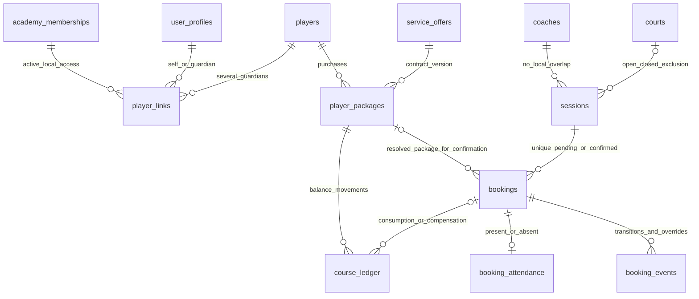
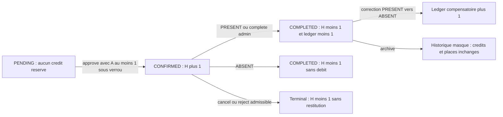

# Sport Connect Academy — Database Design Specification V1.1

## 1. Statut, portée et règle de lecture

Révision de convergence documentaire du **24 septembre 2026**, fondée sur [SPORT_CONNECT_DATABASE_DESIGN_V1.md](SPORT_CONNECT_DATABASE_DESIGN_V1.md) et les arbitrages humains fournis pour cette révision. L’architecture générale est approuvée sous réserve de ces arbitrages. **Aucun SQL, migration, RPC, policy, Edge Function, bucket ou code applicatif n’est créé ou exécuté.**

Ce document remplace les dispositions V1 indiquées ci-dessous ; les autres fiches du catalogue et analyses de V1 restent incorporées par référence. Il ne faut pas appliquer une ancienne alternative marquée Dxx à la place d’une décision résolue ici. V1 et [AUDIT.md](AUDIT.md) restent inchangés comme historique. Les numéros T01–T44, I01–I36, Q01–Q23 et D01–D33 conservent leur identité.

| Statut | Usage |
|---|---|
| CONFIRMED | Preuve du code local, telle que documentée dans l’audit ; aucune nouvelle observation de production |
| INFERRED | Interprétation ou conséquence démontrée sur le modèle, sans test runtime |
| MISSING | Information opérationnelle ou métier encore absente |
| PROPOSED | Traduction technique ou détail d’exécution soumis à revue finale |
| DECIDED — HUMAN | Arbitrage explicitement fourni pour cette révision ; ne signifie pas « déjà implémenté » |

Justifications conservées : A métier confirmé ; B correction d’un défaut confirmé ; C demande nouvelle explicite ; D intégrité/isolation SaaS. Les changements de cette révision relèvent de C, avec A/B/D indiqués selon leur effet.

**Bilan : 44 tables, dont 31 MVP_REQUIRED et 13 MVP_SUPPORTING.** Aucun `credit_holds`. Sur 33 décisions historiques, 17 sont résolues et 16 restent ouvertes. Une clarification nouvelle D34 concerne l’articulation quota override/réservation de crédits : **17 décisions ouvertes au total, 0 bloquante avant DDL**. D34 bloque la finalisation de la branche RPC de quota override, pas les tables ou index communs aux deux options. Aucun feu vert à implémenter n’est donné par le nombre zéro.

## 2. Arbitrages appliqués et dispositions V1 remplacées

| Décision | Contrat DECIDED — HUMAN | Disposition V1 remplacée |
|---|---|---|
| D02/D03 | Plusieurs GUARDIAN actifs ; au plus un principal et un contact financier actifs, éventuellement même lien ; aucun droit par le seul flag financier | Alternative mono-responsable, unicités conditionnelles et droits financiers implicites |
| D04 | ABSENT ne consomme aucun crédit | Consommation d’absence encore ouverte |
| D06 | Nouvelle ligne UUID après CANCELLED/REJECTED ; unique actif uniquement PENDING/CONFIRMED par séance/joueur | Unique incluant COMPLETED ou tout document non archivé |
| D07 | Pas de chevauchement coach dans la même academy ; aucun invariant global cross-academy | Exclusion coach optionnelle/non définie |
| D08 | OPEN et CLOSED bloquent court ; CANCELLED ne bloque pas | Choix de prédicat terrain ouvert |
| D09–D11 | Seulement capacity, age, offer/package, quota, player_overlap ; action correspondante et motif non vide ; jamais tenant/FK/court/solde négatif | Override session_state/date et droits implicites issus du rôle |
| D12 | price_basis obligatoire PACKAGE ou SESSION, sans valeur implicite legacy | Hypothèse tarifaire bloquant tout DDL |
| D14 | community_courses reste concept legacy neutre | Conversion possible en lieu/court ou blocage de nommage |
| D19 | V1 privée, sans accès anon aux tables métier ni catalogues ; assets privés/signés | Publication publique candidate et bucket public initial |
| D23 | Rôles fixes, pas de permissions libres par utilisateur ; périmètres métier/finance/accès séparés | Bundles encore indéterminés, STAFF avec finance facultative libre |
| D24 | numeric(18,2), XAF entier ; autres quatre devises ≤2 décimales ; aucune conversion implicite | Type/précision financière à arbitrer |
| D30 | CONFIRMED réserve logiquement le crédit ; calcul sous verrou package ; PENDING ne réserve rien | Absence de réservation de crédits et éventuelle nouvelle table holds |
| D31 | Archive COMPLETED sans effet place/crédit ; correction explicite compensatoire | Restitution automatique à l’archivage |
| D33 | Durées identiques/tranches chevauchantes autorisées ; une version publiée par academy/offer_key | Unicité globale academy/durée |

Ces décisions ne réécrivent pas les observations CONFIRMED de ChallengeMeAcademy. Elles modifient le comportement cible, notamment les crédits réservés, les gardiens multiples et la confidentialité du catalogue.

## 3. Catalogue de tables : modifications normatives

Les types/blocs ID, TEN, U, ACT, DEL, EVT, WHO de V1 §25 gardent leur expansion. `NN` signifie non nullable ; `?` nullable ; aucun nouveau default métier implicite. Toutes FK tenant, restrictions de suppression et règles d’immutabilité conservées sauf précision explicite ci-dessous.

### T13 — player_links : remplace la fiche V1

**PROPOSED A/B/C/D, choix de cardinalité DECIDED D02/D03.** TENANT, MVP_REQUIRED, classe PLAYER ; mutations assign_player_link/revoke_player_link/set_player_contacts. Colonnes inchangées : ID,TEN,U ; player_id uuid NN, user_id uuid NN, relationship text NN SELF/GUARDIAN ; is_primary boolean NN default false ; is_financial_contact boolean NN default false ; assigned_by uuid ?, revoked_at timestamptz ?, revoked_by uuid ?.

FK : `(academy_id,player_id)→players(academy_id,id)` ; `user_id→user_profiles.id` ; `(academy_id,user_id)→academy_memberships(academy_id,user_id)` ; acteurs→user_profiles. Pas de cascade destructive. Révocation, jamais effacement de l’histoire.

| Contrainte | Clé | Périmètre exact |
|---|---|---|
| PK | id | Toutes lignes |
| Unique tenant cible de FK | academy_id,id | Toutes lignes |
| Un lien actif par couple | player_id,user_id | revoked_at absent |
| Un SELF actif | player_id | revoked_at absent ET relationship=SELF |
| Un principal actif | player_id | revoked_at absent ET is_primary=true |
| Un contact financier actif | player_id | revoked_at absent ET is_financial_contact=true |

**Aucun unique « un lien actif par joueur »** : plusieurs GUARDIAN coexistent, ainsi qu’un éventuel SELF. Principal et financier peuvent être le même user_id ou deux user_id distincts. « Un seul » est une borne maximale ; absence de désignation n’est pas compensée en choisissant arbitrairement un guardian. Proposition de routage : primary désigné lorsqu’un envoi nécessite un responsable unique ; sinon erreur de routage à traiter, pas diffusion implicite à tous. Un lien SELF peut servir de contact pour un joueur autonome ; aucun CHECK ne restreint arbitrairement ces flags aux seuls GUARDIAN.

Le droit de lecture exige **profil actif + membership actif + player_link actif + action/relations autorisées**. is_financial_contact n’accorde aucun droit si un de ces contrôles échoue. Il n’accorde ni payments.confirm, ni invoices.issue, ni droits de rôle staff. Les changements de flags verrouillent player puis liens concernés, retirent ancien flag et attribuent nouveau dans une transaction ; les uniques protègent deux désignations concurrentes. Révoquer un lien désigné retire son rôle de contact actif ; aucune réattribution automatique. Audit avant/après obligatoire. Index I08 conservé.

Migration : seul lien prouvé dans les sous-collections/attributions source est créé ; pas de deuxième parent à partir du nom/email d’une facture. Les flags ne sont pas déduits de l’ordre des documents.

### T19 — service_offers : delta exhaustif de la fiche

**DECIDED D12/D24/D33 ; A/B/C.** Colonnes, FK, états DRAFT/PUBLISHED/RETIRED et immutabilité des versions publiées conservés. `price_basis text NN` CHECK PACKAGE/SESSION, **sans default**. Montant numeric(18,2) selon §5. `duration_minutes` n’est pas une identité commerciale.

Uniques conservés : PK id ; `(academy_id,id)` ; `(academy_id,offer_key,version)` ; `(academy_id,offer_key,id)` pour FK supersedes. **Unique publication : `(academy_id,offer_key)` restreint à status=PUBLISHED**, remplaçant l’unique V1 sur offer_key seul. Aucun unique academy/duration ; aucune exclusion de tranches d’âge. Plusieurs offres PUBLISHED distinctes peuvent avoir même durée, activité, type, prix ou plage d’âge.

La réservation fournit une version d’offre/package explicite : aucune sélection « premier résultat » lorsque plusieurs offres sont éligibles. publish_offer verrouille la série `(academy_id,offer_key)`, retire l’ancienne version courante puis publie la nouvelle atomiquement. FK de supersession dans même série ; incrément version contrôlé. I11 conservé ; **I11b supprimé du plan**.

Legacy : un prix dont la base PACKAGE/SESSION n’est pas prouvée reste NEEDS_REVIEW hors offre opérationnelle publiée. Pas de multiplication ou division par session_count pour deviner la base.

### T20 — player_packages : solde, disponibilité et états

**DECIDED D30 ; A/B/C/D.** Aucun ajout de colonne `available_sessions`, `reserved_sessions` ou hold. remaining_sessions integer NN default0 reste un cache transactionnel de la somme course_ledger.delta. purchased_sessions reste historique, pas une variable de disponibilité. Total_price numeric(18,2) selon §5. Les FK et uniques existants restent inchangés.

La disponibilité et le nombre de réservations sont **calculés** selon §6, jamais écrits par Flutter/Web. Toutes commandes changeant solde, état CONFIRMED, package_id ou interprétation d’un débit prennent le verrou du package. Le compte des réservations doit inclure toutes les réservations du package, indépendamment des droits de lecture partiels du demandeur : calcul interne serveur après autorisation, pas une somme de lignes filtrées côté client.

EXHAUSTED désigne remaining_sessions=0 après consommation, pas available_sessions=0 avec séances confirmées restantes. Un package ACTIVE peut avoir disponibilité0 et des réservations valides. Une correction de crédit peut le réactiver selon solde. ARCHIVED n’est permis qu’après traitement des confirmations rattachées ; archiver le forfait n’efface pas une réservation logique. Ajustement manuel négatif refuse de rendre le solde disponible négatif dans le parcours normal : pas de contournement de D30 par course_ledger.adjust.

### T21 — course_ledger : consommation et compensation

Append-only, mêmes colonnes et FK ; aucun mouvement pour PENDING→CONFIRMED ou pour annuler une réservation jamais débitée. Les raisons existantes, operation_id/effect_key et unique reverses_entry_id restent. Un debit de présence nouvelle est **SESSION_CONSUMED=-1**, une restitution PRESENT→ABSENT est ATTENDANCE_CORRECTION=+1 référençant le débit précis. Une nouvelle correction ABSENT→PRESENT est un nouveau SESSION_CONSUMED=-1 si crédit libre disponible, jamais une réactivation silencieuse de l’ancienne écriture.

Le net consommé est la somme des consommations et compensations **attribuées au booking**, pas tous les ajustements manuels du forfait. Invariant opérationnel par booking/package : débit net 0 ou1 ; toute ambiguïté legacy bloque l’effet automatique. PACKAGE_PURCHASE ou LEGACY_OPENING n’est pas un débit attribuable à une réservation. La correction autorisée et l’écriture ledger/solde se font dans la même transaction que la présence ; pas d’UPDATE d’un ancien mouvement.

### T22 — sessions : deux exclusions locales

**DECIDED D07/D08 ; B/C/D.** Colonnes/relations inchangées. Session OPEN ou CLOSED bloque le **court** et, pour traduction cohérente du planning, le **coach**. CANCELLED ne bloque ni l’un ni l’autre. CLOSED signifie inscriptions fermées, pas rendez-vous abandonné. Les séances adjacentes ne se chevauchent pas : intervalle semi-ouvert début inclus/fin exclue.

| Invariant transactionnel | Clé de ressource | Intervalle | Périmètre |
|---|---|---|---|
| Exclusion court, I16 | academy_id,court_id | starts_at..ends_at, bornes [) | court non NULL et état OPEN/CLOSED |
| Exclusion coach, I37 | academy_id,coach_id | mêmes bornes [) | état OPEN/CLOSED |

Direction PostgreSQL GiST/btree_gist reprise de V1, sans SQL livré. Le coach UUID est local ; aucune exclusion sur user_profiles.id, aucun planning global cross-academy. Une même personne coach dans A et B n’est pas empêchée par cette contrainte de travailler simultanément dans A et B. Deux opérations concurrentes même court/coach local sont arbitrées par la contrainte, pas une lecture « vérifier puis créer ».

capacity reste1..100 ; **pas de CHECK occupied_places≤capacity** puisque capacity override est autorisé. occupied_places reste exact : nombre de CONFIRMED + COMPLETED, y compris COMPLETED archivés. Le début futur et l’état OPEN ne sont plus dérogeables à la création/approbation de réservation ; la complétion d’une réservation passée est une autre commande, pas un override session_state.

### T23 — bookings : unicité, package et archivage

**DECIDED D06/D09/D30/D31 ; A/B/C/D.** PK UUID, colonnes et FK V1 conservées, dont FK enrichie package appartenant au même player/academy. Nouvel unique : **(session_id,player_id), uniquement si status=PENDING ou CONFIRMED**. Aucun filtre deleted_at dans cet unique : une ligne active ne devient pas contournable par simple archivage visuel. archive_booking doit annuler une ligne active atomiquement avant de l’archiver.

CANCELLED/REJECTED libèrent l’unicité, mais gardent leur UUID/événements. Une nouvelle demande crée un nouvel UUID et nouvelle operation_key ; rejouer l’ancienne operation_key renvoie l’ancien résultat, sans créer une nouvelle réservation. COMPLETED n’entre pas dans cet unique, conformément au prédicat humain. Il reste terminal : aucune réouverture. Le prédicat autorise structurellement une nouvelle ligne distincte après COMPLETED ; la RPC doit toujours appliquer ses validations de séance OPEN/future, âge, package et crédits. Aucun unique historique additionnel ni interdiction non demandée n’est ajouté. Le cas d’une complétion administrative avant début dépend encore de D29.

Un booking CONFIRMED nouveau dans le parcours ordinaire doit avoir un package explicite, compatible et résolu. package_id reste nullable dans le schéma pour états legacy/non opérationnels compatibles avec V1, **pas comme moyen d’éviter la réservation de crédit**. Legacy CONFIRMED sans package clair reste staging/quarantaine, n’est pas admis dans les opérations normales. Si quota override devait confirmer sans package, une nouvelle définition serait nécessaire : cette possibilité n’est pas validée et n’est pas activée par D09.

override_reason reste nullable pour les bookings sans override, obligatoire non blanc sinon. booking_events.OVERRIDE_USED conserve les actions exactes, motif, acteurs, contrôles remplacés et valeurs avant/après : un motif seul ne prouve pas qu’une permission a été vérifiée. Aucun override n’affaiblit FK/tenant/court/coach, type numérique ou solde physique non négatif.

Archive d’un COMPLETED : mêmes status, occupied_places, ledger, remaining_sessions et réservations logiques ; seules métadonnées DEL, revision et événement ARCHIVED changent. Toute correction ultérieure est une commande compensatoire explicite, jamais un effet caché d’archive.

### Autres fiches affectées

| Tables | Delta obligatoire |
|---|---|
| T02/T05/T07/T09/T10 | Rôles fixes et bundles §8 ; pas de permission libre par profil/membership ; supprimer bookings.override.session_state du catalogue cible |
| T06 academies / T29 tournaments | V1 privée : catalog_published/published hérités restent false et non modifiables par les RPC V1 ; CHECK false proposé pour empêcher publication accidentelle. Ces flags réservés n’ouvrent aucune policy |
| T19/T20/T23/T27/T28 | Toutes colonnes monétaires numeric(18,2), validation devise/unité §5 ; aucune valeur JSON ne remplace montant autoritaire typé |
| T24 booking_events | REQUESTED/SCHEDULED/APPROVED/CANCELLED etc. conservés ; événement expose effets hold_count_before/after, remaining_before/after et override flags dans metadata bornée, sans en faire source du solde |
| T25 booking_attendance | ABSENT ⇒ net consommé0 après transaction ; PRESENT ⇒ net consommé1 après transaction réussie ; correction conserve historique T24 |
| T33/T34/T35 | Plusieurs guardians ne signifient pas diffusion automatique ; routage au lien principal autorisé, sans accès implicite créé par financial_contact |
| T44 academy_assets | Ownership/MIME/hash/limites inchangés ; bucket privé, URL signée obtenue après autorisation ; aucun public URL permanent stocké comme droit |

### Couverture des 44 tables et frontières MVP

| IDs | Tables incorporées de V1 | Modification V1.1 |
|---|---|---|
| T01–T05 | user_profiles, permissions, platform_roles, platform_user_roles, platform_role_permissions | RBAC/grants privés pour catalogues ; identité inchangée |
| T06–T11 | academies, academy_roles, academy_memberships, academy_membership_roles, academy_role_permissions, academy_invitations | D19/D23 et ensembles de rôles ; structure hors flags inchangée |
| T12–T18 | players, player_links, coaches, stadiums, courts, communities, community_courses | Liens multiples ; cours legacy neutre ; aucune conversion court |
| T19–T26 | service_offers, player_packages, course_ledger, sessions, bookings, booking_events, booking_attendance, player_evaluations | D12/D24/D30/D33 ; deux exclusions ; unicité active et corrections |
| T27–T32 | academy_payments, academy_invoices, tournaments, platform_plans, academy_subscriptions, subscription_events | Montants, confidentialité et droits finance ; SaaS manuel inchangé |
| T33–T39 | academy_notification_recipients, notification_events, notification_deliveries, notification_payloads, notification_webhook_receipts, booking_reminders, audit_log | Routage local et effets réservations ; outbox/audit inchangés structurellement |
| T40–T44 | legacy_identity_map, legacy_entity_map, migration_issues, command_receipts, academy_assets | Prix/package ambigus restent incidents ; assets privés |

MVP_REQUIRED : T01–T10 et T12–T32 (31). MVP_SUPPORTING : T11 et T33–T44 (13). Pas de nouvelle table, pas de déplacement des supports hors MVP. La notation « V1.1 future » dans V1 §37 désignait une roadmap : elle ne rend pas support/billing avancé ou autres fonctions différées actifs dans cette révision documentaire.

## 4. FK et invariants conservés

V1 §26–28 restent applicables : ressources tenant academy_id NN, FK composites et clés enrichies pour player/package/booking, stadium/court, evaluation/session/coach ; profil Auth global séparé ; acteur dérivé auth.uid ; pas de cascade sur historiques. player_links exige simultanément profil et membership local, même avec flags principal/financier. Aucun override autorisé ne contourne ces contraintes.

L’exclusion coach ne requiert pas de nouvelle table ou FK globale. La réservation de crédits utilise FK existante bookings→player_packages et ledger→booking/package. Les champs package_id d’un booking qui a eu des effets de réservation/ledger sont immuables V1 : changer de package demande annulation/nouvelle réservation, pas déplacement d’un débit. Un client n’a aucune mutation directe de remaining_sessions, status, tenant, roles ou counters.

## 5. Contrat financier commun

**DECIDED D12/D24 ; A/B/C.** Champs concernés : service_offers.price, player_packages.total_price, bookings.amount_snapshot, academy_payments.amount, academy_invoices.amount. Type commun numeric(18,2), codes AED/XAF/EUR/USD/MAD ; montants positifs ou nuls selon fiche (payments/invoices strictement positifs, offers/packages/bookings peuvent être0).

| Devise | Validation fonctionnelle |
|---|---|
| XAF | Valeur entière uniquement ; 1000 et 1000.00 acceptables, 1000.25 rejeté |
| AED/EUR/USD/MAD | Au plus deux décimales ; 12.34 accepté, 12.345 rejeté |

Les inputs monétaires sont des chaînes décimales exactes ou nombres décimaux côté serveur, pas des floats faisant autorité. **Valider la précision avant affectation/cast numeric(18,2)** : un arrondi implicite du type ne constitue pas une validation. CHECK entier XAF sur chaque colonne typée ; validation de devise/taille/borne avant écriture. Même contrôle à l’import ; anomalie ≠ conversion automatique ou arrondi silencieux. Les snapshots JSON copient les valeurs validées, jamais une seconde autorité de calcul.

price_basis=PACKAGE : total contractuel = price de la version achetée. price_basis=SESSION : total contractuel = price × purchased_sessions, multiplication une seule fois et contrôlée contre capacité numeric(18,2). Version de prix et quantité figées dans package ; monnaie identique entre package/paiement/facture associés, aucun change implicite. Plusieurs offres éligibles nécessitent un choix explicite d’ID. Un montant de booking n’est toujours pas un encaissement.

## 6. Réservation logique de crédits — contrat D30

**DECIDED — HUMAN : pas de credit_holds et pas de cache client autoritaire.** Le modèle conserve trois nombres distincts par package :

- `R = remaining_sessions = somme des delta ledger` : crédit encore non consommé, entier ≥0.
- `H = confirmed_unconsumed_bookings` : nombre de bookings CONFIRMED rattachés à ce package dont le net consommé prouvé vaut0.
- `A = available_sessions = R − H` : disponibilité calculée sous verrou package.

Les nouvelles confirmations ont net consommé0 ; chaque booking vaut une séance/crédit. PENDING ne compte pas. COMPLETED/CANCELLED/REJECTED ne comptent pas, même non archivés. **Aucun filtre deleted_at ne fait disparaître un CONFIRMED du calcul** ; archive actif annule d’abord. Un legacy CONFIRMED dont le net consommé est prouvé1 ne réserve pas un deuxième crédit. Un net legacy inconnu ne vaut pas0 : il nécessite rapprochement avant admission opérationnelle, sinon le package ne peut pas être présenté comme disponible avec certitude.

### 6.1 Verrou et isolation

Toute commande qui ajoute/retire un CONFIRMED, écrit une consommation/compensation, ajuste un solde ou archive un package prend un verrou exclusif sur la ligne package concernée. Elle relit ensuite le solde et recompte H **après acquisition du verrou**. Règle d’isolation proposée : transaction READ COMMITTED, lectures de comptage exécutées après le verrou ; si isolation plus forte, gestion explicite des échecs de sérialisation et retry complet. Aucun comptage calculé avant l’attente ne peut être réutilisé.

Ordre conservé V1 : clé d’opération, profils/academy/memberships, players triés, sessions triées, packages triés, bookings triés, enfants. Lire préalablement les IDs immuables pour préparer cet ordre puis revalider les lignes verrouillées. Le verrou player ou session ne remplace pas le verrou package ; il protège d’autres invariants. Les contrôles comptent aussi les bookings invisibles à l’acteur, via logique interne bornée. Même règle pour jobs/imports/corrections privilégiées : aucun chemin direct ne réécrit les invariants.

### 6.2 Opérations ordinaires, hors quota override non tranché D34

| Commande | Précondition crédit | Effet atomique | Résultat disponibilité |
|---|---|---|---|
| request_booking | Package résolu et éligible ; A≥1 lors demande normale | Crée PENDING ; R/H inchangés | A inchangé ; aucune garantie de crédit jusqu’à approbation |
| schedule_booking normal | A≥1 après lock | Nouveau CONFIRMED ; H+1 ; aucun ledger | A−1 |
| approve_booking | PENDING, A≥1 après lock | CONFIRMED ; H+1 ; aucun ledger | A−1 |
| cancel/reject CONFIRMED non consommé | État/acteur admissibles | État terminal ; H−1 ; R inchangé, aucun ledger | A+1 |
| PRESENT depuis CONFIRMED non consommé | Sa réservation existe et net0 ; R≥1 | COMPLETED ; H−1 ; SESSION_CONSUMED−1 ; R−1 ; présence/events atomiques | A inchangé |
| ABSENT depuis CONFIRMED non consommé | Net0, réservation connue | COMPLETED ; H−1 ; R inchangé ; pas de débit | A+1 |
| complete_booking administratif | Réservation connue ; R≥1 ; règle temporelle D29 | COMPLETED source ADMIN ; H−1 ; SESSION_CONSUMED−1 ; R−1 ; aucune fausse présence | A inchangé |
| PRESENT→ABSENT sur COMPLETED | Débit net1 prouvé non compensé | +1 compensation référencée ; R+1 ; H inchangé ; présence corrigée | A+1 |
| ABSENT→PRESENT sur COMPLETED | Net0 et A≥1 après lock | Nouveau SESSION_CONSUMED−1 ; R−1 ; H inchangé | A−1 ; ne prend pas un crédit réservé à un autre booking |
| Archive COMPLETED | Autorisation archive | DEL/revision/event seulement | R/H/A et places inchangés |

Le passage CONFIRMED→COMPLETED n’écrit donc pas systématiquement −1 : **D04 prévaut pour ABSENT**, et un legacy déjà débité ne doit pas l’être à nouveau. complete_booking administratif consomme mais ne prétend pas constater PRESENT. Une observation ultérieure ABSENT compense son débit prouvé une fois ; observation PRESENT ne débite pas à nouveau.

Compensation d’un legacy déjà consommé lors annulation : seulement si le débit et la politique d’annulation sont prouvés, opération compensatoire explicitement auditée. Le cas courant CONFIRMED non consommé n’appelle aucune restitution. Absence de courseDebited historique n’est jamais traduite en « crédit à rendre ».

### 6.3 Invariants et répétition

Parcours normal : R≥0 et H≤R, donc A≥0. Une réservation déjà titulaire de son crédit peut être consommée lorsque A=0 : ce zéro signifie qu’il n’y a plus de crédit **libre**, pas que le booking a perdu son crédit réservé. Vérifier le propre hold logique + R≥1, pas A≥1 à la présence depuis CONFIRMED. À l’inverse, correction ABSENT→PRESENT depuis COMPLETED n’a plus de hold et exige A≥1.

Net de consommation par booking/package limité à0 ou1. Retry même operation_key retourne le reçu sans second effet ; nouvelle operation_key pour une présence déjà identique renvoie NO_CHANGE après revalidation, sans ledger/outbox supplémentaire. expected_revision empêche une correction concurrente de remplacer silencieusement une autre. Pour toute compensation, unique reverses_entry_id protège le débit précis ; la chaîne des corrections est auditable.

### 6.4 D34 — quota override et crédit disponible

**Nouvelle tension à clarifier, aucune décision humaine inventée.** D09 autorise quota override ; D30 fait compter chaque CONFIRMED non consommé dans H. Avec R=1,H=1, une seconde confirmation sans nouveau crédit donne H=2,A=−1. R n’est pas négatif, mais deux confirmations n’ont plus chacune un crédit couvert. On ne peut affirmer simultanément « tout CONFIRMED réserve un crédit couvert », « override confirme sans crédit » et « H≤R toujours ».

Deux interprétations restent représentables avec les mêmes tables/index :

1. **Recommandation conservatrice** : quota override dispense de l’éligibilité de quota pour enregistrer PENDING ; toute confirmation attend A≥1. Aucun crédit fictif, aucune sur-réservation. La commande staff retourne explicitement PENDING et événement REQUESTED/OVERRIDE_USED, pas un succès CONFIRMED annoncé à tort.
2. **Sur-réservation explicite** : rôle habilité confirme malgré A<1, donc A peut devenir négatif ; R reste≥0. Tous CONFIRMED sont comptés, sans exemption cachée. Il faut alors fixer quelles présences peuvent consommer et dans quel ordre, et comment résorber le déficit ; le modèle de simple comptage ne donne pas une priorité individuelle. Aucun débit de complétion ne peut rendre R négatif.

**Tant que D34 n’est pas tranchée, la branche quota override de confirmation retourne QUOTA_OVERRIDE_POLICY_UNRESOLVED.** Les confirmations ordinaires respectent A≥1. Pas de champ has_hold, hold_exempt, de crédit gratuit automatique, de booking sans package ou de table holds inventé pour résoudre la contradiction. Les actions d’override restent dans le catalogue ; leur attribution ne décide pas la sémantique financière. D34 bloque cette branche RPC et son activation MVP, pas le DDL commun.

### 6.5 Vérification conceptuelle des sept scénarios demandés

Ces traces sont une **vérification raisonnée**, pas des tests SQL/concurrence exécutés. Notation `(R,H,A)` ; chaque étape est observée après commit ou après lock+relecture. Les validations session/joueur/tenant et les contraintes restent requises.

| Scénario | Trace sous verrou package | Résultat attendu |
|---|---|---|
| 1. Dernier crédit, deux approbations simultanées | Départ(1,0,1). A lock puis confirme ⇒(1,1,0). B attend ; après acquisition relit(1,1,0), refuse A<1 | Un seul CONFIRMED ; deuxième PENDING, CREDIT_UNAVAILABLE ; aucun ledger. Si A rollback, B peut réussir. Même résultat pour deux sessions différentes |
| 2. Confirmation puis annulation | (1,0,1)→confirmation(1,1,0)→CANCELLED(1,0,1) | Aucun mouvement ledger ; nouveau booking UUID permis ensuite, ancienne ligne conservée |
| 3. Confirmation puis présence | (1,1,0)→COMPLETED PRESENT + ledger−1→(0,0,0) | A=0 avant présence n’empêche pas l’usage du crédit réservé ; place reste occupée, un seul débit |
| 4. Double présence/retry | Première consomme et enregistre reçu. Retry même clé relit reçu ; nouvelle clé même observation détecte net1/état identique | Toujours(0,0,0), un débit, pas de double completion/outbox ; correction obsolète refuse revision |
| 5. PRESENT→ABSENT | COMPLETED net1,(0,0,0)→compensation+1 et ABSENT→(1,0,1) | H reste0, un crédit rendu exactement une fois ; retry ne rend pas encore. Nouvelle confirmation peut ensuite réserver ce crédit |
| 6. Staff quota override | Départ R=1,H=1,A=0 ; demande de deuxième confirmation avec action et motif | D34 non tranchée : refus contrôlé sans effet. Option1 garde une demande PENDING ; option2 produirait(1,2,−1) et nécessite politique de consommation explicite ; aucun solde R négatif admis |
| 7. Legacy sans package clair | Pas de package à verrouiller ni de consommation prouvée ; matching par nom interdit | Staging QUARANTINED/NEEDS_REVIEW, aucune confirmation/présence/compensation opérationnelle ; issue audité. Ne pas choisir package courant arbitrairement |

Scénarios complémentaires : cancel et PRESENT concurrents sérialisent ; le premier état terminal gagne, second revalide et refuse ou suit correction autorisée. PRESENT→ABSENT puis nouvelle confirmation puis ABSENT→PRESENT : la dernière correction refuse si A=0, elle ne vole pas le crédit réservé. Ajustement manuel négatif concurrent avec approve est sérialisé et refuse de rendre R<H dans parcours normal. Deux modifications de contacts sont protégées par verrous et uniques ; deux publications d’une offre par unique de série.

## 7. Index Strategy convergente

PK/FK/uniques non mentionnés restent V1 §25/29. Aucun index pour une colonne inexistante ; aucune partition ni index « au cas où ». Qxx réfère aux requêtes de l’audit.

| Index/contrainte | Table et colonnes | Prédicat | Unicité / justification |
|---|---|---|---|
| Liens actifs | player_links(player_id,user_id) | revoked_at absent | Unique, lien courant ; plusieurs guardians différents autorisés |
| SELF actif | player_links(player_id) | actif et relationship=SELF | Unique, ne supprime pas guardians |
| Principal / financier | Deux index player_links(player_id) distincts | actif et is_primary / actif et is_financial_contact | Uniques séparés D02/D03 |
| I08 | player_links(user_id,academy_id,player_id) | actif | Non unique, Q03/Q05, accès responsable→joueurs |
| Booking actif | bookings(session_id,player_id) | status PENDING/CONFIRMED | Unique D06, aucun filtre deleted_at, COMPLETED exclu |
| Publication courante | service_offers(academy_id,offer_key) | status=PUBLISHED | Unique D33 ; remplace offer_key seul |
| I11 | service_offers(academy_id,activity,session_type,min_age,id) | PUBLISHED | Non unique, Q08/Q12 ; tranches chevauchantes permises |
| I11b | **Supprimé du contrat** | — | Aucun unique academy/duration |
| I16 | sessions GiST : academy_id égal,court_id égal,intervalle [) chevauchant | court non NULL et OPEN/CLOSED | Exclusion court, Q10/D08 |
| I37 — nouveau | sessions GiST : academy_id égal,coach_id égal,intervalle [) chevauchant | OPEN/CLOSED | Exclusion coach locale D07, planning Q06 ; pas user_id global |
| I38 — nouveau | bookings(academy_id,package_id,id) | status=CONFIRMED et package_id non NULL | Non unique ; comptage H sous lock D30, y compris lignes non visibles au client ; pas de condition deleted_at |
| I39 — nouveau | course_ledger(academy_id,package_id,booking_id) avec delta,reason en colonnes incluses | booking_id non NULL | Non unique ; agréger net de consommation des candidats I38, corrections/reconciliation ; complément de l’historique I13(package_id,created_at,id) |
| I23 — remplacé | tournaments(academy_id,starts_at,id) | status=OPEN et deleted_at absent | Non unique, catalogue **privé** local Q16 ; aucun published=true dans prédicat V1.1 |

Pour H : sélectionner CONFIRMED via I38, agréger les mouvements attribués aux bookings candidats via I39, retenir net0 ; nouveau booking sans débit ⇒net0 connu, legacy sans preuve⇒incident et admission refusée. La somme du ledger n’est pas recalculée côté client. I18(session_id,status,id) protège toujours lectures de capacité ; il ne remplace pas I38 pour un package utilisé sur plusieurs séances.

L’unique actif `(session_id,player_id)` et I18 servent respectivement la déduplication active et les lectures de participation/occupation de la séance. Un index d’exclusion n’est pas dupliqué par un GiST identique. Les index H sont motivés par la nouvelle commande D30 et les parcours Q05/Q09, pas par une requête Firebase supposée déjà existante.

## 8. RBAC fixe et matrice des overrides

**DECIDED D23 :** rôles ACADEMY_OWNER, ACADEMY_ADMIN, MANAGER, STAFF, COACH, STUDENT, PARENT. Plusieurs rôles sur un membership s’additionnent dans cette seule academy. Aucun champ permissions libre par utilisateur, aucun grant ad hoc financier à STAFF. Les catalogues sont contrôlés/versionnés côté socle, pas modifiables via écran « permission utilisateur ».

Traduction technique proposée des responsabilités approuvées :

| Bundle | Actions accordées, avec contrôles de ressource toujours nécessaires |
|---|---|
| ACADEMY_OWNER | Gestion locale academy/branding/notifications ; memberships read/invite/set_roles/suspend/transfer_owner ; joueurs/liens ; toutes actions sport/planning/bookings ; correction pédagogique dédiée ; packages/crédits ; paiements/factures ; audit tenant ; pas de rôle plateforme implicite |
| ACADEMY_ADMIN | Même gestion locale, y compris memberships et finance ; pas transfer_owner ni auto-attribution OWNER ; ne peut retirer/provoquer absence du dernier owner |
| MANAGER | Joueurs/liens, ressources sportives, coachs, offres, séances, tournois ; bookings schedule/approve/reject/cancel/complete/archive ; lecture pédagogique et correction dédiée ; solde sportif/ledger expurgé. **Pas memberships.invite/set_roles/suspend, pas finance, pas achat/activation/ajustement monétaire ou de crédits arbitraire** |
| STAFF | Catalogues locaux en lecture, joueurs en projection opérationnelle, sessions.read/create pour séance ponctuelle ; bookings.read/schedule/approve/reject/cancel/complete/archive ; solde disponible utile au booking. Pas gestion de rôles, finance, édition d’offres/terrains/communautés, ajustement crédits, évaluation ou correction de présence autonome |
| COACH | Profil propre, ses séances/joueurs/bookings en projection limitée ; attendance.read/record/correct et evaluations.read/record/correct sur affectation ; pas accès général aux liens famille/finance/ledger/catalogues de gestion |
| STUDENT | SELF lié : lecture dossier/historique/presence/évaluation ; identité limitée ; catalogue tenant et demande/réjection booking staff/annulation selon D05 ; aucun solde modifiable |
| PARENT | Même périmètre via GUARDIAN actif ; création joueur lié admise ; aucun accès aux autres joueurs du tenant |

create_coach pour MANAGER associe un membership existant déjà autorisé COACH ; créer/inviter ce membership ou changer son rôle relève Owner/Admin. Cela évite un droit indirect de gestion de rôles via « créer coach ». L’attribution multi-rôles exige la commande memberships.set_roles autorisée et auditée ; elle n’introduit pas des permissions libres.

**Override : contrôle d’action distinct obligatoire à chaque appel.** Le rôle n’est jamais testé comme bypass universel. Le mot `offer` dans le code de permission couvre la dérogation offre/package **compatible avec les FK et le contrat du package réellement consommé** ; pas droit de prendre le forfait d’un autre joueur, changer sa devise ou réécrire un achat.

| Dérogation | Permission exacte | Owner/Admin | Manager | Staff | Coach/Student/Parent | Limites |
|---|---|---|---|---|---|---|
| Capacité | bookings.override.capacity | Accordée dans bundle proposé | Accordée | Non accordée | Non accordée | Peut dépasser capacity, compteur exact ; pas conflit terrain |
| Âge | bookings.override.age | Accordée | Accordée | Non accordée | Non accordée | Ne falsifie pas âge enregistré |
| Offre/package | bookings.override.offer | Accordée | Accordée | Non accordée | Non accordée | Package résolu du même joueur/tenant, prix contractuel conservé |
| Quota | bookings.override.quota | Accordée, branche D34 suspendue | Accordée, branche D34 suspendue | Non accordée | Non accordée | Ne crée jamais crédit/solde négatif ; confirmation insuffisante non activée sans D34 |
| Chevauchement joueur | bookings.override.player_overlap | Accordée | Accordée | Non accordée | Non accordée | Ne lève pas exclusion coach/court ; événement d’override |
| État/date de séance | **Aucune permission** | Interdit | Interdit | Interdit | Interdit | Pas de bookings.override.session_state ; OPEN/future obligatoire pour création/approbation |
| Tenant/FK/court/coach/solde R négatif | **Aucune permission** | Interdit | Interdit | Interdit | Interdit | Aucune branche de dérogation |

L’attribution précise des cinq actions aux bundles Owner/Admin/Manager, sans STAFF, est une traduction **PROPOSED pour revue finale**, cohérente avec gestion sportive D23 ; ce n’est pas une nouvelle permission utilisateur implicite. Motif `trim(reason)` non vide obligatoire, longueur1..1000 proposée. La commande calcule les contrôles effectivement dérogés ; aucun flag ne neutralise une validation non listée. L’ensemble exact des actions accordées est stocké dans academy_role_permissions ; tests doivent démontrer qu’un rôle sans action ne peut pas l’utiliser, même s’il sait appeler la RPC.

## 9. Access Matrix convergente

Remplace V1 §31. Toute cellule de mutation signifie **RPC autorisée sous contrôles**, jamais INSERT/UPDATE/DELETE client libre. `L` = local tenant ; `J` = SELF/GUARDIAN actif ; `C` = séances et joueurs affectés ; `soi` = identité propre ; `—` refusé. Aucune cellule publique/anon. Le rôle PLATFORM_ADMIN garde accès SaaS/métadonnées, pas aux sports/finances personnels sans membership local approprié. SUPER_ADMIN ajoute administration des rôles plateforme, pas bypass pédagogique.

| Ressource / action | Platform Admin | Academy Owner | Academy Admin | Manager | Coach | Staff | Student | Parent |
|---|---|---|---|---|---|---|---|---|
| Profil : read/update_my_profile | soi | soi | soi | soi | soi | soi | soi | soi |
| academy.create/read_metadata/set_status | oui | — | — | — | — | — | — | — |
| academy.read/update/branding | metadata seule | L/oui/oui | L/oui/oui | L/read | limitée C | L/read | catalogue local | catalogue local |
| memberships.read | plateforme minimale | L | L | annuaire minimum | soi | annuaire minimum | soi | soi |
| memberships.invite/set_roles/suspend | premier owner seulement | oui | oui hors OWNER | — | — | — | — | — |
| memberships.transfer_owner | — | oui | — | — | — | — | — | — |
| players.read | — | L | L | L | C limité | projection opérations | J | J |
| players.create/update_identity/archive | — | oui | oui | oui | — | — | soi lié/champs propres/pas archive | enfant lié/champs limités/pas archive |
| player_links.read/assign/revoke/set_contacts | — | L/oui | L/oui | L/oui | — | relation opérationnelle minimale/read | ses liens read | ses liens read |
| coaches/resources/offers.read | — | L | L | L | ses affectations seulement | catalogue opérationnel | catalogue local minimum | catalogue local minimum |
| coaches.create/archive | — | oui | oui | membership COACH existant seulement | — | — | — | — |
| stadiums/courts/communities/community_courses.create/update/archive | — | oui | oui | oui | — | — | — | — |
| service_offers.create/publish/retire | — | oui | oui | oui | — | — | — | — |
| sessions.read | — | L | L | L | C | L | catalogue local | catalogue local |
| sessions.create/close/cancel | — | oui | oui | oui | — | create ponctuel uniquement | — | — |
| bookings.read | — | L | L | L | C limité | L opérations | J | J |
| bookings.request | — | si lien ou schedule | si lien ou schedule | si lien ou schedule | rôle/lien distinct requis | rôle/lien distinct requis | J | J |
| bookings.schedule/approve | — | oui | oui | oui | — | oui sans override | — | — |
| bookings.reject | — | oui | oui | oui | — | oui | J staff booking admissible | J staff booking admissible |
| bookings.cancel | — | oui | oui | oui | — | oui | J selon D05 | J selon D05 |
| bookings.complete/archive | — | oui | oui | oui | — | oui | — | — |
| bookings.override.* autorisés | — | action+raison, D34 | action+raison, D34 | action+raison, D34 | — | — | — | — |
| attendance.read/record/correct | — | L/correction dédiée | L/correction dédiée | L/correction dédiée | C/C/C | read opérationnel, pas correction | J read | J read |
| evaluations.read/record/correct | — | L/correction dédiée | L/correction dédiée | L/correction dédiée | C/C/C | — | J read | J read |
| packages.read / course_ledger.read | — | L | L | solde/ledger sportif expurgé | indicateur C seulement | solde disponible uniquement | J sportif | J sportif |
| packages.purchase/activate_credit/archive ; course_ledger.adjust | — | oui | oui | — | — | — | — | — |
| payments.read/record/confirm | — | L/oui/oui | L/oui/oui | — | — | — | J read autorisé seulement | J read autorisé seulement |
| invoices.read/issue | — | L/oui | L/oui | — | — | — | J read autorisé seulement | J read autorisé seulement |
| tournaments.read | — | L | L | L | affectation métier si applicable | L | catalogue local | catalogue local |
| tournaments.create/update/archive/cover_upload | — | oui | oui | oui | — | — | — | — |
| plans.read/write et subscriptions.read/transition | oui | son abonnement read | son abonnement read | — | — | — | — | — |
| notifications recipients / metadata / retry | — | oui/L/oui | oui/L/oui | — | — | — | — | — |
| audit.read | plateforme | tenant expurgé | tenant expurgé | — | — | — | — | — |
| Payloads/receipts/mappings/command_receipts | — | — | — | — | — | — | — | — |

Finance liée : une facture/paiement sans player_id validé n’est pas exposée à un compte par nom/email de snapshot. Le lien et le rôle SELF/GUARDIAN autorisés donnent le périmètre de lecture prévu ; le flag financial_contact sert au contact désigné, **pas à contourner les checks**, ni à conférer le droit d’émettre/confirmer. La distinction principal/financier n’invente pas une facture invisible aux autres guardians autorisés ; si une confidentialité différente entre responsables est demandée, elle nécessitera une politique nouvelle explicite.

## 10. RLS, catalogues, Storage et Realtime privés

**DECIDED D19 ; C/D.** Aucun grant anon aux tables métier, vues/catalogues ou fonctions de lecture métier ; aucune policy publique. Inscription/connexion Supabase Auth peut rester accessible selon parcours Auth, sans ouvrir catalogues applicatifs. Les clauses V1 « P », « projection publiée publique », « lecture tournoi publique » sont retirées. `public` dans un nom de schéma ne signifie pas que les lignes sont publiques.

Toutes lectures tenant : profil actif + membership actif + action/relations §9. Un parent membre de A ne lit pas catalogue B. Coach n’obtient pas annuaire/joueurs d’une academy par simple membership. Les catalogues globaux de codes non personnels restent réservés aux comptes authentifiés ayant besoin d’eux ; attributions et annuaires sont des projections limitées. Platform Admin n’obtient pas une lecture sportive générale. Les helpers privés, search_path fixé, invoker views ou projections contrôlées et grants par colonnes de V1 restent.

Les calculs R/H/A ne sont pas des lignes éditables ni un endpoint permettant de tester le solde d’un package arbitraire. Projection solde pour joueur lié/staff opérations ; lecture finance distincte. Les mutations critiques et modifications de contacts/roles passent par RPC, sans UPDATE direct client. service_role implique toujours contrôles serveur ; ne pas croire qu’une policy l’empêche de contourner les droits.

**Storage initial : un seul bucket privé `academy-private-assets`**, remplaçant le nom V1 `academy-public-assets` pour éviter une promesse trompeuse. Aucun bucket créé ici. Même arborescence `academies/{academy_id}/branding/{asset_id}.{ext}` et `academies/{academy_id}/tournaments/{tournament_id}/{asset_id}.{ext}` ; mêmes MIME/signature/hash/taille et ownership T44. Logo/couverture lus uniquement après autorisation tenant ; URL signée à durée courte, TTL de déploiement explicitement configuré, aucun token/url permanent comme autorisation. Une URL signée déjà émise reste utilisable pendant sa validité : éviter de promettre révocation instantanée ; ne pas la diffuser sur canal/public log. Future publication implique une nouvelle revue, pas activation d’un flag par la V1.

Realtime conserve invalidations minimales privées V1 §34, pas publication brute des tables ou snapshots. Admission canal authentifiée, scope tenant/lien/affectation, relecture RLS ; révocation de rôle/membership/lien et purge cache testées avant activation. Une disponibilité diffusée est indicative ; la confirmation recalcule A sous verrou. Aucun canal anon de catalogue ajouté.

## 11. RPC Catalog — contrats révisés

Les conditions communes C0 de V1 §32 restent : acteur auth.uid vérifié, academy explicite, operation_key UUID, expected_revision pour objet existant versionné, hash tenant+arguments, reçu idempotent, audit dans transaction, erreurs sans fuite cross-tenant. Une erreur rollback état/compteurs/ledger/outbox ensemble. Même clé ne réexécute pas les effets ; changement de payload même clé = IDEMPOTENCY_CONFLICT.

Lecture commune : profile/membership/roles, academy, relations de ressource ; verrous ordre §6.1. Les colonnes de scope et package sont revalidées après verrou. L’audit et les booking_events sont distincts de la livraison email. Aucun appel HTTP dans ces commandes. Output commun : operation_id, resource_id, revision, outcome ; valeurs R/H/A uniquement si autorisées.

### 11.1 Réservations et présence — remplace les huit contrats V1

| RPC / acteur et inputs | Lectures et locks spécifiques | Mutation, validation, résultat | Audit/outbox/idempotence/erreurs métier |
|---|---|---|---|
| request_booking ; SELF/GUARDIAN bookings.request ; session_id,player_id,package_id,offre explicite,note?,community_course_id? + C0 | Lit liens/offres/joueur/séance/overlap/package/ledger ; locks player→session→package ; recompte A | Séance OPEN/future, joueur/package éligibles, tenant/FK, place, âge/type/activité, A≥1 ; crée PENDING, pas de place ni de crédit réservé. IDs compatibles prouvés | REQUESTED et BOOKING_REQUESTED ; C0 ; CREDIT_UNAVAILABLE,INELIGIBLE,DUPLICATE_ACTIVE_BOOKING,SESSION_CLOSED,PLAYER_CONFLICT |
| schedule_booking ; bookings.schedule + chaque action override ; mêmes IDs,override_flags[],reason + C0 | Même graphe et lock package obligatoire ; contrôles non dérogeables puis flags exacts | Crée CONFIRMED ordinaire si A≥1 ; H+1, occupation+1, R inchangé ; client_can_reject=true. Dérogations seulement cinq §8 ; insuffisance+quota action ⇒D34, pas confirmation implicite | SCHEDULED, OVERRIDE_USED si applicable ; BOOKING_SCHEDULED + reminder ; C0 ; OVERRIDE_NOT_ALLOWED,REASON_REQUIRED,QUOTA_OVERRIDE_POLICY_UNRESOLVED,CREDIT_UNAVAILABLE |
| approve_booking ; bookings.approve + override éventuel spécifique ; booking_id,override_flags[],reason?,revision + C0 | Relit package explicite/offre/session/joueur/bookings ; player→session→package→booking puis compte A | PENDING→CONFIRMED seulement ; OPEN/future et validations recomptées ; A≥1 ordinaire ; H+1, occupation+1, aucun débit ; flags ne changent pas package/tenant | APPROVED + éventuel OVERRIDE_USED ; BOOKING_APPROVED + reminder ; C0 ; INVALID_STATE,STALE_REVISION,CREDIT_UNAVAILABLE,SESSION_FULL,QUOTA_OVERRIDE_POLICY_UNRESOLVED |
| reject_booking ; staff bookings.reject sur PENDING, ou responsable autorisé sur CONFIRMED client_can_reject ; id/reason/revision | Lock package et booking, contrôle net consommé | PENDING→REJECTED sans hold ; CONFIRMED non consommé→REJECTED libère H et place sans ledger ; debit legacy prouvé traité explicitement, inconnu refuse | REJECTED, BOOKING_REJECTED, reminder invalidé ; C0 ; MEMBER_REJECTION_DISABLED,INVALID_STATE,LEGACY_CREDIT_UNRESOLVED |
| cancel_booking ; bookings.cancel ou lien/créateur selon D05 ; id,reason,revision | Lit date/état/ledger/package ; mêmes locks ; acteur et règle annulation revalidés | PENDING/CONFIRMED→CANCELLED ; occupation0/−1 ; CONFIRMED net0 : H−1, R inchangé, **aucun crédit rendu** ; net1 legacy nécessite compensation prouvée et politique admissible | CANCELLED, BOOKING_CANCELLED, reminder invalidé ; C0 ; CANCELLATION_WINDOW_CLOSED,INVALID_STATE,LEGACY_CREDIT_UNRESOLVED |
| record_attendance ; coach affecté attendance.record/correct ou correction pédagogique dédiée ; id,attended,revision,reason correction | Lit session/affectation/heure, attendance,booking,package,net ledger ; lock package avant décision | CONFIRMED→COMPLETED : présent net0 consomme −1 tout en libérant H ; absent net0 libère H sans debit. COMPLETED correction présent→absent compense ; absent→présent exige A≥1 et nouveau debit. Même observation=NO_CHANGE. R jamais<0 | ATTENDANCE_RECORDED/CORRECTED ; aucune nouvelle notification, reminder invalidé ; C0 + unique compensation ; TOO_EARLY,COACH_MISMATCH,CREDIT_UNAVAILABLE,LEGACY_CREDIT_UNRESOLVED |
| complete_booking ; bookings.complete ; id,reason,revision | Lit séance/booking/package/ledger ; locks package/booking | CONFIRMED→COMPLETED source ADMIN ; supprime hold logique, consomme −1 si net0, pas double debit si net1 prouvé ; R≥1 pour nouveau debit ; D29 pour avant début ; aucune présence fabriquée | COMPLETED ; aucune notification nouvelle, reminder invalidé ; C0 ; INVALID_STATE,TOO_EARLY,CREDIT_UNAVAILABLE,LEGACY_CREDIT_UNRESOLVED |
| archive_booking ; bookings.archive ; id,reason,revision | Lit état/package/ledger ; mêmes locks | COMPLETED : DEL/revision uniquement, occupation/R/H intacts. CANCELLED/REJECTED : DEL seulement. Actif : appel interne cancel autorisé puis DEL dans même tx ; pas bypass fenêtre d’annulation | ARCHIVED + CANCELLED si actif ; outbox cancellation uniquement actif ; C0 ; INVALID_STATE,CANCELLATION_WINDOW_CLOSED,LEGACY_CREDIT_UNRESOLVED |

Approbation n’admet jamais un montant/date/quota lu avant attente. Une erreur de crédit laisse PENDING, sans incrément place/outbox. Capacité et H sont vérifiés dans la même transaction ; un compte de place ne prouve pas la disponibilité de crédit. Pour un booking confirmé normal, le crédit réservé est transféré vers consommation atomiquement, pas libéré dans une transaction puis débité dans une autre.

### 11.2 Autres commandes affectées — deltas complets

| RPC | Inputs / acteur | Reads/locks/writes et validations remplacées | Output / audit / outbox / erreurs |
|---|---|---|---|
| assign_player_link | player_id,user_id,SELF/GUARDIAN ; Owner/Admin/Manager autorisé + C0 | Lock player+links ; profil/membership local ; T13 autorise plusieurs GUARDIAN, unique SELF et couple actif ; flags false sauf set_contacts explicite | link_id ; player_link.assigned ; aucune outbox ; ACTIVE_LINK_EXISTS,SELF_ALREADY_LINKED |
| revoke_player_link / set_player_contacts | link_id / player_id,primary_link_id?,financial_link_id? ; même gestion + C0 | Lock player et liens triés ; cibles actives appartenant joueur ; retire ancien flag puis nouveau ; révoquer ne désigne pas successeur ; aucune finance permission créée | liens/revision ; audit before/after ; aucune ; INVALID_LINK,CONTACT_CONFLICT |
| create_offer / publish_offer / retire_offer | champs offre dont price_basis obligatoire, version explicite ; Owner/Admin/Manager | Lock série academy/offer_key ; T19 ; devise/précision avant cast ; pas contrôle doublon durée/tranche ; unique version publiée dans série | offer_id/version ; offer.* ; aucune ; PRICE_BASIS_REQUIRED,INVALID_AMOUNT,VERSION_CONFLICT |
| create_session | IDs offre/coach/stade/terrain,dates/capacité ; Owner/Admin/Manager ou STAFF sessions.create | Lit rôles/parents ; même academy ; future, durée/capacité ; exclusions court **et coach local** à l’écriture ; pas bypass | session_id ; session.created ; aucune ; COURT_CONFLICT,COACH_CONFLICT,INVALID_SESSION |
| close_session / cancel_session | id/raison/revision ; Owner/Admin/Manager | CLOSED continue bloquer court/coach. CANCELLED traite bookings actifs via moteur en ordre canonique, libère H non consommés sans ledger ; batch atomique borné sinon refuse | session/revision ; session.closed/cancelled + événements bookings ; cancellation emails concernés seulement ; INVALID_STATE,TOO_MANY_BOOKINGS |
| purchase_package / activate_package_credit | champs achat ou package/payment ; Owner/Admin finance | Montant exact et price_basis ; confirmation de paiement total unique ou gratuit explicite ; lock package ; ledger PURCHASE unique. Pas attribution libre de crédits par Manager/Staff | package/R/H/A ; package.* ; aucune ; INVALID_AMOUNT,PAYMENT_REQUIRED,ALREADY_ACTIVATED |
| adjust_course_credit | package_id,delta,reason ; Owner/Admin course_ledger.adjust | Lock package puis recompute R/H ; ledger adjustment + cache même tx ; delta négatif refuse R'<0 **ou R'<H** parcours normal ; pas de mouvement ad hoc lié booking pour contourner compensation | R/H/A ; package.credit_adjusted ; aucune ; NEGATIVE_BALANCE,RESERVED_CREDIT_CONFLICT |
| archive_package | package_id,reason ; Owner/Admin | Lock package ; aucun CONFIRMED dépendant non traité ; pas effacement solde/ledger | status ; package.archived ; aucune ; PACKAGE_IN_USE |
| record_payment / confirm_payment / issue_invoice | champs finance ; Owner/Admin exclusivement | Même contrats V1 ; devises/précision §5 avant cast, cohérence montant package, attribution compte par FK ; pas accès STAFF ou Manager | paiement/facture ; finance audit ; aucune email nouvelle ; INVALID_AMOUNT,CURRENCY_MISMATCH,FORBIDDEN |
| set_membership_roles / invite_member / suspend_membership | membership/roles fixes ; Owner/Admin | T08/T09/T11 sous lock academy ; pas liste permissions libre, aucun rôle custom ; dernier owner, pas auto-escalade | attributions/invitation ; audit ; invitation uniquement workflow existant ; INVALID_ROLE,FORBIDDEN,LAST_OWNER |
| prepare_asset / finalize_asset / read_asset_url | branding/tournoi,asset metadata ou asset_id ; action upload ou droit lecture local | Vérifie ownership/tenant/rôle ; bucket privé seulement ; finalize garde validations binaires T44 ; read_asset_url émet signature courte côté serveur après auth | asset/path ou URL signée ; audit mutation, pas token log ; pas outbox ; FORBIDDEN,INVALID_MEDIA,ASSET_NOT_READY |

`read_asset_url` est une lecture serveur/Edge Storage, pas une fonction SQL générant une clé de signature. Aucune modification implicite d’un bucket ou policy dans cette phase. Les commandes non listées restent V1 §32 avec bundles §8–9 et privé §10 ; aucune branche ne conserve l’ancien droit STAFF finance ou PUBLIC.

### 11.3 Erreurs et sorties à stabiliser

CREDIT_UNAVAILABLE peut exposer A au propriétaire/staff autorisé du package, jamais au demandeur hors scope ; message générique sinon. LEGACY_CREDIT_UNRESOLVED renvoie identifiant d’incident uniquement aux gestionnaires autorisés. QUOTA_OVERRIDE_POLICY_UNRESOLVED ne convertit pas silencieusement CONFIRMED en PENDING. Un résultat PENDING éventuel de l’option1 D34 devra faire partie explicite du contrat final de schedule_booking, validé avant activation.

Audit : operation_id, actor, tenant, booking/package, transition, motifs et actions réellement utilisées, deltas R/H/place nécessaires à la preuve ; aucune autorité autonome de ces metadata. Outbox seulement REQUESTED/SCHEDULED/APPROVED/REJECTED/CANCELLED selon commit réel ; aucune notification « débit réussi » ou « archive » nouvelle inventée. Rappels uniquement CONFIRMED éligibles, invalidés pour COMPLETED même ABSENT.

## 12. Edge Functions et ERD

Les Edge Functions V1 restent limitées à Auth Admin/invitations, Storage privé, Brevo/workers/webhooks et nettoyage. Aucun découpage `reserve_credit` puis `confirm_booking` en deux appels Edge : mutation atomique SQL future. Le calcul A reste dans RPC, pas dans Edge autonome ou Flutter.

**Aucune relation supplémentaire ni table de holds** : les huit ERD V1 restent le catalogue de relations, avec les contraintes de cardinalité mises à jour ici. Le diagramme ci-dessous remplace la lecture restrictive des liens et montre la source des crédits réservés ; les autres FK acteur/tenant restent V1 §26–27.





Le diagramme de crédits montre les bookings nouveaux non consommés ; cas legacy et quota override D34 ne sont pas présentés comme résolus. Les formules R/H/A sont dérivées, pas trois nouvelles entités ERD.

## 13. Decision Register convergent

Remplace les statuts et blocages de V1 §39–40. Les raisons historiques et options non retenues restent consultables dans V1 ; elles ne sont plus des décisions à refaire. **DECIDED** signifie réponse humaine appliquée ; OPEN signifie information/politique encore nécessaire. Aucun silence ne vaut approbation.

| ID | Statut | Contrat retenu ou question restante | Bloquante avant DDL ? | Gate restante / effet |
|---|---|---|---|---|
| D01 | OPEN | Conditions métier d’une personne dans plusieurs academies ; modèle local par academy déjà retenu | NO | Import/parcours multi-academy ; aucun partage dossier/crédits implicite |
| D02 | DECIDED | Plusieurs GUARDIAN actifs, liens legacy prouvés seulement | NO | Uniques T13 figés ; migration ne crée pas contacts hypothétiques |
| D03 | DECIDED | Principal et financier distincts, chacun au plus un ; flags ne confèrent pas accès | NO | Double unique partiel et contrôle complet des liens |
| D04 | DECIDED | ABSENT ne consomme pas | NO | Correction compensatoire prouvée et atomique |
| D05 | OPEN | Acteurs précis, délai et exceptions d’annulation/refus membre | NO | Politique cancel/reject avant activation RPC ; pas besoin nouvelle table pour cadre actuel |
| D06 | DECIDED | Nouvel UUID après terminal ; unique PENDING/CONFIRMED par séance/joueur | NO | Ne pas rouvrir ancien booking ; pas unique englobant COMPLETED |
| D07 | DECIDED | Exclusion coach locale academy uniquement | NO | GiST proposé OPEN/CLOSED cohérent planning ; aucun invariant global |
| D08 | DECIDED | OPEN/CLOSED bloquent court, CANCELLED non | NO | Prédicat exclusion figé |
| D09 | DECIDED | Cinq overrides seulement, invariants non dérogeables | NO | Sémantique d’insuffisance quota isolée en D34 ; D09 n’est pas réouverte |
| D10 | DECIDED | Action override correspondante nécessaire | NO | Bundles exacts proposés §8 à relire, aucune permission utilisateur libre |
| D11 | DECIDED | Motif non vide obligatoire | NO | Validation/snapshot audit |
| D12 | DECIDED | price_basis NN PACKAGE/SESSION ; legacy ambigu NEEDS_REVIEW | NO | Résolution des données à l’import, pas blocage de schéma |
| D13 | OPEN | Signification/paiement effectif des anciens non-cash pending | NO | Rapprochement/import/activation crédits ; aucun encaissement deviné |
| D14 | DECIDED | community_courses conservé comme legacy neutre | NO | Pas de conversion en lieu/court ; futures améliorations hors cette phase |
| D15 | OPEN | Noms/périmètre des plans commercialisés | NO | Paramétrage catalogue, SaaS manuel sans tarifs inventés |
| D16 | OPEN | Quotas commerciaux SaaS éventuels | NO | Hors MVP actuel ; nouvelle exigence de limite pourrait nécessiter révision séparée |
| D17 | OPEN | Durée/politique d’essai | NO | Date explicite, pas de default arbitraire |
| D18 | OPEN | Langues/fuseaux et académies pilote | NO | Configuration avant création/activation tenant, FR/EN existants |
| D19 | DECIDED | Privé par défaut, aucun anon, assets privés/signés | NO | Publication publique différée, nouveaux droits seulement après nouvelle revue |
| D20 | OPEN | Politique mots de passe/reset migration Auth | NO | Provisioning/bascule, aucun appel Auth dans cette phase |
| D21 | OPEN | Commits/règles/projets/environnements réellement déployés | NO | Preuves production avant migration/déploiement |
| D22 | OPEN | Rattachement des anciens joueurs academyId=null | NO | Décision par preuve, staging et quarantaine |
| D23 | DECIDED | Sept rôles tenant fixes, périmètres approuvés, pas permissions utilisateur libres | NO | Mappings legacy individuels restent à valider comme données, pas architecture |
| D24 | DECIDED | numeric(18,2), XAF entier, autres ≤2 décimales, aucune conversion implicite | NO | Validation avant cast, contrôle au stockage ; unités legacy non prouvées en incident |
| D25 | OPEN | Rapprochement revenu global/soldes/pièces financières | NO | Import/reporting financier fiable |
| D26 | OPEN | Mentions financières et obligations documentaires applicables | NO | Émission réelle de facture ; aucun fournisseur imposé |
| D27 | OPEN | Collections hors checkout, volumes, backups, fenêtre bascule | NO | Inventaire/export autorisé, dimensionnement et répétition migration |
| D28 | OPEN | Rétention, mineurs, effacement et accès historiques | NO | Production/purge/anonymisation ; aucun nettoyage exécuté |
| D29 | OPEN | Fin administrative avant début de séance | NO | Branche complete_booking avant activation ; n’ajoute pas un override session_state interdit |
| D30 | DECIDED | Holds logiques par CONFIRMED ; R−H sous lock package ; aucune credit_holds | NO | Sept scénarios §6.5 ; exception quota D34 reste séparée |
| D31 | DECIDED | Archive COMPLETED ne change place/crédit | NO | Corrections explicites seulement |
| D32 | OPEN | Effets de suspension commerciale SaaS | NO | Admission/corrections/lecture et jobs avant activation |
| D33 | DECIDED | Même durée/tranches chevauchantes autorisées ; published unique academy/offer_key | NO | Index durée unique abandonné |
| D34 | OPEN | Override quota : PENDING en attente ou CONFIRMED avec A négatif ? | NO | **Bloque branche RPC quota override et activation correspondante**, mais mêmes colonnes/FK/index dans les deux options |

### D34 — fiche de clarification nouvelle

- **Pourquoi** : D09 admet quota override, D30 réserve un crédit par CONFIRMED ; une confirmation en déficit rend A négatif ou nécessite une exception non spécifiée.
- **Impact schéma** : aucun ajout dans les deux options formulées ; R non négatif, H calculé, index I38/I39 identiques. A n’est pas une colonne avec CHECK à modifier.
- **Impact RPC** : schedule/approve et consommation des bookings en déficit, éventuelle priorité de complétion ; aucune branche ne doit être inventée comme approuvée.
- **Impact MVP** : tous les parcours normaux sont définis ; chemin override quota insuffisant doit rester refusé explicitement jusqu’à arbitrage.
- **Bloquante avant DDL** : NO ; bloquante avant validation finale de cette branche transactionnelle : YES.
- **Options** : demande PENDING puis attente crédit ; ou CONFIRMED en sur-réservation comptée avec A négatif et politique de consommation explicite.
- **Recommandation technique** : préserver l’invariant de couverture normale et garder PENDING tant que le crédit manque. Ne jamais insérer un crédit fictif ou exclure un CONFIRMED du comptage pour masquer le déficit.
- **Décision humaine attendue** : résultat exact de l’override quota, puis ordre de consommation si sur-réservation choisie. Une question de clarification a été soumise dans cette phase ; aucune réponse n’est présumée dans le présent état du document.

**Comptage traçable** : 34 entrées = 17 DECIDED + 17 OPEN. OPEN historiques : D01, D05, D13, D15, D16, D17, D18, D20, D21, D22, D25, D26, D27, D28, D29, D32 (16). Nouvelle ouverte : D34 (1). Les 15 anciennes décisions bloquantes avant DDL sont toutes résolues ; D10/D11 également. Aucune nouvelle question ne modifie actuellement la liste des tables ou les contraintes physiques retenues.

## 14. Blocking Decisions Before DDL

**Nombre : 0.** Les contraintes physiques peuvent être décrites sans reprendre les alternatives D02/D03/D04/D06/D07/D08/D09/D12/D14/D19/D23/D24/D30/D31/D33 : cardinalités, index, montant/devise, périmètres de lecture et absence de holds table sont figés par les arbitrages humains.

Ce résultat ne signifie ni « aucune question ouverte » ni « phase implémentation autorisée ». D34 reste gate de convergence RPC ; D05/D29/D32 conditionnent des comportements ; D13/D20–D22/D25–D28 des imports/exploitation ; D15–D18 du paramétrage métier. L’utilisateur demande une revue finale et interdit toujours l’écriture/exécution SQL.

Si la réponse D34 exige une garantie de priorité/allocation non représentable par le simple comptage approuvé, réévaluer les besoins **avant implémentation**, sans ajouter silencieusement colonne/table. Les deux options actuelles gardent 44 tables et les mêmes index.

## 15. Contradictions et corrections explicites

| Point | Nature | Résolution V1.1 |
|---|---|---|
| Absence consommante implicitement suggérée par « CONFIRMED→COMPLETED écrit −1 » | Tension de formulation entre D04 et résumé D30 | ABSENT libère le hold sans debit ; PRESENT/complétion admin consomme une fois ; décision spécifique D04 appliquée |
| Quota override vs réservation de chaque CONFIRMED | **Question nouvelle D34 non résolue** | Deux options exposées, branche refusée tant qu’arbitrage absent ; jamais tableau « tous scénarios passent » mensonger |
| Présence exigeant A≥1 malgré son propre hold | Piège technique issu du nouveau D30 | Présence CONFIRMED consomme son crédit réservé même A=0 ; correction COMPLETED sans hold exige A≥1 |
| Unique booking V1 incluait COMPLETED ou non supprimés | Ancienne candidate remplacée par D06 | Unique seulement PENDING/CONFIRMED ; archive actif annule au lieu d’échapper à l’unique |
| Unicité durée padel et tranche d’âge | Ancienne candidate remplacée par D33 | Plusieurs offres compatibles, choix ID explicite ; aucun unique academy/durée |
| Bucket/public projection V1 | Ancienne candidate remplacée par D19 | Lecture authentifiée tenant, bucket privé, URL signée ; aucun flag ne crée policy publique |
| numeric(18,2) pourrait arrondir une entrée excessive | Limite technique d’une simple déclaration de type | Validation décimale avant conversion ; XAF entier contrôlé aussi dans stockage |
| Manager qui invite coach créerait indirectement membership/roles | Conflit potentiel avec D23 | Manager associe coach à un membership COACH préautorisé ; Owner/Admin invitent/attribuent rôles |
| Legacy net de débit absent traité comme zéro | Risque de réserver/débiter/restituer à tort | Staging/quarantaine et preuve ; pas coalesce implicite d’un état historique inconnu |

Ces corrections sont des convergences de contrat, **pas de nouvelles preuves d’erreurs du code Firebase**. Aucune affirmation CONFIRMED de l’audit n’est modifiée par cette révision.

## 16. Migration et validation documentaire

V1 §38 reste applicable, avec contrôles supplémentaires :

1. Tous liens familiaux réellement prouvés peuvent être représentés ; conflits de SELF/contact principal/financier nécessitent résolution, aucun classement arbitraire des contacts.
2. Ne pas inférer price_basis depuis session_count, durée ou prix ; conserver NEEDS_REVIEW. Ne pas transformer fractions XAF en entier par arrondi.
3. Import de séances : contrôler conflits OPEN/CLOSED sur court et coach **local**. Un conflit source ne bénéficie d’aucun override ; quarantaine ou résolution explicite, sans déplacer les horaires automatiquement.
4. Import bookings : vérifier doublons PENDING/CONFIRMED par couple ; mapper chaque occurrence vers UUID stable. Les preuves de consommation legacy sont distinctes du solde d’ouverture.
5. Avant activation d’un package : reconstruire son R prouvé, identifier CONFIRMED non consommés, calculer H/A sous procédure contrôlée. Si H>R, anomalie à résoudre ; aucune création de crédits ou annulation automatique pour forcer l’invariant.
6. Sans package clair ou net de consommation clair, legacy reste non opérationnel ; une absence de champ ne devient ni hold ni debit prouvé. Comparer les soldes/places avant et après import, sans réécrire l’histoire.
7. Tous assets importés sont privés ; URLs publiques source restent preuves de migration, pas URLs servies au nouveau client. Rien supprimé dans Firebase.

Contrôles de cette phase : cohérence des 44 tables et IDs conservés, registre/counts, prédicats des uniques et exclusions, actions d’override, contrat R/H/A et traces concurrentes, liens documentaires. **Aucun test SQL, émulateur, RLS, Storage ou concurrence réel exécuté** : ils appartiennent à la future implémentation autorisée.

Le livrable est uniquement **SPORT_CONNECT_DATABASE_DESIGN_V1_1.md**. Il est prêt pour revue finale avec D34 clairement signalée ; V1/audit et sources applicatives sont conservés. Aucune autorisation de créer un schéma ou déployer ne découle de ce document.

```text
STATUS: DESIGN V1.1 READY FOR FINAL HUMAN REVIEW
IMPLEMENTATION: NOT STARTED
DATABASE MODIFIED: NO
FIREBASE MODIFIED: NO
SUPABASE MODIFIED: NO
OPEN BLOCKING DECISIONS: 0
```
